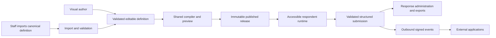

# Smart Form Builder Lite — Product Requirements Document

**Version:** Lite 1.1, 11 September 2026.  
**Source baseline:** Lite PRD 1.0 plus confirmed product decisions from the Claude Software Factory session; Lite 1.0 and Core 1.1 are preserved unchanged.  
**Purpose:** A complete Lite specification with authentication, administration and implementation-contract gaps closed for a fresh implementation handoff.  
**Language:** English. Examples use synthetic people, organizations, answers and credentials.

**Status:** Documentation revision with recorded structural and consistency checks; not a claim of application implementation or product acceptance. All retained Core (C) and Enhancement (E) requirements remain mandatory. Nothing is dropped solely because it was deferred in an earlier implementation plan.

**Reading this specification:** This single PRD, including Appendices A–D, contains all normative Lite requirements, contract details, evaluator tasks and fixed expression vectors. Separate specification files in the handoff are convenience extracts only; they add no independent requirements. Original v1.1 schemas, examples, assertion ledgers and handoff ZIP are historical inputs, not Lite requirements. Proposed Lite wire/engine version is **4.0.0** because exact signed 64-bit integer values now use decimal-string encoding and every package explicitly carries its evaluator contract version. This is a specification profile, not the inspected Software Factory implementation's internal version 1. Implementing and validating the complete Lite schemas/OpenAPI is a delivery obligation, not an artifact claimed to exist already.

**Quick navigation:** [Accounts and roles](#3-organization-roles-and-permissions) · [Journeys](#4-information-architecture-and-complete-journeys) · [Acceptance](#17-acceptance-fixtures-and-evidence) · [Delivery](#18-delivery-sequencing-and-fair-tool-a--tool-b-evaluation) · [Detailed appendices](#20-single-document-authority-and-review-record)

**Scope rule:** Features not explicitly removed or simplified by the user remain. A separate scope review records exclusions and requirement dispositions; excluded capabilities are not optional Lite backlog items or completion gates.

## 1. Product mandate and scope boundary

Build a complete, extensible **Smart Form Builder core**. Organizations author understandable, adaptive forms through a visual editor **or canonical definition import with the same documented application API contract**. Respondents complete and submit those forms. Organizations receive durable, typed submitted response data linked to its form release through the administration UI, exports and documented APIs/events.

The product owns its form model, authoring behavior, rules, validation, runtime and response lifecycle. A prebuilt form-builder or form-engine library MUST NOT provide these core capabilities. UI primitives, design systems, rich-text editors, drag-and-drop helpers, schema validators, storage clients, speech SDKs and other supporting libraries are permitted. This is not a requirement to rewrite ordinary supporting infrastructure.

The existing Smart Intake application is a reference for interaction intent and capability discovery only. No code reuse, repair or migration is required. The separate agreed stack baseline in Section 18 applies to this new implementation. Current implementation defects are evidence for clarifying acceptance behavior, not a requirement to reuse or repair that implementation. Both evaluation tools receive the same product requirements and assets; neither must inspect the old repository to understand the product.

### 1.1 End-to-end responsibility



Staff can prepare a portable definition outside the editor and import it through their normal authenticated workspace access. Outbound webhook consumers receive events configured by authorized staff. No external service-client account or API credential is needed for these journeys; the application API uses staff sessions or respondent session authorization.

### 1.2 Explicit exclusions

| Exclusion ID | Excluded from implementation, milestones and acceptance gates |
|---|---|
| X01 | PDF/document upload for conversion, OCR, field extraction, document-to-form generation and a converter UI. |
| X02 | Building a CLI, AI agent, MCP tool or local Claude generation pipeline. Canonical import/export and documented application APIs remain required under ordinary staff authorization. |
| X03 | Mapping answers into PDF fields, coordinates or document templates; PDF filling, generation or document-processing pipelines. |
| X04 | Certinal or other legally binding e-sign orchestration, signer handoff, signing-status verification or signed-document delivery. |
| X05 | Payment collection, appointment scheduling, CRM/HR/clinical workflows and general business-process automation. Core calculated values and generic integration contracts remain in scope. |
| X06 | An unconstrained conversational agent, typed-question interface, answer dictation or voice-driven answer changes. Compact narration and spoken approved-help questions remain in scope. |

Respondent attachment upload is ordinary data capture and is in scope; accepting a file does not invoke conversion or document processing. A drawing/initials-style field, when enabled, captures ordinary data. It MUST NOT be presented as verified identity, a digital signature certificate or a legally binding e-sign workflow. No excluded feature is required to demonstrate full product completion.

### 1.3 Requirement classes and normative interpretation

- **Core (C):** Required for the product's fundamental promise. All numbered C requirements MUST be implemented.
- **Enhancement (E):** Additional capabilities selected through product judgment because they materially improve author independence, respondent comprehension or operations. They are part of full Lite completion, delivered in later milestones where appropriate.
- **Optional extension (O):** Explicitly optional integrations or future capabilities listed in Section 16. They carry no hidden completion obligation.
- **Business decision (B):** Configurable commercial/operational choice with a safe default in Section 19. An unanswered B item does not block implementation against its default.

MUST/MUST NOT are binding. SHOULD identifies a recommendation whose deviation requires a written rationale and equivalent acceptance evidence. If prose and a machine-readable example conflict, do not silently choose: report and resolve the conflict before implementation. Lite prose and the implementation schemas must agree; original full-product contracts cannot override Lite scope. The examples illustrate the proposed Lite contract, not limits on catalog size or field count; complete schema validation is an implementation deliverable.

## 2. Goals, outcomes and product judgment

The product should make a long, conditional information request understandable without requiring a developer to handcraft each form. It must work for healthcare, research, legal intake, employment, company onboarding and general service requests through configurable data and content, not domain-specific engine assumptions.

| Goal | Completion measure |
|---|---|
| Author independence | A trained non-developer creates, tests, publishes and revises the reference scenarios without source edits. |
| Producer independence | Visual authoring and a canonical import produce semantically identical releases and submissions for the equivalence fixture. |
| Respondent understanding | Users can access clear help, review errors, change language, save/resume and review answers without voice being necessary. |
| Data trust | No acknowledged-answer loss, silent truncation, client-only validation bypass or unexplained change of meaning across versions. |
| Organizational control | Every form, draft, response, attachment and integration is scoped to a tenant/workspace and authorized actor. |
| Long-term adaptability | New composite controls and integrations use documented, versioned extension points. Existing releases remain reproducible. |

Several choices deliberately challenge common shortcuts. The visual canvas is not the source of truth; a canonical definition is. Progress is not simply the furthest page visited. An email-shaped answer is not authenticated identity. A submitted response is not evidence that a downstream webhook succeeded. Voice support is not a reason to omit readable instructions. A large field palette is useful only if controls share predictable validation, accessibility and data semantics.

## 3. Organization, roles and permissions

An **organization** is the tenant boundary. It contains workspaces, teams, memberships, assets, policies and integrations. A form belongs to one workspace and has stable catalog identity, mutable author drafts, immutable releases and response sessions. A person may belong to multiple tenants; the active tenant is explicit and every server request independently checks membership and resource ownership.

| Role | Default permissions |
|---|---|
| Platform super administrator | Create/manage organizations and appoint administrators; bootstrap/owner continuity rules apply. No implicit workspace forms, answers or export access. |
| Organization administrator | Manage users and permitted organization/workspace roles within the tenant; no platform grant or implicit answer access. |
| Organization owner | Membership, workspace, policy and integration administration; may grant roles. No implicit answer access unless also assigned a response role. |
| Workspace administrator | Catalog/ownership/team management inside the workspace; assign permitted workspace roles. |
| Author | Create/edit definitions, preview synthetic data, import/export definitions and propose releases. No real-response access. |
| Reviewer / translator | Comment and approve assigned content/rules/locales; cannot publish or view real answers by default. Translator edits locale content only. |
| Publisher | Publish/retire/roll back approved releases; does not automatically receive response export rights. |
| Response viewer | Read submitted responses and their attachments in the assigned workspace; no response-processing actions. |
| Response exporter | Export responses for every form in the assigned workspace. The role is independent in each workspace; no additional form-specific grants. |
| Auditor | Read permitted audit metadata and approved redacted evidence; no blanket answer export. |
| Respondent | Fill a public form and access only their own session and receipt. No staff membership is required. |

Staff permissions are additive workspace-role grants; each request verifies the resource belongs to that workspace. Export has no per-form grant layer; tenant and suspension restrictions override grants. The implementation must maintain at least one active owner. Role changes invalidate affected access within five minutes; resource authorization is checked on each sensitive operation. Credential/global-status changes revoke all account sessions as specified below.

| ID | Class | User story and required behavior | Acceptance |
|---|---|---|---|
| SF-ORG-01 | C | As an administrator, I can create workspaces, invite/remove members, assign teams/roles and transfer form ownership without transferring respondent data across tenants. | T01 |
| SF-ORG-02 | C | As an author, I can search/filter/paginate forms by title, key, tag, owner, status and updated time; create folders/tags; duplicate, archive and restore forms. No fixed catalog-count cap is embedded in the model. | T01, T22 |
| SF-ORG-03 | C | As an owner, I can configure policy defaults, locale/timezone, storage/retention and approved providers; workspace overrides cannot weaken an enforced organization policy. | T01, T20 |

### 3.1 Accounts, tenant membership and authority

An **account** is a platform identity with one unique username and a credential. An **organization membership** links that identity to one tenant; workspace roles grant access within that tenant. One account may have memberships in several organizations and several workspaces. Switching the active organization never transfers grants, data or form ownership. A tenant membership's organization and account identity are immutable; removing it revokes that membership and every workspace grant beneath it. Rejoining creates an explicit new membership. A missing organization-role row must not cause workspace grants to survive removal.

Usernames are case-insensitive, trimmed at account creation and lookup, and unique platform-wide. The UI labels the field Username; an email address is a supported username, but email delivery is not required to use an account. Do not infer account ownership merely from matching a display name or an email-shaped answer. Existing accounts join another organization by authenticating and accepting the offered membership; an administrator must not overwrite their password or silently merge identities. A tenant administrator cannot enumerate other tenants' accounts or memberships.

Platform super administrators manage organizations and appoint their administrators. Organization owners and organization administrators manage users and workspaces within their organization. Workspace administrators manage permitted workspace memberships. These administrative grants do not directly grant form authoring, answer viewing or export. Explicit workspace role assignment is a separate audited operation, including assigning a role to oneself when authorized. Administrators trusted to provision accounts/set initial passwords can establish access through those explicit paths; the system must not promise that such administrators are technically unable to obtain tenant data. Audit the actor, target, tenant, grants and outcome, without copying secrets or answers.

A tenant administrator cannot grant a platform role, disable a platform account globally, or reset a platform administrator's credential. Tenant suspension of a dual-role person removes tenant access but not their platform authority. Global account suspension is a platform operation. For an account belonging to multiple tenants, tenant administrators manage only their membership; global credential reset is limited to the holder's verified recovery flow or a platform administrator. This closes a cross-tenant takeover path without introducing per-form grants. These are Lite 1.1 boundary defaults, not claims about finished implementation.

### 3.2 First administrator and owner continuity

A clean deployment must be usable without manual database inserts. A deployment operator supplies a one-time bootstrap username and temporary password through protected deployment configuration. Bootstrap creates only the first platform administrator, initially awaiting password replacement. It never ships an active default credential, promotes an unrelated existing account on a username collision, or resets an existing administrator on restart. Concurrent bootstrap attempts must converge to one first account; a persisted bootstrap-completed marker prevents reopening after later account removal. Bootstrap secrets can be removed after activation.

An activated platform administrator creates an organization and its first owner account or pending owner invitation atomically. A new organization is **awaiting owner activation** until that owner has completed activation; ordinary tenant operations cannot proceed in this state. This explicitly permits initial setup without pretending an invited owner can already administer the tenant. Subsequent changes must preserve at least one active, activated, unsuspended owner, and the platform must preserve at least one active, activated platform administrator after initial bootstrap. Count effective account and membership states, not just assigned role names. Serialize concurrent demotion, removal, suspension and administrative credential-reset operations that could violate these invariants. Temporary lockout is not treated as permission to demote the last owner.

When the sole administrator loses their credential, provide a documented deployment-operator recovery procedure using protected operator access and audit, never an anonymous application bypass or reuse of bootstrap as an automatic reset. An ordinary administrator cannot reset their own credential to a temporary one; self-service Change password or verified recovery is the correct flow. Do not make a pending/unactivated second owner sufficient to remove the last acting owner.

### 3.3 Staff authentication and lifecycle requirements

| ID | Class | User story and required behavior | Acceptance |
|---|---|---|---|
| SF-AUTH-01 | C | As a staff member, I can sign in with username/password and sign out; no public self-registration or development identity header substitutes for authentication. Unknown username, wrong password, inactive account and invalid credentials have the same public failure response, with bounded abuse protection. | T27, T20 |
| SF-AUTH-02 | C | As a staff member, I receive an opaque server-managed session with expiry, idle timeout, secure transport and mutation protection. Logout invalidates it server-side. Account suspension/password changes revoke all sessions; membership/role removal invalidates affected access within five minutes and every sensitive request checks current authority. | T27, T20 |
| SF-AUTH-03 | C | As a new staff member, I can use an administrator-set temporary password to reach mandatory password setup without email. Until setup succeeds, only setup, safe session status and sign-out are available; no ordinary staff API or page is usable. | T28 |
| SF-AUTH-04 | C | As an administrator, I can invite a named user with scoped roles using an expiring single-use link. With configured email it is sent and delivery status is visible; without email I can copy the newly issued link. Redemption rechecks current authority and activates the new account or adds an authenticated existing account's offered membership. | T28, T01 |
| SF-AUTH-05 | C | As an active user, I can change my password by proving the current password; forgotten-password recovery is a separate flow. An authorized administrator can initiate recovery without email within the account boundary above. Configured email enables holder-initiated recovery with a generic public response. | T29 |
| SF-AUTH-06 | C | As an account holder, activation/reset/change enforces one documented password policy and invalidates old setup/reset links and affected sessions atomically. Tokens cannot be reused, replayed concurrently, accepted after expiry/revocation, or substituted between purposes/accounts/tenants. | T28, T29 |
| SF-AUTH-07 | C | As an administrator, I see user identity, activation/membership status, workspace roles and invitation delivery state; create/add, role assignment, suspension/removal and authorized recovery are audited. Passwords, hashes and tokens never appear in ordinary list/detail/export/log responses. | T28, T29, T30 |
| SF-PLT-01 | C | As a deployment operator, I can establish and activate the first platform administrator once, safely retry startup, and recover administrator access through a documented audited operator procedure. | T28, T23 |
| SF-PLT-02 | C | As a platform administrator, I can list/create/manage organizations and appoint owners/admins; tenant administrators cannot perform platform operations. Creating an organization and its first owner is atomic. | T28, T20 |
| SF-PLT-03 | C | As an organization, concurrent account, role and recovery actions cannot remove our last acting owner; analogous protection applies to the last acting platform administrator. Pending activation and global account suspension count correctly. | T28, T29 |
| SF-ORG-05 | C | As a staff member in multiple organizations/workspaces, I can switch among permitted memberships, with explicit tenant context and independently enforced roles. Removal in one tenant never grants or deletes membership in another. | T01, T28, T20 |

Detailed account states, secure-delivery exceptions, default lifetimes and API contracts are defined in [Authentication and administration](#appendix-a-authentication-and-administration). These are staff journeys only. Public form respondents continue without staff accounts.

## 4. Information architecture and complete journeys

### 4.1 Administration navigation

Organization switcher and workspace navigation are persistent. Main areas: **Forms**, **Reusable content**, **Responses**, **Integrations**, **People & permissions**, **Audit**, **Settings**. Form detail contains **Build**, **Logic**, **Guidance & languages**, **Theme**, **Preview**, **Versions**, **Share**, **Responses** and **Settings**. A user sees only authorized areas; hidden menus do not replace server enforcement.

The editor has an outline of phases/pages/sections, a central canvas, an add-control palette and a properties panel. Top controls show title, draft revision, save status, undo/redo, preview and publish/review. A diagnostics panel links each issue to the affected object. The properties panel groups content, data, validation, rules, help, localization and accessibility rather than exposing raw JSON by default. Advanced users can inspect/export the same definition.

### 4.2 Author creates a complex form

1. From an empty catalog, choose **Create form**: blank, workspace template or import definition. Enter title and stable form key; key conflicts are explained before creation.
2. Add phases/pages/sections and questions through click, keyboard or drag. New questions receive immutable IDs and sensible labels; title edits never change identity.
3. Configure field type, requiredness, option IDs, examples and contextual guidance. Add a repeating group and use shared data references where a value appears twice.
4. Open Logic, select a target, build nested conditions, and inspect the plain-language explanation and affected dependencies. Invalid or unreachable logic is linked to its source.
5. Set languages and theme. Missing translations, unreviewed guidance, inaccessible colors and unresolved components appear in preflight.
6. Run an ordinary interactive preview, entering temporary sample values in phone/desktop and keyboard views. The author can inspect why a question is visible, required or calculated, and reset the preview.
7. Request review. Reviewers compare changed content/rules/locales against the previous release and approve a specific draft revision. Further edits invalidate affected approvals.
8. Publish atomically. The form receives an immutable release and a share configuration. The author can start a new draft without changing existing sessions.

### 4.3 Staff imports the same form

A signed-in author imports a canonical definition into an authorized workspace. The application discovers the supported capabilities/schema, validates the package and displays diagnostics with pointers and stable IDs. The author fixes errors, commits the validated candidate and uses the same review and publication checks as visual authoring. Import grants no approval, cannot execute code or fetch arbitrary remote assets, and never publishes automatically. API parity is verified using normal staff sessions; it does not introduce machine accounts.

### 4.4 Respondent completes a complex form

The public introduction states purpose, preparation, author-supplied approximate effort, privacy notice, help and language choices. Anyone able to access an open public link may start a session without signing in. Relevant pages appear with clear progress, Back/Next and save state. Help remains readable; speech starts only on request.

Branch changes update only genuinely affected visibility. Focus moves predictably if its control becomes hidden. Repeating items have stable identities and accessible move/remove controls. Errors preserve valid answers. The respondent reviews active answers and explicitly submits; a receipt appears only after server acceptance. A Start another response action opens a fresh session of the same form. The same person can repeat this any number of times, including with identical answers, subject only to ordinary form-wide availability/cap settings, never a person/content duplication rule.

### 4.5 Pause and continue on the same browser/device

Autosave acknowledges a server revision. A respondent can continue an unfinished draft in the same browser/device while its session authorization and deadline remain valid. Expiry explains what happened and offers a new session without claiming to restore lost values. Shared-device mode clears session material on completion/logout and disables persistence beyond the active session. Submitted answers are immutable; another response is a new submission, not an edit to the old one.

### 4.6 View, export and deliver submitted data

A workspace response viewer opens a form's Responses page, filters the list and reads submitted answers and attachments. A workspace exporter uses one Export action, chooses JSON or CSV and downloads the resulting snapshot. Export history and processing/download status may be shown within this journey. There are no response assignments or processing statuses to complete.

Outbound webhooks remain because they were not excluded. Authorized staff configure them separately from the Responses page. Acceptance stores a snapshot and outbox event atomically; external delivery cannot change the respondent's successful submission. Full-data delivery requires the workspace export role. Reference-only events are notifications; receivers do not obtain an inbound API credential or automatic data-fetch right.

### 4.7 Add and manage staff

An authorized administrator chooses **Add user**, supplies the person's username/display name and optional delivery email, selects organization/workspace roles, and chooses **Temporary password** or **Invitation link**. Membership creation grants no automatic form/answer access to either the new account or the administrator. User-facing screens use names, workspaces and roles, without actor selectors or manual code-exchange steps.

For temporary-password onboarding, the administrator supplies a temporary credential and shares it through their existing secure channel. The user signs in, sees **Choose your password**, replaces the temporary password, then signs in normally. They cannot skip setup by navigating to a staff URL or calling an API. Email is unnecessary.

For an invitation, the administrator sees pending/delivered/failed/expired/revoked/accepted states as applicable. Configured email sends the link; without email, a **Copy invitation link** action supplies the newly issued link for manual delivery. Opening the link shows ordinary account setup. An existing account signs in and accepts the membership without having its global password changed. Resend issues a fresh link and revokes the old one. Email failure does not activate the account or claim the invite was delivered.

An active user can **Change password** from account settings. **Forgot password** offers email recovery when configured; otherwise it explains how to contact an administrator. The administrator's scoped recovery action works without email. Authentication, first setup and recovery have distinct UI and audit states. Workspace A's export role covers all A forms and gives no export permission in B.

### 4.8 Staff screen coverage and design baseline

Required screens are Sign in, Choose your password, Invitation acceptance, Change password, Forgot/reset password, Platform organizations and first-owner setup, Organization people, Workspace roles and a no-workspace-access state. A platform-only account lands in platform administration; a staff account with no workspace role sees its account/help/access state rather than a broken catalog. Protected deep links return to the permitted destination after sign-in; unactivated accounts always complete setup first. Expired sessions preserve permitted unsaved local work for reauthentication without exposing it to the next account on a shared device.

Use the agreed Angular 20 and Tailwind 4 baseline with the supplied Certinal UI components/tokens. Reuse the vendored library actually supplied to the implementation; record its version/digest. Brand colors denote identity, semantic colors denote state; authored typography and spacing use design tokens. Read-only details use the standard accessible detail drawer, create/edit use dedicated routes, destructive actions use confirmation, validation is inline with a summary when needed, and operation feedback is concise. Verify keyboard, responsive and RTL behavior. No completion/error analytics dashboard is introduced by this design standard.

The design-system source is a separately supplied implementation asset, not a file an external agent is expected to discover on this computer. The handoff lists this dependency; missing assets must be reported explicitly, not replaced silently or counted as conformant. Form themes remain authored bounded values distinct from the administration application's design tokens.

| ID | Class | User story and required behavior | Acceptance |
|---|---|---|---|
| SF-UI-01 | C | As staff, I can complete all authentication and administration journeys through accessible Certinal UI screens, including empty/no-access, pending activation, expiry, denied operation and email-unavailable states; hidden navigation never replaces API authorization. | T27, T28, T29, T30, T13 |

## 5. Authoring, reusable content and themes

| ID | Class | User story and required behavior | Acceptance |
|---|---|---|---|
| SF-AUT-01 | C | As an author, I can create/reorder/duplicate/delete phases, pages, sections and question instances; use grouped-page or focused-question presentation; retain stable IDs through moves and label edits. | T02 |
| SF-AUT-02 | C | As an author, I can edit label, description, placeholder, help/example, units, requiredness, default/read-only policy and sensitivity without editing application code. | T02, T04 |
| SF-AUT-03 | C | As an author, I can undo/redo at least 100 logical edit transactions per tab; grouped typing and drag actions undo as one action; saved draft history survives reload. Undo never alters a published release. | T02, T10 |
| SF-AUT-04 | C | As an author, I see Saving/Saved/Retrying/Conflict state. Edits use optimistic revision checks; concurrent changes are compared and explicitly resolved, never silently overwritten. | T02, T09 |
| SF-AUT-05 | E | Before deleting/changing a referenced field, option, page or block, I see impacted rules, text, translations and consumers; cancel, replace references or accept a draft-breaking change with diagnostics. | T02, T05 |
| SF-AUT-06 | C | As an author, I can preview the exact candidate through the production compiler/runtime with synthetic data, device sizes and locale changes; preview cannot create real submissions or send live events. | T03 |
| SF-AUT-08 | C | As an author, I can create versioned reusable blocks containing fields, layout, rules, guidance and translations; insert with an ID remap, fork locally or explicitly update with an impact diff. | T07 |
| SF-AUT-09 | E | As a collaborator, I can see who is editing, add/resolve comments and compare revisions. Presence is advisory; revision checks are authoritative. Live character-by-character coediting is optional. | T02, T10 |
| SF-THM-01 | C | As an administrator, I can define logo, approved fonts, colors, spacing, density, border radius, header/footer and responsive layouts using bounded theme tokens. No arbitrary JavaScript or CSS import is allowed. | T13 |
| SF-THM-02 | C | As an author, I can preview themes at 320–1440 CSS-pixel widths, 200% and 400% zoom and RTL; preflight rejects token combinations that fail required contrast or hide controls. | T13 |
| SF-THM-03 | E | As a brand owner, I can lock selected organization tokens and publish versioned theme presets; updates never silently change existing releases. | T07, T13 |

Rich content supports semantic headings, paragraphs, lists, emphasis, links, tables with headers, images with alternative text and safe answer placeholders. It uses a documented sanitized Markdown subset: raw HTML, script, iframe, styles and active content are rejected. Media uses authorized asset references. The Lite message AST represents answer placeholders with the closed value parts in the Lite contract details. The compiler checks expression scope and prevents insertion of attachment URLs or unapproved sensitive answers; interpolated values are escaped text and never reparsed as Markdown. A richer editor may sit on top, but its exported representation must round-trip.

## 6. Field catalog and typed value semantics

The field's canonical type controls storage and validation; a question instance's control controls presentation. For example, radio, dropdown and combobox can all bind a `choice` field. Identity is independent of translated labels and array positions. Every control supports a label, guidance, error state, keyboard operation, read-only display and review rendering.

| Field family / controls | Canonical type | Required behavior |
|---|---|---|
| Short/long text, email, phone, URL, identifiers | `text` | Preserve Unicode; configurable length/format; identifiers remain strings so leading zeros survive. Required checks use trimmed emptiness, but storage preserves entered text unless an explicit normalizer is declared in the contract. |
| Whole number, rating, scale, integer slider | `integer` | Exact signed 64-bit range, canonical decimal-string wire value; enforce min/max/step; distinguish zero from unanswered. Rating endpoints and meaning are labeled. |
| Decimal, amount, currency, fractional slider | `decimal` | Decimal string, no exponent or binary-floating ambiguity; configured scale/unit/currency; round only by declared calculation rules. No payment side effect. |
| Date, time, date/time | `date`, `time`, `dateTime` | ISO calendar date; 24-hour local time; instant plus IANA timezone for date/time. Reject impossible dates and ambiguous nonexistent local times with correction UI. |
| Yes/no, checkbox, acknowledgment | `boolean` | False is an answer. A consent/acknowledgment gate uses explicit `requireTrue`; general required boolean does not require Yes. Optional unknown/declined states are distinct. |
| Radio, dropdown, searchable combobox, image choice | `choice` | Stable option ID; keyboard search; accessible image labels; option visibility; obsolete selections prompt correction. |
| Chips, checkbox group, multiple image choice | `multiChoice` | Unique stable option IDs; cardinality; exclusive None/Unknown options through declared constraints/rules. |
| Ranking | `multiChoice` with `ordered:true` | Ordered option IDs, keyboard move buttons, no duplicate values; order is semantic only when configured. |
| Address, person/contact, row of related values | `object` | Named child fields with individual validation; locale-aware labels, no US-only required address assumptions. Reuse data without concatenating it into one opaque string. |
| Repeating cards, dynamic matrix | `list` of item-field records | Stable item IDs; add/remove/reorder; cardinality; per-item errors; dependent fields and aggregate calculations; nested repeaters to the specified supported depth. |
| Single/multi-choice matrix, yes/no table with details | `list` with fixed item IDs or dynamic rows | Stable row/column definitions, accessible table/card presentation; row details, None/Unknown and per-row validation. Matrix cells use ordinary typed child fields. |
| Family members, history lists, symptoms by category | Composite object/list/choice fields | Configurable relationship/type options and grouped selectable items, detail follow-ups and summaries. These are reusable controls, not hard-coded medical assumptions. |
| File upload | `attachments` | References to verified uploaded assets, including ordinary PDFs, not base64 in answer JSON; multiple files, type/size limits, progress/retry and authorized download. |
| Drawing/initials-style input | `drawing` | Reference to captured image/stroke asset with typed-name/text alternative where a drawing is unnecessary; explicit ordinary-data label; no e-sign claim. |
| Calculated/read-only result | Any compatible scalar or object type | Deterministic server-recomputed value, labeled as derived; cannot be overridden by respondent payload. |
| Static content, collapsible groups, legal/instruction text, review | Layout/content nodes | No answer unless linked acknowledgment or data field; rich readable content, accessible disclosure and review edit links. |
| Mode selector / alternate data-entry view | `choice` plus alternative instances | Switch between manual/list/other presentations of the same canonical fields without duplicating answers; hidden-data rules determine data handling. |

| ID | Class | User story and required behavior | Acceptance |
|---|---|---|---|
| SF-FLD-01 | C | As an author, I can use every field family above with documented storage and constraints, including read-only, conditional and review behavior. Unknown controls fail preflight rather than disappearing. | T04 |
| SF-FLD-02 | C | As an author, I can bind multiple instances to one field; editing one updates the other active views. A new independent question creates a new field ID. | T04, T24 |
| SF-FLD-03 | C | As a respondent, I can manage repeated items without index-based identity loss; nested fields and calculations stay attached to the correct item after reorder/delete. | T06 |
| SF-FLD-04 | C | As an author, I can configure fixed/dynamic matrices, row details and domain composites from typed child fields; they share ordinary validation and accessibility contracts. | T04, T06 |
| SF-FLD-06 | C | As a respondent, I can upload, cancel, retry and remove files; pending/rejected required files block submission and ready files stay bound to the correct tenant/session. | T15 |
| SF-FLD-07 | E | As an author, I can configure rating/ranking, exclusive options, Other-with-detail, safe answer piping and alternate input modes without custom executable code. | T04, T05 |

All canonical field definitions are globally unique within a form package, including children. Each field also has a readable `key`, unique among siblings, for human-facing data dictionaries. Keys are not the primary integration identity and changing a key is a visible contract change. An instance ID identifies a visual placement. An item ID identifies one repeated record; it remains stable when reordered. Option IDs and fixed matrix row IDs are similarly stable.

Decimal input rejects fractional precision beyond the configured scale instead of silently rounding. Storage pads to that scale when declared; without a scale it removes unnecessary trailing fractional zeros. Zero has no negative sign. Calculations use at least 34 significant decimal digits internally and raise a bounded precision/overflow error when exceeded; any rounding is explicit. Integer values cover -9223372036854775808 through 9223372036854775807 exactly, encoded as canonical base-10 strings in typed values. Integer-field min/max/step/defaults use the same representation. Structural counts, revisions, arities and indexes remain bounded JSON numbers. JavaScript evaluates integer values with BigInt; converting them to Number for editing, comparison, sorting, calculations, JSON or export is forbidden when precision would be lost. The exact wire rules are in the Lite contract details. Defaults use the recursive metadata-free InputAnswer wrapper defined in the reviewed contract, initialize once, and must contain an answered value of the field's canonical type. Object/list children use the same wrapper. Default initialization is attributed to source default, never fabricated respondent activity.

### 6.1 Public composite configuration

Built-in controls use `presentation.settings` with a documented bounded shape in the package schema. `children` declares object-child or list-item question instances in display/column order; each child binds the corresponding typed child field. `roles` maps semantic roles to child field IDs, `summaryFieldIds` selects fields for collapsed item summaries, and `fixedRowLabels` maps fixed item IDs to translated label keys. `allowAdd`, `allowRemove`, `allowReorder`, `showRowNumbers` and `orientation` control the named interactions. No built-in accepts hidden implementation-specific properties.

For `repeatingCards`/`dynamicMatrix`, list item fields and child nodes define a row; add/remove/reorder default true within cardinality constraints. A fixed matrix declares `constraints.fixedItemIds`, a label for every fixed row and compatible child controls for columns; add/remove are false and IDs cannot be replaced. Optional reordering affects presentation only when the field is ordered. The runtime initializes fixed rows with unanswered cells, not affirmative/negative defaults.

Address/contact composites use object children; optional roles are `givenName`, `familyName`, `email`, `phone`, `line1`, `line2`, `city`, `region`, `postalCode` and `country`. A role is a rendering hint and does not create undisclosed validation. Family-member lists use explicit `relationship`, `conditions` and optional `displayName` roles; choices/requiredness come from the fields. Symptom groups use object children containing multichoice fields with explicit category headings. Neither control inserts a medical list or requirement that the author did not configure.

None/Unknown exclusive choices are declared by `constraints.exclusiveOptionIds`; selecting one clears other selections and selecting a nonexclusive option clears the exclusive one, with a status announcement. An explicit unknown *answer status* remains distinct from selecting a named option. Other-with-detail uses `presentation.otherFieldId` plus a declared visibility expression; the stored selected option ID and detail text remain separate. Alternate input modes share field IDs and use ordinary visibility/retention policies.

The public capabilities response MUST supply built-in control configuration schemas, compatible value types, roles and defaults for the exact engine version. Registered extensions additionally supply their own settings schema. Unknown settings or roles fail semantic validation. This makes API-produced composites reviewable and editable through the same properties panel as UI-created composites.

## 7. Rules, calculations and validation contract

### 7.1 Expression language and execution

Definitions contain a recursive JSON expression tree. They contain no JavaScript, SQL, templates that execute code, network calls or dynamically downloaded operators. Supported operators and their type/arity rules are documented and exposed in capabilities. Unknown operators or incompatible engine versions are rejected before publication.

| Operator family | Semantics |
|---|---|
| `and`, `or`, `not` | Boolean/Unknown three-valued logic. False AND Unknown is false; true OR Unknown is true; otherwise unresolved inputs propagate Unknown. `not Unknown` is Unknown. |
| `eq`, `ne`, `lt`, `lte`, `gt`, `gte` | Typed comparisons; two operands; no string-to-number or false-to-zero coercion. Missing/unanswered/declined/not-applicable operands yield Unknown. |
| `in`, `contains`, `containsAll` | Membership of compatible scalar/array values; no substring interpretation. For text use explicit text operators/validated patterns. |
| `exists`, `isAnswered`, `statusIs` | Explicit checks of a reference; distinguish a declared field from an answered value and its status. `exists` tests an applicable field with an available value. |
| `add`, `subtract`, `multiply`, `divide`, `round`, `min`, `max` | Deterministic decimal arithmetic; divide-by-zero/type/overflow becomes a structured calculation error. `round(value, scale)` uses half-even. |
| `sum`, `count`, `any`, `all` | Aggregate an applicable list; optional item expression where appropriate. `count` has one list argument; the others have list plus item-expression. Empty sum/count is 0, empty any false, empty all true. Unanswered lists are Unknown. |
| `concat`, `length`, `coalesce`, `if` | Typed string/array length and conditional values. `if` requires three operands; Unknown condition yields Unknown. `coalesce` deliberately chooses the first available answered operand. |
| `today` | Zero arguments; returns the trusted frozen sessionDate, never the machine clock. |
| `dateDiffDays`, `ageYears`, `dateAddDays` | Calendar-aware arithmetic using ISO values; explicit session date/timezone, no machine-local implicit time. AgeYears uses completed calendar years. |

`today` takes zero arguments. `and/or` accept 2–100 arguments; `not`, `exists`, `isAnswered`, `length` one; comparison/membership, arithmetic other than min/max, `round`, `statusIs` and date operators two; `min/max/concat/coalesce` 2–100; `if` three. `any/all/sum` take list plus item expression; numeric sum input must be decimal/integer. `count` takes one list. Literals use the closed typed union in contract 4.0.0; arrays are homogeneous and cannot nest. Null literals are rejected. The normative expression-contract.json fixes result types, numeric promotion, argument order and unavailable/error behavior for every operator. A calendar age on a leap-day birthday reaches the next age on 1 March in non-leap years; this default is explicit so tests agree.

Pattern validators use a published linear-time regular-expression subset with no backreferences or lookbehind, maximum 500 characters and bounded input length. The capabilities document enumerates supported syntax, and client/server conformance vectors cover it. `normalizer` is `preserve` or `trim` for text; nontext fields require `preserve`. Normalization occurs before constraints and is visible in authoring; it never changes option IDs. Numeric `step` must be positive and compatible with declared decimal scale.

Reference scopes are `root`, `item` and `parentItem` with a bounded ancestor depth. A repeated leaf cannot be addressed from root without an aggregate/item context. The compiler resolves field IDs, infers types and rejects scope errors. Statically invalid option literals in a known choice domain and a literal zero divisor fail before publication; dynamically reached zero division remains a structured runtime error. Every offered date/time bound must be enforced server-side or compilation must reject that configuration visibly. Silently accepting an unenforced bound is forbidden; rejection alone does not complete the required field capability. A session freezes `sessionDate` and timezone at creation; changing user locale affects presentation, not that date. Current-time-sensitive eligibility is outside this deterministic rule contract and must not be added as an undocumented check. Mutable locale is not an expression context; switching language cannot change canonical answers or applicability.

### 7.2 Visibility, hidden answers and effect precedence

Questions, groups, sections and pages may reference one visibility expression; multiple conditions are combined into that expression. A node is visible only if its own expression and every ancestor's visibility evaluate true. Undefined expression means visible. Unknown means hidden, and ordinary author diagnostics explain the unresolved dependency.

A field is applicable when at least one active editable/read-only instance on the current reachable route exposes it, or it is an explicitly declared calculated output. If the same field has one hidden and one visible instance, it remains applicable. Non-applicable input values do not participate in rules, required checks, review or submission output. The server emits `notApplicable` with no value. A respondent explicitly choosing Not applicable uses the distinct status respondentNotApplicable, permitted only by allowNotApplicable. Automatic notApplicable is server-only and uses system provenance.

Hidden retention is per-field: **clear** (default) removes the value immediately; **memory** keeps a reversible value in the active page session only; **draft** persists it encrypted with the draft until expiry. Sensitive fields default to clear, and organization policy can prohibit draft retention. Retained hidden values never enter calculated values or final envelopes. The active decision that hides a field and its dependent calculations are evaluated through one acyclic dependency graph, including applicability dependencies; self-hiding/circular designs are rejected.

Enablement does not change applicability. A disabled required unanswered input produces an authoring diagnostic unless a valid declared default makes it satisfiable. Defaults initialize once and never overwrite an entered answer. Declared read-only/default values are enforced server-side; calculated values are read-only and recomputed. Dynamic requiredness applies only to applicable fields. Filtering manually configured options clears an invalid choice and prompts the respondent; it never silently substitutes another choice.

Evaluation orders applicability and calculation dependencies together for each field/item. A derived value used to show a later page must become available in the same evaluation pass; a preliminary visibility pass over stale values is invalid. Multiple placements combine with ANY applicable placement. Applicable empty sums preserve the declared result type (decimal zero under this Lite contract), and unanswered lists remain Unknown. Validation rules consume effective values and produce diagnostics, not dependency-producing assignments. A field validating its own value is legal; calculation/applicability cycles are not. Cross-list access must use an explicit aggregate and proper item context, never infer corresponding rows from equal indexes. Nested repeaters and their parent scopes remain required.

### 7.3 Page paths and progress

Pages have ordered conditional routes plus a default next page. The compiler limits forward routes to later pages and prohibits route cycles. The first true route wins; Unknown does not win. Without explicit routing, use the next applicable page in document order. A final review page is always reachable. Back follows visited applicable history; branch changes remove obsolete history entries. Respondents can revisit completed applicable pages, while direct jumps into unreached pages follow the configured sequential mode.

Required questions cannot be silently bypassed by a route unless their pages become inapplicable. Compiler validation reports unreachable mandatory questions and terminal paths missing review. No rule auto-submits a form.

Progress counts validated and advanced answer pages on the currently known applicable path; review/confirmation and final acknowledgment gates are separate. Optional answer pages count after the respondent advances them while valid. Branch changes invalidate affected completion and may change both numerator and denominator, with an explanation and unresolved-path label. The example progresses 0/2, 1/2, 2/2 at review. There it says answer steps complete; review and submission are still pending. Focused/grouped layouts use the same page metric. Exact review projection, edit-return and zero-answer behavior are defined in the Lite evaluator protocol.

### 7.4 Validation behavior

Drafts may contain incomplete or invalid values as editable raw input state, but API answer values that cannot parse into the declared type return a field diagnostic and preserve the last accepted typed value separately. The UI retains raw text locally and blocks Next/review/submit until corrected. It persists only a markInvalid marker, never the malformed text, using the lifecycle contract. That marker invalidates review and blocks acceptance of the old typed value until an authorized valid set/clear resolves it; restored sessions show a needs-reentry diagnostic. Raw malformed values do not enter typed envelopes. A typed but constraint-invalid draft value may be persisted with validation status. Invalid data never becomes a successful submission.

Validate individual fields after first blur, then on change once an error is visible; avoid announcing required errors on first render. Next validates the current applicable page. Submit validates the entire effective snapshot on the server, recalculates derived fields and rejects invalid choices, impossible dates, whitespace-only required text, out-of-range values, unauthorized edits to read-only fields and incomplete attachments. Return all relevant field errors with stable IDs/item paths and localization keys. Optional unknown/declined status satisfies requiredness only when expressly allowed. Cross-field warnings require explicit acknowledgment if configured; hard errors cannot be waived by a respondent.

| ID | Class | User story and required behavior | Acceptance |
|---|---|---|---|
| SF-RUL-01 | C | As an author, I can compose nested typed expressions, use item/parent scopes and inspect a readable explanation; identical inputs/context produce identical client/server results. | T05 |
| SF-RUL-02 | C | As a publisher, I receive blocking diagnostics for cycles, bad types/arity, unknown IDs, impossible scopes and conflicting assignments before any release is created. | T05 |
| SF-RUL-03 | C | As a respondent, changing a branch consistently updates ancestor/child visibility, requiredness, calculations, review and output under the hidden-retention policy. | T05, T06 |
| SF-RUL-04 | C | As an author, I can define safe page routes and defaults, optional sections and conditional requiredness without skipping applicable mandatory answers or review. | T05 |
| SF-RUL-05 | C | As a user, I receive deterministic typed calculations and repeat aggregates; invalid arithmetic returns explicit diagnostics and never NaN/Infinity or silently rounded data. | T05, T06 |
| SF-RUL-06 | E | As an author, I can use scoring/calculated summaries and safe answer piping for personalized explanations; the product makes no diagnostic, legal or payment decision automatically. | T05 |
| SF-VAL-01 | C | As a publisher, I can rely on shared type, enum, bounds, cardinality, pattern, cross-field and required checks on every authoring path and server submission. | T04, T05, T08 |
| SF-VAL-02 | C | As a respondent, I see a linked error summary, inline correction guidance and preserved valid input; hidden fields do not create inaccessible errors. | T08, T13 |
| SF-VAL-03 | C | As a publisher, I can test boundary/invalid inputs through the staff-authorized validation API; diagnostics include code, severity, field/node ID, row path and JSON pointer. | T03, T08, T24 |

## 8. Guidance, localization, voice and accessibility

Guidance is authored content, not an unrestricted chat service. Each page/section/question can reference brief help, detailed help, examples, a glossary, approved Q&A and narration text. Authors can attach approved public source notes and separate private reviewer notes. Only the former may appear in portable `guidance.sourceNotes`; private notes remain in authorized review records. Respondents see clear content and optional public source links; internal reviewer notes are not published. Search/matching returns approved entries and their scope, and clearly says when no answer is available. It never invents missing advice.

Ordinary labels, descriptions and inline instructions remain readable without audio. The respondent voice surface has only Play/Pause and Click to Ask. Do not expose a separate Read help panel/action, typed-question box, answer-dictation selector, Apply transcript action or speed/settings toolbar. The current approved narration/answer may appear as passive readable text for accessibility; it is not another task or input mode.

Locale bundles belong to one definition. Stable values and option IDs do not change when text changes. The runtime supports Unicode/BCP-47 locale identifiers, English, Hindi and Arabic content packs, with Arabic RTL verification. The English PRD uses escaped Unicode where sample artifacts need non-Roman text. Product localization is not restricted to the PRD's writing alphabet. Additional locales may be imported by administrators after the same completeness/review checks.

Required translations include field/options/help, validation, navigation, intro/review/confirmation, upload/status messages and accessibility names. A locale is advertised only when complete and approved; otherwise it remains a draft locale. The default locale is always complete. Generic system messages have maintained language packs, not free-form per-form strings for every standard error. Optional source-note translation is not a publication blocker. When source content changes, linked translations and narration are marked stale until reviewed. No silent fallback for mandatory acknowledgment text.

The compact bar contains Play/Pause for current approved narration and Click to Ask for a spoken question. No autoplay. Play becomes Pause while speaking; pressing it again resumes, and Play can restart completed narration. Click to Ask pauses narration, requests microphone permission when needed, records only after that explicit action, then answers from approved guidance. The same control changes state to end/cancel capture; there is no extra permanent recording toolbar. Show concise listening, processing, speaking and unavailable states. Stop capture/playback on navigation, locale change, form submission or dismissal. Keep the bar compact and the page layout stable during ordinary saving.

The core includes provider-neutral speech interfaces and a real ElevenLabs reference integration; credentials stay server-side. Speech-to-text is used only to understand the spoken question, never to fill an answer. Resolve the question against currently visible page, section and field guidance; the response may select a relevant field even when asked from the page bar. Select approved entries whose content covers the question, then speak exactly their approved text in the active supported locale. Do not always read the generic page brief, expose hidden-field help, invent advice or execute commands. A no-match reply says no approved answer is available. Cache only approved nonprivate narration by release/content/locale/voice. Microphone denial or provider failure leaves normal form entry and readable instructions usable, with a concise status; do not introduce a typed-question fallback.

| ID | Class | User story and required behavior | Acceptance |
|---|---|---|---|
| SF-GUD-01 | C | As an author, I can edit/version scoped brief/detailed help, glossary, examples, Q&A and narration with review notes and approval status. | T11 |
| SF-GUD-02 | C | As a respondent, I can read ordinary instructions and see the approved text associated with narration or a spoken answer; unavailable help has an honest fallback. No separate Read help action or typed-question interface is required. | T11 |
| SF-GUD-03 | C | As a respondent, I can play/control narration in a supported locale and see its exact text; no audio/provider/microphone capability is required to finish. | T11 |
| SF-GUD-04 | E | As a respondent, I can use Click to Ask for a spoken question and hear the most relevant approved visible-scope answer. Speech never enters field values, acknowledges terms or submits. | T11 |
| SF-GUD-05 | C | As an operator, I can manage provider credentials, locale/voice selection, pronunciation terms, quotas and timeout/failure metrics without exposing keys or raw private speech in logs. | T11, T20 |
| SF-LOC-01 | C | As a translator, I can import/export and review locale bundles, find missing/stale keys, preview long strings and publish only complete supported locales. | T12 |
| SF-LOC-02 | C | As a respondent, switching language preserves typed values and answer meaning; a persisted locale change may advance the session revision and invalidates locale-bound review/acknowledgments; dates/numbers display locally and the page language/direction updates. | T12 |
| SF-LOC-03 | C | As an author, I can support RTL, mixed-direction identifiers, pluralization and locale-specific formatting without duplicating the form or changing stable IDs. | T12, T13 |
| SF-ACC-01 | C | As a keyboard/screen-reader user, I can author and complete all required journeys with semantic labels/groups, accessible focus, errors, tables, dialogs, uploads, repeaters and review. Target WCAG 2.2 AA. | T13 |
| SF-ACC-02 | C | As a user, I can zoom/reflow, reduce motion, use touch targets and disable speech without losing functionality. Focus is not hidden by sticky navigation or the voice bar. | T13 |
| SF-ACC-03 | E | As an author, I see automated contrast/label/alt-text and structural warnings plus a manual accessibility checklist; automated success is never presented as full conformance. | T03, T13 |

The accessibility target draws on W3C's requirements and forms guidance, including keyboard/focus, labels, error correction, audio control and reflow. Automated checks must be supplemented by actual assistive-technology tasks. [WCAG 2.2](https://www.w3.org/TR/WCAG22/), [WAI form notifications](https://www.w3.org/WAI/tutorials/forms/notifications/), [WAI multi-page forms](https://www.w3.org/WAI/tutorials/forms/multi-page/)

## 9. Publishing, sessions, sharing and response administration

### 9.1 Definition and release lifecycle

`EDITABLE_DRAFT → IN_REVIEW → APPROVED → PUBLISHED_RELEASE`. A draft can return to editing; approvals bind to its revision/digest and cannot be reused after changes. Publishing compiles and commits an immutable package, asset/component dependencies, effective policy snapshot and semantic digest atomically. A form's active-release pointer selects the release for new sessions.

Publishing a new release does not mutate existing sessions. Rollback selects a prior release for new sessions. Retire stops new sessions on that release; the default permits already-authorized sessions to finish until expiry. Emergency close explicitly blocks both new and existing submissions, tells affected respondents and preserves drafts for an authorized recovery path. Archive removes a form from normal catalog operation without deleting retained responses. Permanent deletion is a separate policy-controlled job with audit evidence.

A release stores the portable package digest and a runtime manifest digest covering resolved components, assets, effective policy and timezone database version. A session pins that release manifest and engine contract. Choices and their labels come from the pinned package; no runtime option-source snapshot extends it. Security/access revocation applies despite pinned content. Compiler/renderer fixes must satisfy retained contract fixtures; incompatible behavior requires a new engine-contract version.

### 9.2 Session and submission lifecycle

`ACTIVE → SUBMITTING → SUBMITTED`, with `EXPIRED`, `ABANDONED` and `CANCELLED` as terminal alternatives. SUBMITTING is an operation state, not proof of success. Draft revisions track autosave concurrency only. Every accepted response is a separate immutable submission with its own ID; no correction lineage exists. Submission acceptance and outbound delivery have separate operational states, not a response-processing workflow.

Autosave occurs within 1 second after data mutation when idle and at least every 5 seconds during continuous editing, subject to available connectivity. Only the server acknowledgment advances “Saved.” Before Next/review/submit, flush pending typed mutations; navigation may proceed after local validation while displaying a pending-save state, but submit waits for a consistent server revision. On HTTP error, show retry and retain unsent input. On network loss, default mode keeps unsent values only in current-tab memory; an optional personal-device offline extension may use encrypted local persistence with expiry. Shared-device mode never enables that persistence.

Public sessions use high-entropy unguessable authorization limited to that session, delivered in secure cookies or an equivalent secure delivery mechanism. A session ID alone grants no access. Same-browser/device continuation requires that existing authorization and an unexpired draft. Do not put answers in URLs. There is no verified-person entitlement or answer-content duplicate restriction; repeated submissions of the same form are allowed.

Autosave must not replace the form with a loading skeleton, hide unrelated questions, shrink the page to the edited field, move focus, or reset scroll. Keep the current effective layout while saving; update only dependencies whose meaning actually changed. Ignore stale acknowledgments for rendering newer input. Test text, choices and multilingual input under delayed and reordered save responses.

### 9.3 Sharing and embed

Each form may have public link, QR or iframe channels with allowed release selection, start/end time, maximum accepted responses and configured thank-you text. Friendly slugs are routing labels, not security boundaries. A QR code is just a rendering of the same approved share URL. Pausing acceptance returns an explanatory state, not a broken form.

Embedded forms use an isolated iframe and allowlisted parent origins with a documented, versioned `postMessage` protocol for ready, resize, progress, completed and error events. Answer values are not emitted to the parent by default. Completion events carry only an opaque receipt/reference. Parent messages cannot inject answers or grant authorization. Blocked third-party cookies must have a documented top-level fallback that preserves the authorized session.

### 9.4 Submitted responses and simple exports

Workspace response viewers can list/filter/search permitted metadata and read submitted typed answers and attachments. Authoring rights alone do not reveal answers. Sensitive answer-text search remains opt-in by authorized field and organization policy. This area shows submitted responses only; unfinished drafts remain part of the respondent's own session.

One form-level Export action offers JSON or CSV, a filter snapshot and an optional selection of output columns. Column selection is an output preference, not a new permission grant. The workspace export role covers all forms in that workspace; it grants nothing in another workspace. Membership, role, workspace ownership and current revocation are checked at export request and download.

JSON preserves canonical structure. CSV uses one root row per submission and separate files for repeaters with submission ID, parent item ID and item ID. Include a data dictionary and the pinned form interpretation. Do not silently flatten repeaters into numbered columns. Multi-choice values preserve stable IDs with optional labels; dates and decimals stay unambiguous. Escape spreadsheet-formula-like text. Large exports run asynchronously with simple progress, history and expiring downloads, 24 hours by default. Equal answer values in different submissions remain distinct rows.

| ID | Class | User story and required behavior | Acceptance |
|---|---|---|---|
| SF-PUB-01 | C | As a publisher, I can request review, approve a revision and atomically publish only after shared structural, semantic, localization, policy and dependency checks pass. | T10 |
| SF-PUB-02 | C | As a respondent, my session pins a release/manifest/engine contract; publishing or theme/block updates do not change its questions, meaning or history. | T10 |
| SF-PUB-03 | C | As an operator, I can roll back, retire, archive and emergency-close forms with the explicit new-session/existing-session effects described above. | T10, T14 |
| SF-PUB-04 | E | As a reviewer, I can see semantic differences and impacted reusable dependencies/consumer keys before release; breaking changes require an explicit acknowledgment. | T07, T10 |
| SF-RES-01 | C | As a respondent, I get clear introduction, adaptive navigation, truthful progress, review/edit links and explicit submit; no rule or voice command silently submits. | T14 |
| SF-RES-02 | C | As a respondent, acknowledged drafts survive restart and recovery; failed or pending saves are displayed truthfully and retry without overwriting newer revisions. | T09 |
| SF-RES-03 | C | As a respondent, I can continue an authorized draft on the same browser/device, handle expiry and start a fresh response without exposing another person's answers on shared devices. | T09, T20 |
| SF-RES-04 | C | As a respondent, I can submit the same form repeatedly, including identical answers, and receive a truthful receipt for each accepted submission. No person/content duplicate restriction applies. Uncertain requests expose status without falsely claiming success. | T17 |
| SF-SHR-01 | C | As a publisher, I can publish public link/QR/iframe channels with availability windows, form-wide response caps and clear confirmation. | T14 |
| SF-SHR-02 | C | As an integrator, I can embed with origin checks and the defined message protocol; no raw answers leak to an unapproved parent. | T14, T20 |
| SF-ADM-01 | C | As a workspace response viewer, I can list/filter/read submitted responses and inspect their attachments without editing answers or processing a response workflow. | T18 |
| SF-ADM-02 | C | As an exporter, I can obtain complete JSON and relational CSV exports, including repeated data and dictionary metadata, with safe cell encoding and expiring downloads. | T18 |
| SF-ADM-04 | C | As a workspace user, I receive a documented typed submission envelope with stable IDs, pinned form-release metadata, locale, timestamps, attachment references and provenance. | T17, T24 |

## 10. Canonical definitions and structured submissions

Lite uses JSON Schema 2020-12 for implementation schemas. Sections 6–12 and [Appendix B: Lite contract details](#appendix-b-lite-contract-details) define the required semantics. The proposed package, envelope, manifest and event wire version is 4.0.0; the implementation must publish exact matching schemas before contract acceptance. The original 2.0.0 files are not Lite validators and must not be used to admit removed capabilities.

### 10.1 Form package structure

| Property | Contract |
|---|---|
| `schemaVersion`, `engineContract`, `contractVersion`, `kind` | `4.0.0`, `4.0.0`, `4.0.0`, `smart-form-package` for this profile. schemaVersion identifies shape; contractVersion identifies evaluator semantics; engineContract is the legacy public name for that same semantic version and MUST equal contractVersion. Both are explicit in new packages; there is no implicit latest contract. |
| `formKey`, `definitionVersion` | Portable catalog key and author-visible semantic version. Server form/release IDs are separate and assigned within the authenticated workspace. |
| `titleKey`, `descriptionKey`, locales | Keys resolve in the default and every advertised supported locale. Locale tags follow BCP-47; direction is explicit. |
| `data.fields` | Root typed fields; recursive object properties and list item fields. IDs are globally unique and keys unique among siblings. |
| `flow.phases/pages/sections/nodes` | Layout and navigation. Question instances reference field IDs; repeaters create item contexts. Content-only nodes carry no answer. |
| `expressions` | ID-to-expression map using the owned recursive grammar and typed operator contract. |
| `guidance`, `translations` | Versioned content and locale messages with glossary/Q&A/narration. Declared approval states are content metadata; trusted publication approvals live in server audit records. |
| `theme` | Versioned bounded tokens and authorized asset references. |
| `policies` | Review, public access, draft expiry, voice, retention key and confirmation; effective organization policy remains authoritative. No response-edit or single-person restriction setting. |
| `dependencies` | Exact versions/digests of reusable blocks and registered components; no floating “latest.” |
| `assets` | Authorized portable asset references; no embedded secrets, executable modules or remote-fetch instructions. Choice options are defined in the package. |

Unknown top-level/core properties are rejected; namespaced extensions are accepted only if their registered schema/version is approved for the tenant and required dependency is declared. An imported component configuration cannot activate executable code by naming a URL. A generic `presentation.settings` object is validated against the selected built-in or registered component's versioned configuration schema; it is not an unvalidated escape hatch.

Release `packageHash` is SHA-256 of RFC 8785 canonical JSON bytes of the normalized portable package. Normalization N is fully defined in the Lite contract details: materialize only the three named repeater flags, preserve all other omissions, IDs, strings and array order. Block insertion resolves/remaps before the portable package reaches N. No Unicode or option meaning changes are permitted. UI and API producers using identical IDs/content must obtain the same normalized hash. Integer strings preserve exactness through RFC 8785 normalization; they are not converted into JSON numbers. The runtime-manifest digest additionally binds effective policy and resolved asset/component versions. [JSON Schema 2020-12](https://json-schema.org/draft/2020-12), [RFC 8785](https://www.rfc-editor.org/rfc/rfc8785)

All authorized definition exports include the package, dependency/data dictionary manifest and the published schema/engine versions. Secrets, membership lists, live responses, internal reviewer comments and private source notes are excluded from respondent delivery and portable definition exports by default. Administrative backups may include them only through a separately authorized operation.

### 10.2 A complete synthetic form example

The complete inline minimal package below demonstrates the proposed Lite wire shape. It is a specification example; executable schema validation remains an implementation deliverable. The detailed evaluator task supplies a complex form with repeated values, calculation, attachments and review without requiring saved simulation management.

```json
{
  "schemaVersion": "4.0.0",
  "engineContract": "4.0.0",
  "contractVersion": "4.0.0",
  "kind": "smart-form-package",
  "formKey": "simple-request",
  "definitionVersion": "1.0.0",
  "titleKey": "form.title",
  "descriptionKey": "form.description",
  "defaultLocale": "en",
  "supportedLocales": ["en"],
  "data": {"fields": [{"id": "fld_name", "key": "name", "type": "text", "labelKey": "q.name", "sensitivity": "personal", "mode": "input", "hiddenRetention": "clear", "normalizer": "preserve", "constraints": {"required": true, "maxLength": 120}}]},
  "flow": {"startPageId": "page_name", "phases": [{"id": "phase_request", "titleKey": "form.title", "pages": [{"id": "page_name", "titleKey": "q.name", "sections": [{"id": "section_name", "titleKey": "q.name", "layout": "stack", "nodes": [{"id": "node_name", "kind": "question", "fieldId": "fld_name", "control": "shortText"}]}], "routes": [], "defaultNextPageId": "page_review"}, {"id": "page_review", "titleKey": "page.review", "sections": [{"id": "section_review", "titleKey": "page.review", "layout": "stack", "nodes": [{"id": "node_review", "kind": "review"}]}], "routes": []}]}]},
  "expressions": {},
  "guidance": {},
  "translations": {"en": {"direction": "ltr", "reviewState": "approved", "messages": {"form.title": "Service information request", "form.description": "A synthetic, general-purpose guided intake.", "q.name": "Full name", "page.review": "Review and submit", "confirmation": "Your response has been received."}, "pronunciations": []}},
  "theme": {"themeKey": "accessible-default", "version": "1.0.0", "tokens": {"accent": "#175CD3", "background": "#FFFFFF", "text": "#182230", "fontFamily": "system", "density": "comfortable", "radius": 8}},
  "policies": {"reviewBeforeSubmit": true, "draftExpiryDays": 30, "showProgress": true, "presentation": "grouped", "guidanceMode": "text", "narrationAutoplay": false, "allowVoiceQuestions": false, "retentionPolicyKey": "standard-intake", "responseAccess": "anonymous", "confirmationKey": "confirmation"},
  "dependencies": [],
  "assets": []
}
```

The following standalone expression illustrates a richer form. Its `sum` evaluates the amount field once for each item in the expenses list. Reordering items changes no value or identity.

```json
{
  "op": "sum",
  "args": [
    {"ref": {"fieldId": "fld_expenses", "scope": "root"}},
    {"ref": {"fieldId": "fld_amount", "scope": "item"}}
  ]
}
```

### 10.3 Submission envelope and typed answers

The server emits the envelope; it never trusts client-supplied tenant IDs, release hashes, timestamps, calculated values, accepted attachment state or provenance. Respondent mutation requests supply only authorized input fields and navigation/locale intent. The server reconstructs the effective typed snapshot.

Every declared root field has an answer cell. Applicable optional unanswered fields use `unanswered`; non-applicable fields use `notApplicable`; allowed unknown/declined/explicit not-applicable answers use unknown/declined/respondentNotApplicable. Untouched unanswered cells use system provenance; defaults use default. Only `answered` cells contain `value`. Object values contain a `fields` map; lists contain ordered `items` with stable `itemId` and `fields`. Child cells use the same structure recursively. A non-applicable parent has no value or descendants. Multi-choice values are unique option-ID arrays. Integer and decimal strings avoid ambiguous arithmetic; dates, instants and timezones have explicit formats. Authorized readers can derive a simple value map but must not collapse absent/false/zero/unknown states.

`submissionId` identifies one immutable accepted submission. There is no response revision/head/predecessor identifier. `sessionRevision` identifies the accepted draft state; form `releaseId`, `definitionVersion`, engine version and hashes identify the form interpretation. `startedAt`, `submittedAt` and `receivedAt` are authoritative server times, with receivedAt possibly preceding commit. Client-entered dates remain ordinary answers. Server timestamps use UTC RFC 3339. Equal answers submitted again receive a new submissionId.

The following answer-cell excerpt illustrates false, automatic hidden state and a calculated total. It is not a complete envelope. The Lite contract details define envelope metadata; the implementation must supply and validate a full synthetic envelope.

```json
{
  "fld_updates_requested": {
    "type": "boolean", "status": "answered", "value": false,
    "provenance": {"source": "respondent", "changedAt": "2026-09-05T10:00:00Z"}
  },
  "fld_details": {
    "type": "text", "status": "notApplicable",
    "provenance": {"source": "system", "changedAt": "2026-09-05T10:00:00Z"}
  },
  "fld_total": {
    "type": "decimal", "status": "answered", "value": "19.75",
    "provenance": {"source": "calculated", "changedAt": "2026-09-05T10:00:00Z"}
  }
}
```

Attachments in answers are IDs; the envelope's attachment manifest contains name, media type, byte size, digest, readiness and creation time, never durable bearer download URLs. Authorized consumers obtain short-lived downloads separately. Acknowledgment records bind a field or warning validator and stable row path to SHA-256 of canonical `{locale,contentKey,text}`, plus accepted locale, instance identity where applicable and server acceptance time. The configured approved content key, warning requirements and locale-change invalidation are specified in the Lite contract details. These are ordinary form-interaction records only.

### 10.4 Compatibility and normalization rules

Every stored draft, published package, runtime manifest and submission interpretation identifies the exact evaluator contract. Unsupported versions fail explicitly before evaluation. Legacy interpretation requires an explicit version-specific adapter and regression evidence, never guessing latest. The inspected Software Factory package with numeric schemaVersion/contractVersion 1 is a different shape and language; changing its version label does not migrate it to this PRD. The implementation comparison is documented in the gap report.


- Breaking field-type, option-meaning, expression-semantics or envelope changes require a new major contract version. New optional metadata can use a minor version only if older consumers can safely ignore it; changing defaults is not automatically compatible.
- Producers discover supported schema/engine versions and capabilities. Unsupported required features return `UNSUPPORTED_CAPABILITY`; the server must not silently drop them. Consumers tolerate unknown optional envelope fields within a compatible major version, while import validation uses the negotiated exact definition schema.
- Removing a field or option from a new form release does not delete its historical definitions/answers. Reusing its ID for another meaning is forbidden. A renamed label keeps its ID; a changed semantic meaning gets a new ID.
- Block insertion remaps internal field/node/expression IDs and all references deterministically using an instance namespace; it records the original block version. Export emits the resolved portable definition, with the dependency record, so staff import clients need not run internal editor code.
- Preserve original typed values and explicit statuses. Format and presentation changes must not mutate canonical response data. New calculations are not retroactively inserted into prior immutable snapshots.

## 11. Application APIs, imports and outbound events

The API prefix below is `/v1`; deployments provide their base URL and machine-readable OpenAPI document. All bodies use UTF-8 JSON unless an upload URL explicitly specifies binary transfer. Stable machine error codes coexist with localized UI messages. Resource IDs are opaque; clients must not derive authorization from their shape.

### 11.1 Authentication, concurrency and errors

Administration uses ordinary authenticated staff sessions, with CSRF protection for cookie-based mutations. Workspace roles cover definition read/write/import, publication, response viewing/export, attachments, webhook configuration and audit. Each endpoint enforces its workspace role and resource ownership; export has no additional per-form grant. Public respondents receive authorization for only their own session/receipt. API documentation does not create an external machine-client authentication product. Credentials never appear in query parameters or portable definitions.

Mutable resources return strong ETags. Updating a definition requires `If-Match`; missing precondition returns 428 and stale revision returns 412 with current revision and a conflict link. Session mutations use `baseRevision`; stale versions return 409 and do not partially apply operations. A client can fetch the latest state and present a conflict resolution UI.

Ordinary administrative creation, import commit, publish and delivery replay use Idempotency-Key scoped to tenant (or platform for platform operations), staff account, method and resource. Authentication/secret issuance uses the dedicated replay rules in the authentication companion and is excluded from raw-secret result caching. Store the request digest/result for at least seven days; equal key/body returns the original administrative result and changed body returns 409. Draft mutations retain clientMutationId replay to avoid applying an edit twice. Lite does not require deduplicating submitted responses, including repeated requests: each accepted submission has its own identity. A submission attempt is tracked for receipt/status recovery; no uniqueness constraint may be based on person, email, answers or prior response lineage.

Errors use RFC 9457-style `application/problem+json` with `type`, `title`, `status`, `code`, `detail`, `requestId` and `errors[]`. Field diagnostics include `fieldId`, `instanceId` where relevant, `rowPath`, `pointer`, `messageKey`, `severity` and safe parameters. Do not return raw answers, tokens, stack traces or cross-tenant resource existence in errors. [Problem Details, RFC 9457](https://www.rfc-editor.org/rfc/rfc9457)

| HTTP status | Meaning and client action |
|---|---|
| 400 | Malformed JSON/duplicate keys/invalid request structure; correct request. |
| 401 / 403 | Authentication required or insufficient scope; preserve unsent data, reauthorize where allowed. |
| 404 | Missing or unauthorized resource where existence must be concealed. |
| 409 / 412 / 428 | Conflict, stale ETag or required precondition; refetch and explicitly resolve. |
| 410 | Expired/deleted session or expired capability; show specific authorized recovery path. |
| 413 / 415 | Size/type unsupported; show limits before retry. |
| 422 | Well-formed definition/answer fails semantic validation; display structured diagnostics. |
| 429 | Quota/rate limit; honor Retry-After without claiming success. |
| 500 / 503 | Unexpected/retryable service failure; reconcile idempotent operation status before retry. |

Staff authentication, platform, membership and recovery endpoints are specified in [Authentication and administration](#appendix-a-authentication-and-administration). Platform operations use platform authority; account operations use the account/session scope, so the ordinary workspace authorization rule is not incorrectly applied to bootstrap, sign-in or self-service credential changes. Credential setup/recovery proof is purpose-bound and is not a machine-client credential.

### 11.2 Definition and publication endpoints

`{w}` is an authorized workspace ID; `{f}` a form ID; `{d}` a draft ID. Response examples include `requestId` in the actual API even where omitted from this table for clarity.

| Endpoint | Request and response contract |
|---|---|
| `GET /v1/capabilities` | Supported schema/engine versions, field controls, operator signatures, extension versions, limits, locale/system-pack and speech capability availability. No secret configuration. |
| `GET /v1/schemas/{kind}/{version}` | Exact versioned JSON schema plus immutable digest and cache headers. |
| `POST /v1/workspaces/{w}/forms` | `{formKey,title}` creates catalog identity and empty editable draft; 201 with IDs/revision/ETag. Blank drafts need not compile until completed. |
| `GET /v1/workspaces/{w}/forms` | Cursor pagination/filter/sort; default 50, max 200. Stable sort `(updatedAt,id)` and snapshot cursor; no missing/duplicate records caused by edits during a page walk. |
| `GET /v1/workspaces/{w}/forms/{f}/drafts/{d}` | Draft package, revision, ETag, diagnostics and authorized review state. |
| `PUT /v1/workspaces/{w}/forms/{f}/drafts/{d}` | Full canonical package plus optional edit note, with If-Match. Atomic shape-safe draft save; semantic diagnostics may remain in editable draft, but unsupported executable/unsafe content is rejected. 200 new revision/ETag. |
| `POST /v1/workspaces/{w}/imports/validate` | `{mode:"create" or "update",targetFormId?,targetDraftId?,allowInvalidDraft?,package}`. Validate limits/schema/references/policies; 200 candidate/digest/diagnostics if acceptable, 422 diagnostics otherwise. No live form mutation or publication. |
| `POST /v1/workspaces/{w}/imports/{candidateId}/commit` | `{candidateDigest,expectedDraftRevision?}` and idempotency key. Recheck permissions/policy and candidate expiry; 201 draft IDs/revision. Update mode also requires If-Match on the target draft. |
| `POST /v1/workspaces/{w}/forms/{f}/drafts/{d}/validate` | Validates structure and semantics and returns diagnostics and normalized package hash. Ordinary preview can evaluate temporary answer inputs through the same engine; no saved-scenario resource is created. |
| `POST /v1/workspaces/{w}/forms/{f}/drafts/{d}/review-requests` | Binds current revision/digest and reviewers. Review decisions record actor, revision, decision and comment. An edited revision invalidates approval. |
| `POST /v1/workspaces/{w}/forms/{f}/releases` | `{draftId,draftRevision,packageHash}` with publish scope/idempotency; compile/recheck approvals atomically. 201 release ID, both digests, version and status; 422 if no release created. |
| `GET /v1/workspaces/{w}/forms/{f}/releases/{releaseId}` | Immutable package and manifest for authorized staff user. Respondent delivery is a separate sanitized view. |
| `POST /v1/workspaces/{w}/forms/{f}/activation` | `{releaseId,mode:"activate" or "retire" or "emergencyClose",reason}` with ETag; returns effective new/existing session policy. Rollback activates a previous release. |
| `GET /v1/workspaces/{w}/forms/{f}/export?releaseId=...` | Portable package, schema/engine versions and dependency/data dictionary manifests; no responses or secrets. |

### 11.3 Import lifecycle and trust

Import is a transaction, not an executable installation. Default maximum uncompressed JSON size is 5 MiB; depth/node/field limits apply before expensive semantic processing. Reject duplicate JSON keys, malformed Unicode, excessive nesting, unsafe prototype-style keys, raw executable content, unsupported types/operators, remote references and secret-like provider fields. No ZIP import is required in Lite; assets are pre-uploaded through an authorized asset API and referenced by digest.

A candidate is scoped to tenant, actor, target and policy version, expires after 24 hours and cannot be committed by another tenant. Unsafe requests are rejected without saving executable content. Structurally valid but semantically incomplete imports can be committed to a visibly invalid draft only when explicitly requested with `allowInvalidDraft:true`; publication is still impossible until errors are resolved. Default commit requires no error diagnostics. Review/approval claims inside imported JSON do not grant trusted approval or publication rights.

Updating an existing form requires explicit target form/draft identity and revision; IDs retain their existing meanings. Creating a new form accepts producer-supplied IDs within the new form namespace, enabling exact UI/API package equivalence. The separate catalog Copy action remaps IDs and returns a mapping manifest. Importing twice with the same idempotency key returns the first result. Unknown optional extension configuration is not silently discarded. Capability negotiation tells the producer what to change, and an import/export round trip preserves all supported semantics.

### 11.4 Respondent session and submission endpoints

Public entry resolves a share ID to an open public release. The service issues secure session authorization before returning private draft data. Tenant identity comes from the share context, never user-selected query parameters.

| Endpoint | Contract |
|---|---|
| `POST /v1/public/forms/{shareId}/sessions` | `{locale,timeZone}` starts a fresh public response. Returns 201 with session ID, sanitized release, draft revision, expiry and session/receipt authorization. Enforces availability/caps at start and rechecks atomically at acceptance. |
| `GET /v1/sessions/{s}` | Authorized pinned definition reference, typed draft state, current page, revision, expiry and errors; no other session data. |
| `PATCH /v1/sessions/{s}` | Atomic batch `{baseRevision,clientMutationId,operations,currentPageId?,locale?}`. Operations are set, clear, markInvalid, addItem, removeItem, moveItem; item addresses use stable row paths. 200 acceptedRevision/currentRevision/replayed/validation; fetch current state after recovery when revisions differ. Same clientMutationId/body returns its original accepted result before checking stale baseRevision, after current authorization; changed-body reuse conflicts. Other 409 conflicts leave the draft untouched. |
| `POST /v1/sessions/{s}/attachments` | `{fileName,mediaType,sizeBytes,sha256}` returns upload ID, allowed transfer target and expiry; validates policy before upload. |
| `POST /v1/sessions/{s}/attachments/{a}/complete` | Server verifies object size/hash/type and scan status; returns processing/ready/rejected, never trusts client “ready.” |
| `DELETE /v1/sessions/{s}/attachments/{a}` | Removes draft attachment reference and schedules safe deletion if not retained by an accepted snapshot. |
| `POST /v1/sessions/{s}/validate` | `{sessionRevision}` returns all effective errors/warnings and review digest. It does not submit. |
| `POST /v1/sessions/{s}/submissions` | `{sessionRevision,reviewDigest,acknowledgments,attemptId}`. Validate/recompute and commit an immutable snapshot and outbox atomically; 201 receipt/submission ID or structured errors. Changed answers after review return 409 REVIEW_STALE. attemptId correlates status; it is not a person/content duplicate restriction. |
| `GET /v1/sessions/{s}/submission-operation` | Look up a caller-authorized attemptId; return notStarted/pending/succeeded/failed with minimal receipt if accepted. No success may be inferred from a URL flag. |

Set operations use `{op:"set",fieldId,rowPath,answer:{status,value?}}`; no caller-supplied type/provenance is trusted. `rowPath` is an ordered array of `{listFieldId,itemId}` ancestor addresses. `addItem` carries a new client-generated item ID (validated for collision) and typed input cells; `moveItem` carries `beforeItemId` or null for end; `removeItem` explicitly deletes the item; all operate inside the declared parent row path. Clear changes a field to unanswered and triggers dependent rules. Whole-list replacement is rejected when stable item mutation is required. The row-addressed mutation example in the Lite contract details defines this input shape.

### 11.5 Response, export and event APIs

| Endpoint | Contract |
|---|---|
| `GET /v1/workspaces/{w}/submissions` | Filter by form/release/time/authorized metadata with stable snapshot cursor; submitted response summaries only. |
| `GET /v1/workspaces/{w}/submissions/{id}` | Canonical immutable envelope under response-read scope; 410 tombstone after authorized deletion. |
| `POST /v1/workspaces/{w}/exports` | Workspace export role; formId, filter snapshot, JSON/CSV and optional output columns. 202 job ID; read status/history/download within the same export journey. Recheck workspace permission at download. No response revision or per-form permission selector. |
| `GET /v1/workspaces/{w}/attachments/{id}/download` | Authorized short-lived capability, maximum 5 minutes by default; binding checked against owning response/session. |
| `POST /v1/workspaces/{w}/webhooks` | URL, form filters, allowed event types, reference/full mode; validates ownership/egress and issues signing secret once through a secure response. |
| `GET /v1/workspaces/{w}/webhook-deliveries` | Attempt history, next retry, redacted failure and event ID; no payload secrets. |
| `POST /v1/workspaces/{w}/webhook-deliveries/{id}/replay` | Authorized idempotent replay; retains original event ID and records new delivery attempt. |

The implementation must also expose permission-checked CRUD for catalog, roles, blocks, themes, locale bundles, share channels and policy objects through the same API conventions. These supporting resources use explicit ETags, audit, pagination and authorization; core form authoring cannot depend on an undocumented UI-only endpoint.

### 11.6 Events and delivery semantics

Core event types: `form.published`, `form.retired`, `submission.created`, `submission.deleted` and `attachment.rejected`. Every event contains schema version, unique event ID, type, server timestamp, tenant/workspace, affected resource IDs, monotonic per-form sequence and data mode. Sequence assists reconciliation; delivery order is not guaranteed. Events never contain credentials or local file paths.

Reference mode contains event/resource IDs and no API-fetch entitlement. Full-envelope mode is available to staff with the workspace export role and organization policy approval; it lets the configured receiver get response data without an inbound service credential. Webhook signing secrets authenticate outbound deliveries only. Staff-session APIs remain for the application. Retention/deletion suppress queued full payloads and replay of deleted data.

Delivery is at least once. Persist submission plus outbox record atomically; acknowledge the respondent independently of network delivery. Use HTTPS endpoints with DNS/IP egress checks, block private/link-local/loopback destinations by default, revalidate redirects and do not follow redirects automatically. Local test receivers require an explicit isolated test-mode allowlist.

For each attempt, send `SmartForms-Event-Id`, `SmartForms-Key-Id` and `SmartForms-Signature: t=<unixSeconds>,v1=<hex>`. Compute HMAC-SHA256 over UTF-8 `timestamp + "." + eventId + "." + rawRequestBody` with the subscription secret. Consumers compare in constant time, enforce a five-minute timestamp tolerance and deduplicate event IDs. Retry attempts use the same event/body but a fresh timestamp/signature while deliverable. Deletion terminally suppresses queued full events and their replay; it emits a new deletion event with a new ID/sequence instead of rewriting the old event body. In-flight external copies cannot be recalled. Secret rotation supports old/new key IDs for a 24-hour transition; only authorized administrators retrieve a new secret.

Any 2xx acknowledges delivery. Retry network failures/408/429/5xx at offsets 1 minute, 5 minutes, 30 minutes, 2 hours, 6 hours, 12 hours and 24 hours after the initial attempt, with jitter and bounded Retry-After handling. 401/403 pauses for credential/configuration action; 410 disables the endpoint; other permanent 4xx enters failed state. Each request has a 10-second timeout. After exhaustion, show failed/dead-letter state and controlled replay. Delivery history is retained for 30 days by default, with payload data minimized under response retention policy.

| ID | Class | User story and required behavior | Acceptance |
|---|---|---|---|
| SF-API-01 | C | As a staff author, I can discover capabilities/schema versions and create/update/import/export/validate/publish definitions through documented application APIs under my workspace role, with the same results as the UI. | T24 |
| SF-API-02 | C | As an authorized workspace user, I receive stable typed envelopes, data dictionaries, cursor pagination and compatible version evolution without knowing internal implementation details. | T17, T18, T24 |
| SF-API-03 | C | As a client, I can safely retry idempotent operations, detect stale revisions and receive actionable structured errors without partial mutation. | T09, T17, T24 |
| SF-API-04 | C | As an operator, I can configure signed webhooks, inspect/replay delivery failures and distinguish accepted submissions from pending downstream delivery. | T19 |
| SF-API-05 | C | As a respondent or staff user, session and attachment access is server-authorized; query values or forged envelope metadata cannot override authorization. | T15, T20 |
| SF-IMP-01 | C | As a producer, I can validate then commit a definition candidate with a digest/revision guard; invalid candidates show path/ID diagnostics and never publish automatically. | T24 |
| SF-IMP-02 | C | As an administrator, imports reject unsafe code, remote fetch instructions, duplicate keys, incompatible capabilities and excessive size/depth before expensive processing. | T21 |
| SF-IMP-03 | C | As an author, importing/updating preserves approved identities and dependencies; copying remaps them explicitly; export/import round trips preserve supported semantics. | T07, T24 |
| SF-IMP-04 | C | As a security owner, candidate expiry, tenant/actor binding, trusted approvals and effective policy are enforced at commit and publish, not trusted from JSON. | T20, T21, T24 |

## 12. Security, privacy, retention and audit

Design for multi-tenant operation from the start. Every database query, object-storage read, job, export, speech request and event delivery is tenant/resource authorized. Random identifiers help but do not replace authorization. Encrypt transport and storage, manage secrets outside definitions/client bundles, and make audited support access time-limited and role-scoped. The PRD asserts no legal certification; deployments select jurisdiction-specific policy requirements separately.

Default retention profile: abandoned draft 30 days, uploaded but unattached/rejected objects 24 hours after final disposition, submitted responses 365 days, export capabilities 24 hours, audit metadata 365 days, webhook delivery metadata 30 days. Tenant policy may choose shorter/longer supported durations; a policy change displays affected records and effective date. Retention jobs include replicas, derived exports, object references and queued full payloads. Backups expire within 35 days; deletion tombstones are reapplied after restore so deleted data is not re-exposed. Legal/administrative hold is an explicit authorized policy state; data on hold is not falsely marked deleted.

Respondents receive a configured privacy notice and collection purpose at entry. Optional consent to voice/provider processing is separate from mandatory data-collection acknowledgments. Do not persist raw microphone audio or question transcripts by default; transient question recognition is only for approved-help matching. Diagnostics must not capture raw answers, typed keystrokes or private attachments by default. Log IDs, states and error codes; redact authorization headers, exchange codes, signed URLs and sensitive values.

Audit events include staff/session/system origin, role, tenant/workspace/resource, action, previous/new revision identifiers, time, result and correlation ID. Answer-read/export and policy/permission/publish events are auditable. Store changed-value hashes or redacted summaries where feasible instead of copying all sensitive values into long-lived logs. Audit permissions are distinct from response permissions. Deletion/redaction operates under policy while preserving lawful operational metadata; no blanket “immutable forever” promise overrides retention.

Upload handling checks extension, declared MIME, detected type, byte size and digest, scans for malware and quarantines pending/rejected files. HTML/SVG active content is disallowed as respondent-rendered inline media by default. Assets are served with safe content disposition/CSP and scoped access. Download links are short-lived and cannot enumerate storage paths.

| ID | Class | User story and required behavior | Acceptance |
|---|---|---|---|
| SF-SEC-01 | C | As an organization, my definitions, sessions, answers, attachments, jobs, exports and integrations remain isolated across tenants even with guessed IDs or concurrent requests. | T20 |
| SF-SEC-02 | C | As an administrator, least-privilege roles/scopes, secret storage, revocation, CSRF/CSP/session protections and audit apply equally to UI/API/background work. | T20 |
| SF-SEC-03 | C | As a policy owner, I can configure retention/deletion/holds and verify expiry, backup-restore deletion handling and derivative cleanup without false success. | T20, T23 |
| SF-SEC-04 | C | As a respondent, sensitive hidden answers, voice and logs follow explicit minimization/consent policy; readable forms remain available without provider consent. | T11, T20 |
| SF-SEC-05 | C | As an auditor, I can trace publication, access, export, permissions and integration actions with correlation and revision evidence, subject to retention and redaction. | T18, T20 |
| SF-SEC-06 | C | As an operator, uploads and remote-provider/webhook connections are bounded, authorized and protected against malicious files, SSRF and data exfiltration. | T15, T19, T21 |

## 13. Reliability, performance and supported limits

These are Lite acceptance targets, not claims about an existing application. Both tools use the same reference environment: a documented four-vCPU/8-GiB application allocation, PostgreSQL-equivalent durable transactional storage with declared resources, isolated object storage, and a test client with four modern CPU cores, 8 GiB RAM, 20-Mbit/s downlink and 100-ms round-trip latency. Different architectures are allowed within equal total resource/cost ceilings recorded before the run. Load generation runs on a separate machine. Report cold and warm results separately.

| Workload / target | Required measurement |
|---|---|
| Large catalog | 10,000 forms in one workspace, 100 releases on selected forms; paginated search p95 ≤ 1 second server time. This is a benchmark floor, not an embedded catalog cap. |
| Complex form | 1,000 field definitions, 2,000 instances, 100 pages, 500 expressions, three nested repeater levels; current-step local rule/render update p95 ≤ 100 ms and no long task above 500 ms during ordinary entry. |
| Respondent runtime | First usable input p95 ≤ 3 seconds on the reference network for a 100-field form; ≤ 5 seconds for the complex fixture. Lazy loading must preserve validation/review correctness. |
| Save/submit | 200 active sessions at 20 draft mutations/second aggregate; save acknowledgment p95 ≤ 1 second and submit commit p95 ≤ 2 seconds, excluding file transfer/provider speech. Error rate below 0.1% excluding deliberate invalid requests. |
| Import/compile | 1,000-field package compile p95 ≤ 5 seconds; runs over 2 seconds expose progress/job status. Invalid large input rejected within bounded resources. |
| API/export | Cursor walk of 10,000 responses has zero missing/duplicate snapshot items; 10,000-response JSON/CSV export completes within 60 seconds in the reference environment. |
| Durability | Zero loss of acknowledged writes across application restarts; retry-safe acceptance under injected network/service failures. Defined backup RPO ≤ 24 hours, restore RTO ≤ 4 hours; runtime crash recovery is separate from disaster recovery. |
| Accessibility/browser | Latest and previous major Chrome/Edge/Firefox/Safari at test time; iOS Safari/Android Chrome; record exact versions. Manual NVDA or equivalent desktop reader and VoiceOver mobile/desktop tasks. |

Default published limits: 5 MiB definition JSON; 1 MiB typed draft/submission JSON excluding attachments; 25 MiB per file; 10 files per question; 100 MiB total attachments per session; 500 items per repeater; three nested repeater levels; 10,000 expanded active answer cells; expression depth 20; 10,000 AST nodes per package; maximum 100,000 evaluation steps per mutation. A field-specific limit may be stricter. Explicitly return limits in capabilities and show them in authoring/respondent UI. Reject rather than truncate. Higher plans/deployments may configure larger tested limits without changing semantics.

Default rate controls: 60 administrative mutations/minute/actor, 120 draft mutations/minute/session and configurable tenant aggregate limits; use burst allowance to avoid breaking normal typing. Return 429 with Retry-After and maintain queued client mutations. Availability target is 99.9% monthly for the core after deployment, with maintenance accounting documented. A build-tool evaluation must not claim that SLA from a short test; it must demonstrate health checks, observability, recovery and a deployment design that can support it.

| ID | Class | User story and required behavior | Acceptance |
|---|---|---|---|
| SF-NFR-01 | C | As a user, the catalog/runtime/save/submit/compiler/export meet the measured thresholds above under the shared workload and declared resource budget. | T22 |
| SF-NFR-02 | C | As an operator, configured limits are discoverable and enforced consistently; exceeding any limit produces a clear error without truncation or corruption. | T21, T22 |
| SF-NFR-03 | C | As an operator, restart/timeout/partial dependency failures preserve acknowledged data and idempotent outcomes; health, metrics, alerts and correlation IDs identify failures. | T17, T23 |
| SF-NFR-04 | C | As an operator, backup/restore and deletion replay are documented and demonstrated with RPO/RTO measurements and tenant isolation after recovery. | T23 |
| SF-NFR-05 | E | As a product owner, I can see per-provider latency/error/cost and operational service-health metrics without collecting raw sensitive answers. | T11, T18, T22 |

## 14. Loading, empty, error and recovery behavior

| Surface/state | Required interaction |
|---|---|
| Empty catalog | Explain Create, Template and Import definition; no document-conversion upload option. |
| Empty editor | Add first page/question with keyboard access; distinguish editable incomplete draft from a publishable form. |
| Import processing | Show candidate stage and cancel; cancel stops work where possible and never partially creates a published release. |
| Import/compile failure | Summary with count, severity, exact pointer/ID and jump-to-editor; retain safe draft candidate for correction; no generic success toast. |
| Save pending/offline | Persistent status; retry/backoff; preserve unsent data; warn before destructive navigation; no green Saved badge before acknowledgment. |
| Edit conflict | Compare local vs server revisions; keep a copy, merge manually or reload; never default to overwriting another actor. |
| No option results | Explain when search or dependent filtering of manually defined choices has no matches; allow clearing/changing the filter and preserve required-field validation. |
| Hidden/current-page change | Explain new path, place focus at a meaningful heading and preserve only policy-permitted values. |
| Voice unavailable | Text remains visible, Play status explains unavailability, retry optional; no blocked navigation. |
| Upload pending/rejected | Per-file reason/progress/retry/remove; retain other answers; required attachment prevents final submit. |
| Expired/closed/no access | Explain the authorized state without leaking another tenant's form title or response; offer configured contact/start-new path. |
| Submit uncertain | Keep transition view and reconcile operation status; do not immediately re-submit or show receipt. |
| Success | Show durable receipt, submitted time and a Start another response action; outbound delivery status belongs in integration administration. |
| No responses/export empty | State filter/time window and zero result; allow filter reset; distinguish from failed query/export. |
| Delivery failed | Show redacted cause, attempt history and next/replay action; successful form submission remains intact. |

| ID | Class | User story and required behavior | Acceptance |
|---|---|---|---|
| SF-UX-01 | C | As an author/respondent/operator, I can distinguish loading, empty, invalid, denied, expired and failed states and recover as specified without losing valid work. | T02, T08, T09, T14, T19 |
| SF-UX-02 | E | As a non-developer, I can complete the scripted author task after a 20-minute orientation; at least four of five independent trial users publish the fixture without code edits or facilitator intervention. | T25 |
| SF-UX-03 | E | As a respondent, I can complete the tested complex branch with help/review; at least four of five representative trial users finish without assistance and no critical answer-meaning errors. Report failures rather than claiming general usability from five users. | T25 |

## 15. Research and feature traceability

The source PRD records research consulted on 5 September 2026; those historical references are retained here, not newly verified vendor claims. Research is a source of product lessons, not a claim that this product must copy every vendor feature. Capabilities may vary by vendor plan/version; no pricing, certification or superiority claim is made. Libraries below are research references only and MUST NOT become the owned core engine.

### 15.1 Competitor- and standards-informed requirements

| Origin | Documented capability / lesson | PRD requirements |
|---|---|---|
| M01 | Google Forms documents publish/share, response access and embed controls. Explicit access and publication are essential. [Official sharing guide](https://support.google.com/docs/answer/2839588?hl=en) | SF-SHR-01, SF-SHR-02, SF-PUB-01, SF-API-05 |
| M02 | Google Forms provides API-based creation/update and publication management. The Lite lesson is canonical import and UI/API parity under staff authorization. [Create forms](https://developers.google.com/workspace/forms/api/guides/create-form-quiz), [publish API](https://developers.google.com/workspace/forms/api/guides/publish-form) | SF-API-01, SF-IMP-01, SF-IMP-03 |
| M03 | Google Forms documents section-based branching and a range of question types. A clear visual hierarchy and explicit branch semantics matter. [Branching](https://support.google.com/docs/answer/141062?hl=en), [question types](https://support.google.com/docs/answer/7322334?hl=en) | SF-AUT-01, SF-FLD-01, SF-RUL-04 |
| M04 | Google Forms supports response viewing and spreadsheet export. Stable structured exports and access controls should be designed together. [Response management](https://support.google.com/docs/answer/139706?hl=en-GB) | SF-ADM-01, SF-ADM-02, SF-ADM-04 |
| M05 | Jotform documents conditional visibility, page paths and calculations. Our engine must exceed simple show/hide while keeping effects predictable. [Conditional logic](https://www.jotform.com/help/57-smart-forms-conditional-logic-for-online-forms/) | SF-RUL-01, SF-RUL-04, SF-RUL-05 |
| M06 | Jotform documents revision history and collaboration. Recovery and edit accountability deserve explicit behavior. [Revision history](https://www.jotform.com/help/294-How-to-view-form-revision-history/), [collaboration](https://www.jotform.com/help/419-understanding-form-collaboration/) | SF-AUT-03, SF-AUT-04, SF-AUT-09, SF-PUB-04 |
| M07 | Jotform multilingual forms include field and warning translations, language selection and missing-content review. [Multilingual guide](https://www.jotform.com/help/298-how-to-make-your-forms-multilingual/) | SF-LOC-01, SF-LOC-02, SF-GUD-01 |
| M08 | Typeform documents branching maps and typed variables/calculations. Visual rule inspection and type semantics are important for authors. [Branching](https://help.typeform.com/hc/en-us/articles/360029116392-What-is-branching-logic), [variables](https://help.typeform.com/hc/en-us/articles/360052365212-How-to-add-and-change-variables) | SF-RUL-01, SF-RUL-05, SF-RUL-06 |
| M09 | Typeform documents one form with multiple language versions and consolidated responses. [Languages](https://help.typeform.com/hc/en-us/articles/23541138531732-Create-multi-language-forms) | SF-LOC-01, SF-LOC-02, SF-ADM-04 |
| M10 | Fillout documents nested conditions, page logic, answer piping and calculations. [Logic](https://www.fillout.com/help/logic), [calculations](https://support.fillout.com/help/calculations), [page logic](https://www.fillout.com/help/page-logic) | SF-RUL-01, SF-RUL-04, SF-RUL-05, SF-FLD-07 |
| M11 | Fillout documents automatic partial progress and same-browser/device recovery. Lite retains same-browser/device continuation. [Partial submissions](https://www.fillout.com/help/partial-submissions) | SF-RES-02, SF-RES-03, SF-SEC-04 |
| M12 | Formstack documents field/section conditions and explains how labels/values affect rules. Stable option identity reduces accidental semantic changes. [Official conditions guide](https://help.formstack.com/hc/en-us/articles/44592316217619-Conditional-Logic-for-Formstack-Forms) | SF-FLD-02, SF-RUL-02, SF-AUT-05, SF-PUB-04 |
| M13 | SurveyJS documents dynamic matrices, item-context expressions and composite question types. These establish useful depth benchmarks, not an implementation dependency. [Dynamic matrices](https://surveyjs.io/form-library/examples/dynamic-matrix-add-new-rows/documentation), [complex expressions](https://surveyjs.io/form-library/examples/use-and-represent-complex-questions-in-expressions/documentation), [composites](https://surveyjs.io/form-library/documentation/customize-question-types/create-composite-question-types) | SF-FLD-03, SF-FLD-04, SF-RUL-01, SF-EXT-01 |
| M14 | JSON Forms separates data/UI concerns and documents conditional UI rules and custom renderers, including explicit undefined-value behavior. [Rules](https://jsonforms.io/docs/uischema/rules/), [custom renderers](https://jsonforms.io/docs/tutorial/custom-renderers) | SF-FLD-02, SF-RUL-01, SF-EXT-01, SF-API-01 |
| M15 | react-jsonschema-form generates UI from JSON Schema and permits UI customization. The lesson is declarative interoperability; using that generator as our runtime would violate the owned-core requirement. [Official documentation](https://rjsf-team.github.io/react-jsonschema-form/docs/) | SF-API-01, SF-IMP-03, SF-EXT-03 |
| M16 | LimeSurvey documents relevance, branching, calculations and text tailoring for complex surveys. We adopt explicit semantics and conformance fixtures, not its engine or expression syntax. [ExpressionScript](https://www.limesurvey.org/manual/ExpressionScript_-_Presentation), [question types](https://www.limesurvey.org/manual/Question_types) | SF-RUL-01, SF-RUL-03, SF-RUL-06 |
| M17 | W3C specifies accessible forms, error notification, focus and multi-page guidance. [WCAG 2.2](https://www.w3.org/TR/WCAG22/), [notifications](https://www.w3.org/WAI/tutorials/forms/notifications/), [multi-page forms](https://www.w3.org/WAI/tutorials/forms/multi-page/) | SF-ACC-01, SF-ACC-02, SF-VAL-02, SF-RES-01 |
| M18 | ElevenLabs documents secure provider credential practices. Provider support does not itself supply an accessible product workflow. [Security guidance](https://elevenlabs.io/docs/eleven-api/guides/how-to/best-practices/security) | SF-GUD-03, SF-GUD-05, SF-SEC-04 |

Derived descriptions are intentionally brief; the requirements and defaults are our product decisions. Payment, document and signing features offered by these vendors do not alter the exclusions in Section 1.

### 15.2 Reference behavior retained within the new core

The source reference was inspected at commit `8a499cd478b800e3c29d104da60fcf09ea837641`. These are **interaction/capability references**, not implementation instructions. Each row states how the new product preserves or generalizes that intent. Formal verification of the new implementation uses the fixtures, not the old application's behavior as a correctness oracle.

| Origin | Reference capability | New core coverage |
|---|---|---|
| R01 | Text, textarea, date, radio, select and combobox controls | SF-FLD-01, SF-AUT-02, SF-VAL-01 |
| R02 | Chips, checkbox groups, collapsible chips and Other details | SF-FLD-01, SF-FLD-07, SF-RUL-03 |
| R03 | Rows, groups, collapsible groups, headings and static content | SF-AUT-01, SF-FLD-01, SF-ACC-01 |
| R04 | Yes/no tables with conditional row details | SF-FLD-04, SF-RUL-03, SF-VAL-01 |
| R05 | Repeating cards and alternate/manual entry modes | SF-FLD-03, SF-FLD-07, SF-RUL-03 |
| R06 | Family members/conditions and categorized symptom controls | SF-FLD-04, SF-AUT-08, SF-EXT-01 |
| R07 | File upload and attachment status | SF-FLD-06, SF-API-05, SF-SEC-06 |
| R08 | Acknowledgment, legal/consent text and read-only content | SF-FLD-01, SF-VAL-01, SF-GUD-01; document signing explicitly X04 |
| R09 | Review summary and edit navigation | SF-RES-01, SF-VAL-02, SF-ACC-01 |
| R10 | Conditional visibility and clearing dependent values | SF-RUL-01, SF-RUL-02, SF-RUL-03 |
| R11 | Defaults, computed age/date values and read-only fields | SF-AUT-02, SF-RUL-05, SF-API-05 |
| R12 | Multi-step navigation, progress and restore | SF-AUT-01, SF-RUL-04, SF-RES-01, SF-RES-02 |
| R13 | Brief/detailed authored narration and glossary | SF-GUD-01, SF-GUD-02, SF-GUD-03 |
| R14 | Q&A matching, per-step help and browser voice input | SF-GUD-02, SF-GUD-04; compact spoken-question matching with approved audio/text answers |
| R15 | ElevenLabs speech and playback controls | SF-GUD-03, SF-GUD-05, SF-ACC-02 |
| R16 | English/Hindi content and language switching | SF-LOC-01, SF-LOC-02, SF-LOC-03 |
| R17 | Branding, responsive layout and mobile page navigation | SF-THM-01, SF-THM-02, SF-RES-01 |
| R18 | Shared values referenced on multiple pages | SF-FLD-02, SF-API-01, SF-ADM-04 |
| R19 | Draft persistence, session state and completion messaging | SF-RES-02, SF-RES-03, SF-RES-04, SF-UX-01 |
| R20 | Static JSON-defined forms | SF-API-01, SF-IMP-01, SF-IMP-03; generalized to a documented producer-independent contract |
| RX01 | PDF Studio upload/extraction/generation | Excluded X01, X02. Staff can import an externally prepared canonical definition through normal workspace access. |
| RX02 | PDF preview overlays, field mapping and filled downloads | Excluded X03. Respondent review is an answer summary. |
| RX03 | Certinal launch, signer polling and signed completion/download | Excluded X04. Core completion means durable structured submission. |

The source PRD records historical renderer, engine, guidance, Q&A and locale entry points at the reference commit above. They are provenance only; this PRD and the linked Lite companions are sufficient product-specification inputs.

### 15.3 Independently selected enhancements

| Origin | Enhancement and rationale | Tradeoff / requirements |
|---|---|---|
| P01 | Dependency-aware deletion and semantic release diffs prevent authors from accidentally breaking many rules/consumers. | Additional compiler/editor work; SF-AUT-05, SF-PUB-04. |
| P05 | Versioned reusable blocks/themes reduce maintenance across large catalogs without surprise updates. | Explicit update management; SF-AUT-08, SF-THM-03. |
| P06 | Stable typed envelopes and relational repeater exports support arbitrary downstream systems. | More explicit integration contract than a flat label/value map; SF-ADM-02, SF-ADM-04. |
| P07 | Spoken questions can reduce the effort of finding relevant approved help. | Compact Click to Ask; scoped exact-content replies with no answer mutation; SF-GUD-04. |
| P08 | Tenant-aware authoring and resource authorization are essential even when the initial demo has one organization. | Foundation work before enterprise scale; SF-ORG-01, SF-SEC-01. |

## 16. Extensibility without surrendering the core

The extension registry supports versioned components, reusable blocks, speech providers and outbound data consumers. The core owns authorization, schema/rules, validation, session/release behavior and the submission envelope. Canonical import uses staff access; outbound events use administrator-configured destinations.

A component package declares ID/version, compatible engine contract, configuration schema, allowed canonical value type, editor properties UI, respondent/read-only/review renderers, accessibility/localization contract and migration/conformance fixtures. Its executable implementation is installed only through an administrator-controlled deployment process, never uploaded as code inside a tenant form definition. Trusted component code must use scoped capabilities and cannot bypass core validation or access unrelated responses. A required missing component blocks publish/resume with an explicit compatibility error; it never drops answers or silently renders a generic field.

Reusable blocks are data-only packages resolved into the canonical definition with provenance. Choice lists, labels and dependent filtering rules are authored in the package and pinned to each release. Provider/component changes never silently alter accepted answer meaning.

Required integrations are one real TTS provider, one generic HTTPS outbound webhook path, and an email delivery adapter for staff invitations and self-service account recovery, alongside mandatory email-independent onboarding/admin recovery. Controlled local providers can test contracts but do not prove external delivery. Technology choices must satisfy the unchanged performance, ownership and security requirements.

Optional extensions: additional TTS/STT providers, AI-proposed translations/help that require review, advanced quiz grading, barcode/camera-specific inputs, geolocation with consent, richer collaborative coediting, additional deployment topologies, and external industry integrations. These are not required Lite acceptance gates. An upstream converter or downstream document/signing application remains an external system even if developed later; it does not become a mandatory phase of this PRD.

| ID | Class | User story and required behavior | Acceptance |
|---|---|---|---|
| SF-EXT-01 | C | As a developer, I can add a versioned composite control with editor/runtime/review/validation/localization/accessibility fixtures through the documented registry without altering the core response format. | T07, T26 |
| SF-EXT-02 | C | As an administrator, I can approve/pin/disable provider and component versions; missing/incompatible required dependencies fail safely and prior releases remain reproducible. | T07, T26 |
| SF-EXT-03 | C | As a product owner, I receive an owned schema/engine/rule/authoring implementation with a dependency inventory proving no prebuilt form engine supplies those responsibilities. Supporting libraries are disclosed. | T26 |
| SF-EXT-04 | E | As an extension developer, I can use documented speech and retained provider/component adapter contracts and conformance fixtures without learning private database or UI internals. | T11, T26 |

## 17. Acceptance fixtures and evidence

Every numbered requirement below maps to Lite fixtures. These are test specifications, not evidence of an implemented product. The generated requirement register and scope review in Section 20 account for every original requirement. The full-product assertion ledger is not a Lite acceptance gate; evaluators must materialize a Lite corpus from this document and the linked Lite evaluator protocol.

| Fixture | Setup and concrete assertions | Required evidence |
|---|---|---|
| T01 Organization/catalog | Two organizations and two workspaces each; normal staff sign-in, Add user using both setup paths and membership invitation acceptance, role changes, create/transfer/archive/restore. An author lacks answer access; export role in A permits all A forms but not B forms. No extra per-form export grant. | Real account journeys with email disabled and configured, authorization tests and admin UI walkthrough. |
| T02 Author editing | Build a 30-field form in three phases with two authors. Move/delete referenced items, undo 100 actions, reload saved history, produce conflict and resolve without lost work; keyboard alternatives available. | Browser recording, revision/audit assertions. |
| T03 Interactive preview | Enter temporary sample inputs for valid/invalid/unknown/hidden branches; inspect diagnostics, reset, vary device and locale. No real response, webhook or email is created; no saved-scenario catalog is required. | Compiler outputs and browser/network evidence. |
| T04 Field catalog | At least one valid/invalid/boundary case for every catalog control; zero/false, Unicode/leading-zero identifiers, decimals, date/time, ranking, Other, shared fields, matrix details and drawing alternative. | Shared client/server conformance vectors and browser evidence. |
| T05 Rules | Nested AND/OR/NOT, Unknown truth table, parent hiding, all route outcomes, divide-by-zero, leap dates, changing options, cycles, wrong scopes/types, dead paths and hidden-sensitive data. No excluded value in final envelope. | Deterministic expected-output fixtures and compiler diagnostics. |
| T06 Repeaters | Three nested levels; add/delete/reorder 50 items; fixed/dynamic matrices; item/parent references; empty/unknown aggregate semantics; no index identity drift or truncation. | Exact typed output and item-ID assertions. |
| T07 Reuse/versioned dependencies | Insert block twice with explicit ID remaps, fork one, update source block/theme/component. v1 release/session unchanged; update diff accurate; missing dependency fails visibly. | Package hashes, manifests and before/after snapshots. |
| T08 Validation/errors | Direct API bypass: whitespace required text, invalid date/type/option, forged calculated value, read-only field edit, out-of-range decimal, invalid nested row. All rejected correctly; accessible linked errors preserve valid data. | API responses, screen-reader/browser evidence. |
| T09 Draft/recovery | Type after idle and during continuous input; acknowledge save, kill app process, resume. Inject 500/offline, two tabs, stale revision, expired draft and shared-device use. No acknowledged loss or wrong-session access. | Revision timeline, fault injection and recovery recording. |
| T10 Publish/lifecycle | Review v1, edit to invalidate approval, publish v1, create active session, publish reordered/translated v2, rollback, retire, emergency-close. Verify exact effects on new/existing sessions. | Release/manifest hashes, state transition and audit tests. |
| T11 Guidance/voice | Only Play/Pause and Click to Ask as permanent voice actions. Verify narration controls, spoken page and field questions, relevant approved answer selection, exact text/audio parity, no-match, English/Hindi/Arabic, branch/locale changes, microphone denial and provider timeout. No typed-question, separate Read help or dictation interface; speech never changes answers or submits. | Browser/control inspection, real speech request/playback evidence and redacted provider logs; mocks labeled separately. |
| T12 Localization | English, Hindi and Arabic RTL test bundles, long labels, mixed-direction identifier, plural messages, missing/stale mandatory key. Switching locale changes no canonical values. | Translation checks, screenshots and reviewer sample approval. |
| T13 Accessibility/responsive | Author and respondent flows with keyboard, screen reader, 320-pixel layout, 200/400% zoom, high-contrast/reduced-motion preferences, repeaters/tables/dialog/errors/voice bar. | Automated scan plus manual assistive-technology task log. |
| T14 Share/embed/navigation | Public links/QR/iframe, windows/caps, allowed/blocked parent origins, cookie-blocked fallback, page history/progress and final review. No staff sign-in is required to fill a public form. | Browser/origin tests and real server acceptance. |
| T15 Attachments | Upload an ordinary PDF and another permitted file; ready/pending/quarantined/oversize/type/digest mismatch/cancel/retry; required-upload gating, unauthorized download, expiry and reference-aware cleanup. No PDF processing is invoked. | Real storage/scan and browser evidence. |
| T17 Submission integrity and repeats | Submit identical answers repeatedly in fresh sessions: every accepted submission has a distinct ID and appears in exports. No verified-person/content deduplication. Exercise double-click/retry outcomes, commit failure, restart, stale review and computed values; every recorded success must correspond to a durable snapshot/outbox. Reconcile unknown attempts truthfully. | Database/receipt assertions, failure injection and envelope validation. |
| T18 Response viewing/export | List/filter/read submitted answers and attachments; JSON and relational CSV with nested repeaters, formula-like text and 10,000-response export. Equal-answer submissions remain separate. Workspace-role authorization applies at request/download; no per-form export grants or response workflow controls. | Export files/dictionaries, role-boundary tests and UI walkthrough. |
| T19 Webhooks | Signed HTTPS delivery, tampered body/old timestamp, duplicate and out-of-order events, 429/500/401/410, retry exhaustion/secret rotation/replay, reference/full payload delivery and deletion tombstone. | Real controlled receiver logs, signature checks and delivery records. |
| T20 Security/privacy | All role/tenant resource paths including background jobs; forged metadata, revoked access, logs/secrets, cookie/CSRF/CSP, respondent-only unfinished-draft access, hidden retention and provider consent. | Negative authorization tests and redacted audit/log inspection. |
| T21 Hostile/large imports | Duplicate keys, unsupported executable property/component URL, unknown operator/type, depth/size bomb, invalid Unicode, cross-tenant candidate, expired candidate and forged approval. | Parser/compiler rejection evidence with bounded resource measurements. |
| T22 Scale/limits | Agreed 10,000-form and 1,000-field datasets, 200 sessions, prescribed loads; exceed each cap by one; measure p50/p95/p99 and memory/errors/cost. | Reproducible workload commands and raw benchmark data. |
| T23 Recovery/retention | Crash/restart, database failure, restore backup, rerun deletion tombstones, restore tenant isolation, expire drafts/exports/objects, test hold and retries. | Timestamped recovery drill and inventory reconciliation. |
| T24 Producer equivalence | Build the same package through UI and documented HTTP requests under the same staff workspace role, import/export twice, validate schemas and semantic constraints, compare normalized hashes and typed submissions. Copy uses documented remap; update uses preserved IDs. | Golden packages, API transcript, hash/output comparison. No custom CLI/MCP product is required. |
| T25 Usability trials | Five independent authors/respondents per task, defined orientation and scenarios, record success/time/errors/help and critical misunderstandings. | Task script, anonymized observations and pass/fail against SF-UX-02/03. |
| T26 Extensibility/ownership | Add a non-healthcare equipment-list composite using registry contracts; preserve canonical list output; inspect dependency inventory and pin/disable versions. | Extension conformance pack, dependency review and old-release regression. |

The complex medical-style core fixture is a **new synthetic definition** exercising history, family relationships, symptoms and repeated entries. It is not a PDF, a conversion task or an obligation to reproduce 643 document destinations. At least one equally complex non-healthcare fixture must be included to expose domain assumptions. The evaluator owns the fixed assertions and must freeze the complete input/expected-output corpus, including both complex domain definitions, before either measured run. Implementation teams supply adapters and runners and cannot select or rewrite the oracle. The Lite fixture descriptions, expression vectors and evaluator protocol are specification data; they are not a complete executable Lite fixture suite. Remaining corpus materialization is a disclosed evaluation-start gate, not a passing result.

The additional foundation fixtures T27–T32 below are mandatory alongside the 25 retained fixtures. Their detailed expected behavior is specified in the authentication and contract companions.

| Fixture | Required behavior | Evidence |
|---|---|---|
| T27 Staff authentication | Username/password, generic failures/throttling, setup-only guard, normal session expiry/logout/revocation, CSRF, deep-link return and shared-device clearing. | API/browser negative and positive cases, redacted security logs. |
| T28 Administration and onboarding | Bootstrap, pending first owner, last-owner races, platform/tenant boundaries, multiple memberships, both onboarding paths without email and configured invitation delivery. | Transaction/race tests, UI walkthrough, provider evidence separately. |
| T29 Password lifecycle | First setup vs change vs recovery, no-email admin recovery, email self-recovery, link expiry/reuse/revoke, shared-account boundary and all-session invalidation. | API/browser cases and audited operator recovery drill. |
| T30 Staff UI consistency | All required staff screens, access-empty states, Certinal UI assets/tokens, keyboard/RTL/zoom, role restrictions and meaningful failure recovery. | Versioned design asset manifest and browser evidence. |
| T31 Interpretation and numeric fidelity | Signed 64-bit extrema and 2^53 boundary survive input/save/JSON/CSV/calculation; explicit package/manifest contract stamps, mismatched versions rejected, frozen today, derived visibility, repeated placement and typed empty aggregate cases. | Same golden vectors in server/browser plus round-trip files; unsupported version and overflow diagnostics. |
| T32 Local deployment | Clean documented start/bootstrap/onboarding; stop/restart preserving data; unavailable DB/storage readiness; migrations/restore; email-disabled operation and explicitly configured providers. | Exact environment/commands, persistence assertions and recovery logs. |

### 17.1 Hard completion gates

Full product completion requires all C and E requirements and their fixtures to pass at the appropriate evidence level. The following failures block release regardless of weighted score: cross-tenant/unauthorized data access; loss of acknowledged answers; silent truncation or changed answer meaning; acceptance of invalid/forged protected data; false submission success; arbitrary executable definitions; a UI-only authoring model; use of a prebuilt engine for owned-core responsibilities; and inability to complete the required keyboard/text-only respondent journey.

Submission, staff response viewing/export and outbound webhooks must be demonstrated against real services. Real TTS and configured staff invitation email delivery also require evidence. Email-disabled onboarding/recovery must pass independently; lack of email configuration does not block that local operating mode. It still leaves the full email-integration acceptance case unverified. Missing credentials are blocked, not passed through mocks. Ordinary PDF upload/download is an attachment acceptance case; PDF conversion/signing remain outside scope.

### 17.2 Evidence levels

E0: design/source inspection. E1: unit/conformance fixture execution. E2: integrated local/staging execution with controlled test services. E3: configured external-provider verification. Each result records requirement, fixture, commit, environment, exact command, artifact, observed result and pass/fail/blocked/not-run. A screenshot proves layout only; a mock proves a contract branch only. No test may silently skip required assertions because an integration is unavailable.

## 18. Delivery sequencing and fair Tool A / Tool B evaluation

### 18.1 Full-product delivery milestones

| Milestone | Deliverable | Exit evidence and limitation |
|---|---|---|
| D1 Contract and usable identity foundation | Local stack, bootstrap, real staff sign-in, temporary-password activation, platform/tenant administration and screens, owner safety, tenant/workspace roles; owned canonical model, evaluator version and exact numeric semantics. | T27/T28 temporary-password cases, T30/T31/T32 and T01/T04/T05/T20/T21/T24 foundation cases. Email integration and invitation/recovery completion follow explicitly; this is not a complete builder. |
| D2 Complete author/respondent core | Full field catalog/composites/repeaters, author editor/undo, validation, navigation, durable drafts/review/submit, sharing/embed and response retrieval. | T02/T04/T06/T08/T09/T14/T15/T17/T24. Missing governance/voice/operations still means interim. |
| D3 Governance and content | Reusable blocks/themes, form review/publish/version pinning, localization/RTL, guidance, real TTS, accessibility and ordinary preview. | T03/T07/T10/T11/T12/T13. Remaining retained operations are still required. |
| D4 Operations and extensibility | Simple submitted-response viewing/export, complete email/manual staff invitations and password change/recovery, signed events/retry, retention/audit, retained extension contracts and remaining E features. | T01/T18/T19/T20/T23/T26/T28/T29 and affected earlier fixtures. |
| D5 Full acceptance | Complete all C/E requirements, scale/resilience/security/accessibility/usability trials, deployment/runbooks and evidence review. | All 31 listed Lite fixtures pass at required levels; known limitations and operational measurements delivered. Only this is full Lite completion. |

No deadline/team-size assumption is embedded. Security, accessibility, shared contract behavior and language architecture begin in D1/D2; later milestones deepen them. Excluded upstream/downstream pipelines appear in no required milestone.

### 18.2 Agreed implementation baseline and operational delivery

Use Angular 20, Tailwind 4 and the supplied Certinal UI library for the client, Spring Boot for the application API, PostgreSQL for transactional data and Docker Compose for the initial local deployment. This adopts the confirmed Software Factory stack decisions; it does not require reusing its code. Pin actual compatible dependency versions in lockfiles and record them. Cloud hosting and managed storage are optional later topologies; durable local attachment/export storage must still meet sealing, authorization, retention and recovery requirements. Provider credentials stay outside the repository and client.

Deliver a clean-start runbook with prerequisites, environment variable names, migrations, protected first-admin bootstrap, activation, first tenant/workspace creation, sample-role accounts and the path to the UI. Stop/restart must preserve acknowledged records and uploaded bytes. Readiness must fail when mandatory database/storage dependencies fail; speech/email failures show their own capability state without unnecessarily disabling ordinary form entry. A dev seed or identity header is never the only way to use the product. No working production bootstrap password belongs in committed examples.

Schema/parser and evaluator acceptance precede the browser rule implementation; both run the same frozen semantic corpus. Public response lifecycle work must apply size, expanded-row and evaluation budgets before expensive execution. Actual UI/API/provider journeys, not scaffold builds or isolated unit tests, establish completion. First local usability, each work order's review status and full Lite acceptance are distinct.

| ID | Class | User story and required behavior | Acceptance |
|---|---|---|---|
| SF-OPS-01 | C | As an operator, I can start, bootstrap, use, stop, restart and restore the documented local stack without direct database provisioning, preserving acknowledged data and seeing accurate dependency readiness. | T32, T23 |
| SF-CON-01 | C | As a producer/consumer, I receive an explicit schema and evaluator contract on every package and pinned interpretation; unsupported or inconsistent versions fail before evaluation and an old package is never relabeled as compatible. | T31, T10, T24 |
| SF-CON-02 | C | As a respondent/exporter, every signed 64-bit integer remains exact through browser input, evaluation, storage, review, JSON and CSV. Typed integer wire values are canonical strings and overflow/invalid syntax are explicit failures. | T31, T04, T18, T24 |

### 18.3 Identical evaluation inputs

Use **Tool A** and **Tool B** until product identities/versions are confirmed. Do not tailor architecture or acceptance to the phonetic “war flux” name. Supply both the same PRD bundle and manifest checksum, design/reference assets, synthetic fixtures, integration test endpoints, resource budget, permitted dependency policy and credentials with equivalent scope. Starting point is a new implementation; the old code is optional read-only inspiration for both, never an unequal head start.

Freeze model/tool version, time/token/cost allowance if a budget is used, allowed human assistance, clarifications, infrastructure and stage being compared. Every clarification or contract correction goes to both. Keep separate test tenants and equivalent secrets. If one external dependency is unavailable, report that evidence dimension blocked for both or provide an equivalent controlled environment to both; do not reward a mock over a required live integration.

| Scoring category | Weight |
|---|---:|
| Definition/rule/data correctness and producer equivalence | 25% |
| Authoring depth and usability | 20% |
| Respondent experience, guidance, localization and accessibility | 20% |
| Reliability, response export and outbound delivery behavior | 15% |
| Tenant/security/privacy controls | 10% |
| Maintainability, extensibility and operational performance | 10% |

Apply hard gates before ranking. Freeze a Lite-only assertion ledger with one scoring category and required evidence for each retained requirement before evaluation; no original excluded assertions enter scoring. Score each requirement 0 (absent/failing), 1 (partial), 2 (implemented but insufficient evidence), 3 (every required assertion meets its evidence). The weighted base score is sum(category weight * sum(requirement scores)/(3 * category requirement count)); report as a percentage. Do not move or double-count cross-cutting requirements. Record measured improvements separately; score 4 is disabled unless an evaluator-owned addendum freezes a numeric improvement metric before both runs. Excluded features receive no points. Report C and E coverage separately and label milestone completion accurately; a D2 demo is not full Lite.

Require runnable source, dependency inventory/license notes, lockfiles, API documentation, schemas, migrations, deployment and restore runbooks, test commands, fixture data, benchmark results, accessible UI evidence, provider integration records and a known-issues list. Record human correction effort and maintainability review as well as elapsed build time. Use independent reviewers and a blinded author/respondent task where practical. Scoring does not require investigating or identifying either tool now.

## 19. Defaults, tradeoffs and business decisions

The following decisions are made so implementation can proceed. Business owners may later change a default through a versioned PRD/configuration decision applied equally to both tools.

| Decision | Default and rationale | Class / follow-up |
|---|---|---|
| New product vs reuse | New implementation; own core contracts. The confirmed stack baseline is in Section 18; no reference implementation reuse is required. | Decided. |
| Lite depth | All C and E requirements retained in this Lite PRD, including complex controls and staff-authorized canonical import/API parity. | Decided. |
| Language readiness | English/Hindi/Arabic demo and acceptance content; maintained complete system packs for advertised locales; extensible locale imports. Avoid advertising incomplete locales. | Decided; B: commercial launch locales. |
| Approval separation | A publisher may approve their own content in small organizations, recorded explicitly; organization policy can require separate reviewer and publisher. | B: default self-approval allowed, audit mandatory. |
| Authentication | Administrator-created username/password accounts, separate platform/tenant admin, temporary-password and invitation activation, email-independent onboarding/admin recovery, workspace roles; public respondents without sign-in. | Confirmed scope; defaults in authentication companion. |
| Offline storage | Memory-only unsent input by default; personal-device offline persistence is an optional extension governed by policy; disabled on shared devices. | B: tenant policy, privacy tradeoff. |
| Voice | Compact Play/Pause and Click to Ask only; approved relevant audio answers, normal readable instructions, no typed-question or answer-dictation workflow. | Decided; B: provider/residency/commercial terms. |
| Hidden answers | Clear by default; explicitly configured memory/draft retention permitted under policy, never in final output while hidden. | Decided. |
| Submitted data | Immutable submitted answers; new repeat submissions are independent records and may contain identical answers. View and export only in the response area. | Decided. |
| Publish/session behavior | Pin releases; retire permits existing sessions until expiry; emergency close blocks acceptance with clear state. | Decided. |
| Survey-style extras | Ratings/ranking/calculations included; advanced examination/proctoring, payments and scheduling not required. | Decided; optional extensions as stated. |
| Notifications | Configurable email for staff invitations/self-service recovery; no-email paths remain usable. Integration/operator failure notices remain. | Decided. |
| Scale and quotas | Benchmark floors and limits in Section 13; no fixed form-catalog cap. Commercial tiers must not alter answer semantics. | B: pricing/fair-use policies. |
| Deployment/residency | Initial local Docker Compose stack per Section 18; portable tenant-aware architecture and documented provider boundaries. | Decided local-first; B: later regions/dedicated deployments. |
| Privacy/retention | Defaults in Section 12; domain/jurisdiction-specific adjustments are configuration and reviewed policy, not a certification claim. | B: contractual durations and holds. |
| Conditional complexity | Forward-only page graph with nested expressions/repeaters. Avoid respondent route loops; future workflow engines remain external. | Decided; favors explainable navigation. |
| Optional AI | Reviewed translation/help suggestions and externally prepared definition files may use AI; no unconstrained advice or autonomous answer changes. | O, not needed for full completion. |
| Tool identity | Tool A/Tool B placeholders; same input and evidence policy. | B: confirm exact names/versions before execution. |

## 20. Single-document authority and review record

**This PRD is self-contained.** Its main sections and four appendices contain all product requirements, authentication/admin details, canonical rules, full evaluator task instructions, operator signatures and 101 fixed expression vectors. No separate requirement document must be merged into it.

- [Appendix A: Authentication and administration](#appendix-a-authentication-and-administration) — identity, activation, recovery, authority boundaries, API operations and detailed staff acceptance.
- [Appendix B: Lite contract details](#appendix-b-lite-contract-details) — values, normalization, draft replay, invalid-input markers, review, acceptance, attachments, deletion and exact numeric transport.
- [Appendix C: Evaluator protocol](#appendix-c-evaluator-protocol) — complete retained author/respondent task and new foundation cases.
- [Appendix D: Expression contract](#appendix-d-expression-contract) — complete machine-readable operator signatures and fixed vectors, embedded as JSON for extraction.

The handoff ZIP additionally includes matching convenience extracts, Certinal UI source assets, the gap report, coverage register, file hashes and documentation validation evidence. These supporting files neither add hidden product obligations nor override the single PRD. Actual component source is an implementation asset, like fonts or provider configuration, rather than a second PRD.

Core 1.1, Lite 1.0 and their companion files remain unchanged and are historical inputs only. Complete package/envelope/manifest schemas, OpenAPI and executable fixture adapters remain implementation deliverables; the embedded vectors do not claim those artifacts already exist. Existing Core 2.0.0, Lite 3.0.0 and Software Factory internal v1 contracts cannot be relabeled as profile 4.0.0.

Documentation validation checks coverage, references, JSON syntax, selected scope/contract conflicts and preserved-file hashes. It does not establish exhaustive formal consistency, runtime correctness or completed product acceptance. Product fixture execution remains not run for this revision.

## 21. Binding Lite contract decisions

Appendices A–D complete the retained semantics within this same document. If implementation discovers a contradiction, resolve it explicitly against the recorded scope; do not restore removed capabilities through an old schema, endpoint, example or test assertion.

Definition assets use staff-authorized creation, upload, completion and read endpoints. Only sealed ready bytes with matching tenant, purpose and digest can resolve package assets. Removal is ETag-protected and cannot delete bytes retained by a published dependency; cleanup follows reference and retention rules.

Form review decisions bind draftRevision, packageHash, decision and comment to the currently authorized reviewer. They require revision checks and a stable administrative request identity. Imported approval flags grant nothing. Content/rule/locale changes invalidate the affected approvals before publication.

Public submission requires server-confirmed current answers, review digest and explicit acknowledgment intents. Staff grants are workspace-scoped; public session authorization is limited to the individual draft/receipt. These are ordinary authorization requirements, not a machine-client credential feature.

Feature identifiers removed from the source are intentionally not renumbered or reused. T16 is absent because its sole remote-option-provider feature was removed. All other listed fixtures and every remaining numbered requirement are binding for Lite.


## Appendix A: Authentication and administration

Binding companion to the Lite 1.1 PRD, Sections 3, 4 and 11. This document defines required behavior; it does not claim that the existing implementation or its UI has completed it. All examples are contract descriptions, not active credentials.

### Identity and authorization

Use normal username/password staff accounts, administrator onboarding and no public self-registration. Staff authentication is independent of public respondent session authorization. The global account and tenant memberships are separate objects. Preserve one account's multiple organization memberships and explicit current workspace. Resolve resource ownership from stored state on every sensitive operation; never trust a tenant selector, posted role or hidden menu as authority.

The platform grant authorizes organization/account administration only. Organization owner/admin authorizes tenant membership and policy administration; workspace roles authorize form, publish, response read/export and other data operations. The role matrix in the PRD governs. Retain reviewer/translator and auditor roles even if they are not yet represented in the current code. Exporter includes response viewing needed to choose and inspect export contents, and export permission covers every form in the workspace. Full webhook payload configuration also requires that workspace export permission; a platform or organization administrative grant alone is insufficient.

An organization administrator may explicitly assign permitted workspace roles to themselves, with audit. Creating another account never changes the caller's current grants automatically. Administrator-set passwords mean administrators are trusted to establish access through provisioned accounts; do not describe this as technical protection from every administrator takeover. Tenant admin credential reset is refused for platform accounts and accounts with memberships in multiple tenants. A platform administrator or verified holder recovery handles those accounts. Tenant admins retain control of their own memberships only. This multi-tenant credential boundary is a new explicit Lite 1.1 default closing the gap in the one-tenant implementation.

### States and transitions

| Object | Required state and transition |
|---|---|
| Account activation | Awaiting setup → active after successful password selection. A temporary-password reset returns the account to awaiting setup. An invitation for an existing active account adds membership only and never resets its password. |
| Account status | Active or suspended independently of activation. Global suspension prevents staff authentication and invalidates sessions; activation cannot bypass it. |
| Tenant membership | Pending acceptance, active, suspended or removed. An unaccepted offer grants no workspace data access. Removal revokes all descendant workspace grants. |
| New organization | Awaiting owner activation → active once the initial owner activates; suspended prevents ordinary tenant operations. Platform setup/recovery remains separately authorized. |
| Invitation | Pending → accepted, expired or revoked. Resend replaces rather than extends the same secret. Delivery state is separate: not configured, queued, sent, failed. Sent means provider accepted delivery, not recipient acceptance. |
| Reset reference | Pending → consumed, expired or revoked. Reset and invite references are distinct purpose-bound secrets. |
| Staff session | Setup-only or normal; active → expired or revoked. A setup-only session has no tenant/data permissions. Sign-out is safe and idempotent. |

Activation, credential replacement, token invalidation, required session revocation and audit must commit atomically. Concurrent redemption yields one state change; retries cannot set a different password after consumption. Failed validation leaves the previous valid credential/setup path usable until its expiry. A password set through one path invalidates other outstanding credential setup/reset references. Membership-only invitations do not grant credential-reset authority.

Owner continuity is checked against active accounts and active memberships that have completed setup, under a serialized transaction. After initial activation, refuse any demotion, suspension, removal or reset that would leave no acting organization owner or platform administrator. Bootstrap/new-organization setup is the explicit pending-state exception, not a permanent loophole. A pending successor does not count as an acting owner. For a shared account, a platform-level suspension/reset must check owner continuity in every affected organization.

### Password, token and session behavior

The following are **Lite 1.1 implementation defaults**, chosen to make the handoff executable without more product decisions. They may be tightened through documented configuration. They are not all values already implemented in Software Factory.

| Setting | Default and observable behavior |
|---|---|
| Password policy | At least 15 characters, allow spaces and Unicode, no mandatory symbol/case recipe, permit paste/password managers. Support at least 64 characters. Never trim, normalize or silently truncate a password. Show constraints before setup and enforce the same policy at bootstrap/create/activation/change/reset. |
| Password storage | Use a maintained password-hashing library with unique salts and calibrated cost. No reversible password storage. If a library has an input-byte limit, do not silently truncate; choose an implementation supporting the advertised character policy. Existing BCrypt/12-character configuration is evidence of a current implementation choice, not an exemption from this contract. |
| Normal staff session | Opaque random server-managed reference; 12-hour absolute and 2-hour idle lifetime. Cookie HttpOnly, Secure outside an explicitly isolated localhost profile, SameSite and CSRF defenses appropriate to deployment. Issue a fresh session after authentication/activation; never accept a caller-chosen session identifier. |
| Setup-only session | Maximum 15 minutes, bound to the account and setup purpose. Only setup, non-sensitive session status and sign-out routes permitted. Expiry returns to sign-in/setup. |
| Temporary password | Expires 24 hours after issue/reset. After expiry an authorized administrator issues a replacement; an old temporary credential cannot regain access. Record setup reason as onboarding or recovery. |
| Staff invitation | Expires 72 hours after issue. Account/membership, tenant, intended recipient and purpose are fixed; offered roles cannot be expanded by the link payload. Current issuer authority, tenant state and offered grants are rechecked at acceptance. |
| Forgotten-password reference | Expires 30 minutes after issue; one successful redemption. Sending or requesting it does not suspend the account or change the password. |
| Abuse control | Default ten failed credential attempts produce a 15-minute account throttle, with independent source/global limits; bounded unknown-username handling and generic public failures prevent discovery or unbounded storage allocation. One account's failures must not lock unrelated users. |
| Revocation | Logout invalidates that session immediately. Password replacement and global suspension revoke all sessions. Membership/role removal denies affected operations on the next sensitive authorization check; no cache may extend access beyond five minutes. Reauthentication cannot recreate a removed grant. |

Generic failure and recovery responses should avoid disclosing whether an account exists. Password changes require the current credential; setup/reset requires the appropriate proof, and a completed reset should return to normal sign-in. These principles are supported by [OWASP Authentication](https://cheatsheetseries.owasp.org/cheatsheets/Authentication_Cheat_Sheet.html) and [OWASP Forgot Password](https://cheatsheetseries.owasp.org/cheatsheets/Forgot_Password_Cheat_Sheet.html). The numeric lifetimes and workflow choices above are this product's defaults.

CSRF protection includes authenticated cookie mutations and defenses against login CSRF; SameSite alone is not the entire solution. Browser origins are explicitly allowed. On shared-device logout/account switch, clear account-bound query caches, private detail views and unsent buffers so a later user cannot see earlier staff data. A tenant/workspace switch clears resource caches for that context; a request already in flight cannot render old-tenant data into the new workspace.

### Email-independent onboarding and recovery

Both onboarding paths must work with email delivery disabled. Temporary-password onboarding uses the administrator-supplied credential. Invitation onboarding returns the newly generated invitation URL to the authorized issuer for copying through the normal Add user journey. Email delivery is a configured adapter, and the full Lite product still includes and verifies it; deployment without email is a supported operating mode, not removal of the feature.

When email is configured, invitation and self-service recovery messages carry links to an allowlisted application origin. Do not construct links from an untrusted Host header or arbitrary client redirect. Link pages must avoid third-party resource leakage and remove secrets from browser history after they have been handled. Invalid/expired/revoked links present ordinary recovery actions without revealing another user's account or tenant. Issuing a link is not evidence it was delivered or accepted.

Without email, Forgot password explains how to contact an authorized administrator. For an account solely in that administrator's tenant, the administrator can set a fresh temporary password. Shared or platform accounts follow the boundary above. For the sole acting administrator, the operator recovery runbook restores credential control without leaving the platform without an acting administrator after recovery. Do not add security questions, an anonymous reset shortcut or respondent recovery credentials.

### Safe secret-delivery exceptions

The blanket “no tokens in any API response” wording in some Software Factory notes conflicts with session establishment and copyable invitation links. Resolve it explicitly:

- A password or password hash is never returned. Administrator-supplied temporary passwords are not echoed.
- The initial session cookie is a necessary credential delivery, not an ordinary JSON profile field.
- A newly issued invite/reset URL may be returned once to the currently authorized issuer when manual delivery is selected. Later list/detail/history endpoints return status only. Copy after loss creates/reissues a new link and revokes the old one.
- Secrets are absent from logs, audit, analytics, export files and support bundles. Store only suitable token verifiers; encrypted deployment backups remain governed by restricted disaster-recovery access and retention, not falsely described as containing no credential hashes.

These exceptions do not create API keys, server-to-server accounts, actor selection screens or respondent invitation access.

### Application API requirements

The canonical prefix for the new implementation is `/v1`. The inspected Software Factory code uses `/api`; that is an implementation mapping to document, not a second conflicting normative endpoint set. Complete OpenAPI schemas, authorization, errors and example responses must be delivered for these operations. Every mutation has an explicit replay/concurrency contract. Auth secrets are excluded from generic idempotency result caches.

| Canonical endpoint | Required behavior |
|---|---|
| `POST /v1/auth/sign-in` | Username/password; generic failure. Success sets a new normal or setup-only cookie and returns safe account/setup state, never a password/hash or bearer token in ordinary JSON. |
| `POST /v1/auth/sign-out` | Invalidates the session, expires the cookie; repeated sign-out succeeds safely. |
| `GET /v1/auth/session` | Authenticated safe identity, activation state and permitted organization/workspace choices. Unauthenticated is 401; setup-only reveals no private tenant/data details. |
| `POST /v1/auth/activate` | Setup proof and chosen new password. Consumes proof atomically, revokes setup/old sessions and directs to fresh normal sign-in. No ordinary operation may precede success. |
| `POST /v1/auth/password-change` | Normal authenticated session, current/new passwords; applies policy and revokes sessions atomically. |
| `POST /v1/auth/recovery` | Requests configured email recovery; generic acknowledgment whether the username exists. Without email, the UI offers administrator contact; no reset secret returned publicly. |
| `POST /v1/auth/reset` | Purpose-bound reset proof and new password; single-use, expiry checked atomically; directs to normal sign-in. |
| `POST /v1/invitations/accept` | New account establishes its password using invite proof; existing account authenticates and accepts offered membership. Body cannot modify offered roles or recipient. |
| `GET/POST /v1/platform/organizations` | Platform-only list/create, paginated; creation includes first-owner setup with atomic pending state. |
| `PATCH /v1/platform/organizations/{o}` | Platform-only organization metadata/status with ETag, reason and audit. |
| `POST /v1/platform/organizations/{o}/users` | Platform provisioning within named tenant; explicit roles and onboarding method. |
| `PATCH /v1/platform/accounts/{a}` | Platform grant/global status management with owner-safety checks; no implicit workspace data grant. |
| `GET/POST /v1/organizations/{o}/users` | Tenant-authorized safe user list/create-or-invite. Existing-account offers cannot overwrite global credentials or expose other tenant membership. |
| `PATCH/DELETE /v1/organizations/{o}/users/{u}` | Permitted membership metadata/status/organization-role update or removal; stored tenant binding, ETag, owner-safety checks and audit. |
| `PUT/DELETE /v1/workspaces/{w}/users/{u}/roles` | Explicit additive role set or grant removal inside the owning tenant; no per-form export grant. |
| `POST /v1/organizations/{o}/users/{u}/invitations` | Issue/resend invitation and optional email/manual delivery, current issuer authorization, old-link revocation. |
| `DELETE /v1/organizations/{o}/invitations/{i}` | Revoke pending invitation; accepted membership removal is a distinct audited operation. |
| `POST /v1/organizations/{o}/users/{u}/recovery` | Authorized no-email temporary-password reset for an account within the defined credential boundary. |
| `POST /v1/platform/accounts/{a}/recovery` | Platform-authorized credential recovery, with cross-organization owner-safety checks and audit. |

Platform/account operations have an account/platform authorization scope rather than a fictitious workspace ID. Tenant operations resolve the explicit tenant choice against current membership; posted organization IDs never expand authority. Normal membership create/update/delete operations use the PRD's ETag/idempotency conventions. Link issuance is retry-safe for one operation but must not persist a raw secret in the generic result store: return a redacted already-issued result after an uncertain issue and let an explicit reissue revoke/replace it. A token/password redemption retry after consumption never repeats credential replacement.

### Acceptance detail

**T27:** Fresh and existing staff login, generic invalid credentials, throttling, expiry/idle expiry, logout, CSRF, protected deep links, setup route guard, shared-device cache clearing and dev-header denial. Verify server refusal, not just hidden buttons.

**T28:** Empty database/bootstrap and concurrent bootstrap; first organization/pending owner activation; both email-disabled onboarding methods; configured email delivery; invite expiry/revoke/resend/concurrent accept; existing account joins a second tenant; roles stay separate; cross-tenant/forged-ID attempts; last-active-owner concurrency and dual platform/tenant roles.

**T29:** Current-password change, admin recovery without email, self-service email recovery with generic public outcome, token reuse/cross-purpose/expiry, all-session revocation, old-link invalidation, weak/oversize Unicode input without truncation, shared-account reset boundary and sole-admin recovery procedure. A tenant admin cannot use reset to gain another tenant's credentials.

**T30:** All named staff screens with real API calls, no-access state, inline validation, copy-link feedback, failed delivery, keyboard/RTL/mobile/zoom, deep-link return and independent workspace roles. No actor/code management surface. Record actual browser and provider evidence separately from API-only/source inspection.


## Appendix B: Lite contract details

Binding detail for Lite PRD 1.1. This is specification prose, not an implemented schema or a product-test result. The original full-product contract files do not govern Lite.

### Version and normalization

The proposed Lite package/envelope/manifest/event and engine contract is 4.0.0. It deliberately changes the accepted capability and submission shapes. Historical packages require explicit validation/migration; they cannot silently activate omitted capabilities. Definition/theme/block versions remain independently authored.

The normalizer N accepts a structurally and semantically valid, resolved portable package. For every `repeatingCards` or `dynamicMatrix` node, it creates `presentation` and `presentation.settings` when absent and fills absent `allowAdd`, `allowRemove`, `allowReorder` with true. It preserves explicit false. **These three settings are the entire materialized-default table for engine 4.0.0.** Every other optional property remains absent when omitted; its documented behavioral default belongs to the pinned engine contract. No value, ID, text, Unicode sequence or array order is changed. Scalar field defaults must already have canonical field values; invalid precision/default shape is diagnosed rather than silently repaired.

After N, encode with RFC 8785 and hash UTF-8 canonical bytes with SHA-256. N is idempotent. Both omitted and explicitly true repeater settings yield the same digest. Changing semantic array order, IDs or text changes the digest. Implementation acceptance must supply normalization inputs, expected canonical output and hashes using a conforming encoder. These are not claimed to be generated schemas or executed product tests.

Portable packages always contain resolved ordinary fields/nodes/expressions. Block insertion is a separate authoring transaction before N, never a runtime fetch. The caller supplies an immutable insertion namespace; remap each inserted field/node/expression/guidance/term/validator/option/fixed-row identity to `i_` plus the first 60 lowercase hex characters of SHA-256 over UTF-8 `namespace + ':' + identityKind + ':' + originalId`. Namespace is a nonempty ASCII ID under the normal ID pattern, unique per insertion in the target form. Rewrite references by resolved identity, including typed choice literals; do not rewrite ordinary text or keys. Return the full old/new mapping, reject collisions, and store the exact block version/digest dependency. Copy uses the same procedure with a new explicit namespace. The package hash includes the resolved result and dependency records, not editor history.

`packageHash` identifies N(package). `runtimeManifestHash` identifies the complete immutable credential-free interpretation manifest. `candidateDigest` hashes canonical `{mode,targetFormId,targetDraftId,expectedDraftRevision,allowInvalidDraft,normalizedPackageHash,policyVersion}` with absent target fields represented as null. The candidate ID is an opaque server resource, not the digest. The server returns these inputs and expiry; clients never derive authority from a digest. An invalid-draft candidate has no normalizedPackageHash: use a separate `inputPackageHash` in its digest payload, include sorted diagnostic codes/pointers, and mark `publishable:false`. Such a candidate cannot be used to publish.

### Typed values, defaults and expressions

`InputAnswer` is recursive `{status,value?}`, with no `type`, provenance, actor, tenant or release properties at any depth. Only `answered` carries a value. Type is resolved from the pinned field. Object values are `{fields:{fieldId:InputAnswer}}`; list values are `{items:[{itemId,fields:{fieldId:InputAnswer}}]}`. Defaults use this same wrapper and must be answered, canonical and recursively valid. Missing child inputs initialize as unanswered; they do not disappear from an applicable object's eventual envelope. Whole-list/object replacement through `set` is rejected; edit leaves by field ID and rowPath and add/remove/move records with the discriminated operations. An object is structurally present when applicable and its child cells are initialized; lists distinguish untouched/unanswered from explicitly answered empty items. Client item IDs must be unique across that entire list field in a session, including nested parent paths; a deleted ID cannot be reused during that session.

Server envelope statuses are answered, unanswered, unknown, declined, respondentNotApplicable and notApplicable. Only the last is automatic exclusion by applicability and is forbidden in client mutations. `respondentNotApplicable` is permitted only by `allowNotApplicable`, satisfies requiredness when allowed, remains visible in review, and is distinct from an automatically hidden field. Unknown/declined follow the analogous allow flags. All nonanswered cells omit value. A hidden parent omits descendants regardless of hidden retention.

Initial unanswered and automatically hidden cells use provenance source `system`; declared defaults use `default`; derived values use `calculated`; explicitly entered answers/statuses use `respondent`. changedAt is the authoritative initialization/mutation time at which the effective state was established. Client payloads cannot set provenance. Hidden retention may preserve prior values privately under policy, but the effective excluded answer has system provenance and no value.

Literal shape is `{literal:{type,value}}`; homogeneous arrays additionally declare `itemType`. Decimal constants are strings, integers are exact signed 64-bit values encoded as canonical decimal strings, and date/time/choice types are explicit. Null, arbitrary objects and nested array literals are rejected; the dateTime value's bounded `{instant,timeZone}` object is the sole scalar object representation. `expression-contract.json` defines every operator, type/arity, promotion, lazy evaluation, Unknown/error result and fixed vectors. Decimal arithmetic is exact within 34 significant digits; calculations that cannot produce an exact bounded result fail rather than round implicitly. Mutable locale is absent from all expression contexts. Localized formatting may read the selected locale after evaluating a value, but no locale-dependent expression can affect answers, applicability, routing, constraints or options.

### Authorable content and messages

Fields have an optional `descriptionKey`, shared across instances; instance guidance can add local explanation. Sections now accept `guidanceId` with the same approved-content lookup as pages/questions. At an active question, Q&A searches the currently visible page/section/field guidance for the best relevant approved coverage; an unresolved tie prompts a short spoken clarification using Click to Ask, and a no-match response never invents advice. Narration uses only the selected visible scope. Empty/missing optional guidance is omitted; an unresolved declared reference blocks publication.

Theme tokens accept closed spacing values in pixels (`fieldGap`, `sectionGap`, `pagePadding`) and a responsive map with fixed compact <=639px, medium <=1023px, and wide column count 1..3. Omitted spacing is 16/32/24 and omitted wideColumns is 2; these defaults are engine behavior and remain omitted in N. Compact always stacks, medium caps at two columns, wide uses the requested count while honoring minimum readable control width; content order never changes. Header/footer use localized approved content keys and are sanitized through the same text renderer. Fonts remain the existing bounded system/sans/serif choices. Arbitrary CSS, executable HTML and user-supplied breakpoints remain unsupported.

Translation messages may be plain text or `{grammar:'smartforms-message-1',parts:[...]}`. Parts are literal text, a formatted expression value, or a cardinal plural with an integer count expression and locale cases. There is no executable template syntax. Content/guidance/header/footer text parts use the sanitized Markdown subset from the PRD (semantic headings, paragraphs, lists, emphasis, HTTPS links, header tables and authorized asset images); plain labels remain inline text. Parse authored Markdown before inserting escaped expression-value text, so a value cannot add a link, image or formatting node. Legacy {{field:...}} string placeholders are not wire 4.0.0 syntax and produce a migration diagnostic; visual placeholders export AST value parts. Value text is escaped; unsupported/Unknown values show the localized system 'not provided' label, never an old hidden value. Maximum nesting is 3, maximum total parts is 200 per message; cycles through content references are impossible because parts cannot reference other messages. For plural counts only nonnegative integers are accepted. The frozen `smartforms-cardinal-1` map is: English one for 1, otherwise other; Hindi one for 0 or 1, otherwise other; Arabic zero for 0, one for 1, two for 2, few for integer remainder modulo 100 in 3..10, many for 11..99, otherwise other. Every required category plus other must be supplied for the advertised locale. Additional locale category maps are exact-version capabilities and must pass a locale review before advertisement; they cannot silently fall back to English.

The AST supports safe answer piping and repeated counts. Message expressions read the same effective values as review; they cannot mutate the definition or answer. For narration, use the same rendered plain text; formatting/escape output must not expose hidden values. Acknowledgment content is deliberately restricted to an approved **plain string** for this version, with no answer piping. Warning text may use the AST and is hashed after rendering against the current review snapshot.

### Acknowledgments and review binding

An acknowledgment control must declare `acknowledgmentContentKey`; labelKey is its short action label and is not implicitly the entire content. Multiple instances sharing one Boolean field must bind the same content key. The server checks requireTrue and the matching acknowledgment intent. A field record contains kind=field, fieldId, instanceId, rowPath, locale, contentKey, contentHash and acceptedAt. Warning records instead contain kind=warning and stable validatorId, fieldId, rowPath, locale, contentKey, contentHash and acceptedAt. Validators have globally unique IDs, a payload matching kind, and requiresAcknowledgment; severity=error requires false and cannot be waived.

Hash canonical `{locale,contentKey,text}` for the actual approved rendered text. The client submits intent with expectedContentHash and no acceptedAt; the server computes/compares content and stamps acceptance. Logical uniqueness is `(kind,fieldId,rowPath,validatorId when warning)` within the current review snapshot. Reordering rows does not move acceptance to another row; removed/hidden rows contribute no record. A locale change clears pending acknowledgments and invalidates the review digest, but leaves canonical answers and applicability unchanged. In particular, the acknowledgment Boolean may remain true while its locale-specific acceptance is pending; submit still requires the current matching record. Changed content, warning parameters or affected answers require renewed review and acknowledgment. No voice or caller-supplied timestamp can stand in for the respondent's explicit confirmation.

### Pinned interpretation and consumer access

Every envelope includes `schemaVersion`, `submissionId`, trusted tenant/workspace/form/session IDs, `sessionRevision`, authoritative timestamps, locale, `evaluationContext:{sessionDate,timeZone}`, release metadata, recursive answers, attachment metadata and acknowledgments. The release metadata includes releaseId, definitionVersion, packageSchemaVersion, runtimeManifestVersion, runtimeManifestHash, packageHash and engineContract plus contractVersion (equal semantic-version aliases). No response-lineage/head/predecessor metadata exists.

The manifest binds the exact normalized package hash, effective behavior policy, resolved components/assets and timezone database version. The session pins it unchanged. Choice IDs and locale labels resolve through the pinned package. There are no remote option sources, session option snapshots or per-answer snapshot references. The frozen evaluation date/timezone makes calculations reproducible without enabling response editing.

`GET /v1/workspaces/{w}/submissions/{id}/interpretation` is a staff response-view operation returning `{package,runtimeManifest,dataDictionary}` for that submission. It grants no draft/edit authority. Exports include each distinct interpretation once, keyed by hashes. The dictionary is an array of `{fieldId,keyPath,type,unit?,parentFieldId?,optionIds?,ordered}`; keyPath is an array of sibling keys, avoiding dotted-key ambiguity. Provider credentials and private author-review notes never enter it.

Readers negotiate exact supported schemas by digest; unknown compatible optional metadata can be retained, while unknown majors fail explicitly. Imports reject unknown core fields. Complete 4.0.0 implementation schemas/OpenAPI and matching full examples are required before API acceptance; this prose and the proposed minimal example are not a claim that those deliverables have passed validation.

### Remaining execution boundary

The retained vectors and proposed schema rules are specification data. They do not execute the required compiler, APIs, browser, provider, authorization, scale or accessibility behavior. The full evaluator-owned fixture corpus and implementation adapters must be frozen and versioned before either timed Tool A/Tool B run; the Lite corpus must be materialized independently and is not claimed to be a complete executable suite yet.

### Compact speech contract

Only Play/Pause narration and Click to Ask are permanent respondent voice actions. Capture follows an explicit user gesture; the same ask control shows capture/finish/cancel states. Recognized text is transient question input to the help matcher, not an answer candidate. Select only approved relevant content from visible scopes and speak its exact text; retain passive readable narration/answer text and ordinary inline instructions. No typed-question endpoint capability, answer-dictation application, extra Read help panel, or speed toolbar is a Lite respondent requirement. No match, unsupported language, denied permission or provider failure changes any answer or blocks normal form completion.

Speech context binds the form release, locale and effective visible question context. Invalidate pending results when those change. Ordinary autosave must not collapse the form or remount unrelated controls. A saved-revision update by itself must not interrupt still-relevant audio; if the edited branch changes the spoken content's relevance, stop stale output. Relevant approved field help can answer a question asked from the page bar without forcing generic page narration.

### Draft lifecycle — Revisioned mutation replay and unparseable input

#### Atomic mutation replay

`PATCH /v1/sessions/{s}` continues to accept one atomic batch:

```json
{
  "baseRevision": 11,
  "clientMutationId": "mutation_synthetic_012",
  "operations": [
    {"op": "set", "fieldId": "fld_name", "rowPath": [], "answer": {"status": "answered", "value": "Alex Example"}}
  ],
  "currentPageId": "page_review",
  "locale": "en"
}
```

`baseRevision`, `clientMutationId` and `operations` are required; `operations` may be empty only when locale or currentPageId is present; a truly empty mutation is rejected. This permits presentation-only updates without fabricating answer changes. Navigation and locale fields are optional intent subject to ordinary authorization and validation. `clientMutationId` is unique within the session and applies to the whole batch, including navigation and locale intent. The server stores the canonical request digest, outcome and accepted revision atomically with every accepted mutation. Failed requests MUST NOT partially apply operations. A definitive failed outcome may also be recorded under the mutation ID; changing the request requires a new ID.

After current authorization checks, the server MUST check the mutation identity before rejecting a stale `baseRevision`. Replaying the same session/mutation ID and identical canonical body returns the recorded outcome without reevaluating or reapplying the batch. The same ID with a different body returns `409 MUTATION_ID_REUSED`. A new mutation ID with a stale base returns `409 SESSION_REVISION_STALE` and leaves the draft unchanged. Dedupe identity MUST NOT depend on a client timestamp or credential rotation.

The response distinguishes `acceptedRevision` from `currentRevision`. A replay remains associated with its original accepted revision even if another actor advanced the current state. Example mutation response fields are:

```json
{
  "requestId": "req_mutation_012",
  "clientMutationId": "mutation_synthetic_012",
  "outcome": "applied",
  "acceptedRevision": 12,
  "currentRevision": 13,
  "replayed": true,
  "validation": {
    "blocking": false,
    "invalidInputs": [],
    "diagnostics": []
  }
}
```

`validation` and any returned effective changes MUST identify the revision to which they refer; when `acceptedRevision` differs from `currentRevision`, the example validation describes the accepted revision and MUST NOT replace newer client state. The client reconciles the current state with an authorized GET. Implementations may additionally return explicitly revision-tagged current validation. An older acknowledgment MUST NOT roll back the client's latest state or mark later unsent input as saved. Mutation results are retained while the draft is recoverable; deletion/revocation removes their access, and result records MUST NOT retain raw answers beyond the applicable data-retention policy.

#### Persistent parse-invalid marker

The UI MUST retain unparseable raw text only in the allowed local input buffer and mark it invalid immediately. It MUST NOT present that raw text as saved. Local invalid input MUST block review and submit for applicable fields even if offline or the marker request is still pending. The submit path flushes pending typed mutations and marker mutations before obtaining a review digest. No successful server acknowledgment can acknowledge raw text that was never stored.

Add the input operation `markInvalid` with this exact bounded shape; additional keys are rejected:

```json
{
  "op": "markInvalid",
  "fieldId": "fld_amount",
  "rowPath": [
    {"listFieldId": "fld_expenses", "itemId": "item_beta"}
  ],
  "code": "UNPARSEABLE_INPUT"
}
```

`op`, `fieldId`, `rowPath` and `code` are required. `code` is the literal `UNPARSEABLE_INPUT` in Lite 1.1; there is no caller-supplied raw text, value, message, parameter, type or provenance. The operation is permitted only for an input cell that this actor can edit; read-only fields, calculated outputs and fields outside the authorized session cannot be marked by the respondent. It participates in the same atomic batch, revision guard and dedupe rules as `set`, `clear` and item operations.

An accepted marker persists a server-owned invalid state and advances the session revision. It preserves the last accepted typed value separately; that value may preserve the current editing display/dependency preview but MUST NOT be accepted in an applicable submitted cell while the marker exists. If there was no prior typed value, the field remains unanswered. The marker invalidates all previously issued review digests for the session. It does not claim that the raw input can be restored after tab loss.

GET session and mutation responses expose marker state in `validation.invalidInputs`, with the following exact entry shape:

```json
{
  "fieldId": "fld_amount",
  "rowPath": [
    {"listFieldId": "fld_expenses", "itemId": "item_beta"}
  ],
  "code": "UNPARSEABLE_INPUT",
  "messageKey": "validation.input.unparseable",
  "markedAtRevision": 12,
  "markedAt": "2026-09-05T10:00:00Z"
}
```

Every property is required and server-generated except the validated address and fixed code. Timestamps are UTC RFC 3339; `markedAtRevision` is a positive integer. No raw input or raw-input hash is stored in this marker. `validation.blocking` is true whenever an applicable parse-invalid marker or another blocking validation error exists. `validation.diagnostics` contains the corresponding safe field diagnostic with severity `error`, the same address/code/message key and no answer-bearing parameters. After reload, a marked cell displays the parse-invalid state and explains that re-entry is required; it MUST NOT display its previous typed value as the respondent's current valid answer.

`POST /v1/sessions/{s}/validate` and submission MUST return `422 INVALID_INPUT_PENDING` with applicable marker diagnostics and MUST NOT issue a new review digest or accept a snapshot while such a marker exists. A submit referencing a digest made before the marker returns `409 REVIEW_STALE`. A type-valid, authorized `set` to that exact cell or an authorized `clear` removes its parse marker in the same transaction; normal requiredness and constraints still apply. A typed but constraint-invalid set can remove the parse marker while remaining blocked by ordinary validation. A rejected set does not remove a marker. Merely reading, reviewing, changing locale, receiving an acknowledgment or retrying does not remove it.

Removing an item removes markers within that item. Server-applied hidden `clear` removes both the prior typed value and marker atomically. Under `memory`/`draft` hidden retention, a hidden marker may remain in draft state, but the non-applicable cell emits no value and creates no inaccessible final-review error; if the cell becomes applicable again, its retained marker blocks acceptance until a type-valid set or clear. Thus a hidden marker never permits an old typed value to reappear as an accepted answer. Servers cannot infer invalid text that a client has never transmitted; compliant UI blocking is mandatory in addition to the server marker.


### Public acceptance controls

Form/channel availability windows are [startsAt, endsAt). Start and acceptance check the current public channel, release retirement policy, emergency close/revocation and expiry. A configured maximum counts accepted submissions per share link across its releases, not people or answer uniqueness. Session creation does not reserve a slot. Default public access permits unlimited repeat responses until an explicitly configured form-wide cap or closing time is reached. Deletion does not refund an historical acceptance count.

The acceptance transaction serializes those checks, counter increment, immutable snapshot, session state and outbox. Return RESPONSE_CAP_REACHED or CHANNEL_CLOSED when applicable. Retired releases reject new sessions but previously authorized sessions may finish within their ordinary deadline/window unless emergency-closed. Rollback changes the release selected for new sessions only. No verified-person claim, invitation entitlement, content hash uniqueness or prior response head participates in acceptance.

### Receipt and repeated-submission behavior

A respondent may start another response to the same form immediately after submitting. Identical values are not merged, rejected or hidden from lists/exports. A fresh accepted submission receives a new submissionId and its own created event. No product requirement deduplicates response content or a person's repeated submissions.

Each new deliberate Submit uses a fresh attemptId. The client uses that attemptId to query pending/succeeded/failed status after an uncertain request. It does not show success before durable acceptance or automatically resubmit while the outcome is unresolved. Lite does not require submission-request deduplication: if a repeated request is accepted, it must be represented truthfully as another submission. The operation ledger records each received attempt and any accepted receipt; it must not collapse accepted records by answer/person identity. An accepted session stops editing; Start another response creates a fresh draft. Terminal-state validation is separate from identity/content deduplication.

Receipt-read authorization is distinct from draft-write authorization and expires seven days after the absolute draft deadline. It permits only status and minimal receipt `{submissionId,submittedAt,status:"accepted",requestId}`, not draft/answer/attachment reads. Receipt recovery can survive ordinary draft expiry but is immediately revoked by security revocation or deletion. Persisted pending operations resolve after restart; missing receipt/status never proves that acceptance failed. Same-browser/device authorization remains required; this does not deliver a cross-device resume link.

### Policy retention and deletion

Retention remains an administrative policy capability, not a response-processing workflow. Deletion targets an immutable submission and all its session/receipt credentials, retained attachment references, derived exports and queued answer-bearing payloads. An authorized policy job inventories affected stores, checks holds and installs a tombstone/access cutoff atomically. New access and derivatives are blocked after cutoff. Existing download capabilities must be revocable; already downloaded external copies cannot be recalled.

Retention runs from that submission's submittedAt. A hold committed before deletion blocks it without side effects; a new hold after the deletion cutoff fails clearly rather than claiming preservation. Status separates blockedByHold, accessRevoked, purging, livePurgedAwaitingBackupExpiry, completed and failedRetryable. Access revocation alone is not erasure. Live cleanup deadline is 24 hours by default; backups expire within 35 days. Restoration reapplies tombstones before access, and tombstones survive every backup/replay horizon that could restore data. Deleting a reference never removes bytes legitimately retained elsewhere or grants access via shared storage.

### Attachments — Finalized attachment bytes are sealed

An upload ID begins in `issued`, may transition through `uploading` and `processing`, and terminates as `ready`, `rejected`, `cancelled` or `expired`. Only `ready` creates an accepted attachment reference. `complete` is retry-safe for the same uploaded object/version: it returns that upload's current/final state and never runs a conflicting second finalization. Replacing bytes requires a new upload/attachment ID.

Before marking ready, the server MUST bind the ID to the exact verified immutable bytes or immutable object version, and bind type/size/hash and malware-scan results to that same version. Outstanding transfer credentials must not be able to change the bytes served through a finalized ID. Implementations may seal/copy the object or use version-pinned access; all later validation/downloads must resolve the sealed version. Client-provided `ready`, successful upload transport or an old scan result is never sufficient.

Late completion or scanner callbacks for cancelled, rejected, expired or deleted uploads cannot revive them. A retry with conflicting object/version metadata fails visibly. Upload cancellation and deletion serialize with finalization; referenced accepted snapshots retain their authorized sealed bytes until their own retention requires deletion. Per-session byte limits account for in-progress reservations so parallel transfers cannot evade the published bound; abandoned reservations expire and release quota. Processing failure/timeout remains visible and blocks any attempted acceptance of that attachment rather than silently claiming readiness.


### Deleted outbound event payloads

Deletion suppresses undelivered full payloads, prevents further dispatch and rejects replay without returning answer data. Never rewrite a previously emitted event's body while keeping its ID. Emit a separate submission.deleted event with new eventId, monotonic form sequence, timestamp, tenant/workspace/form/submission IDs and deletionId/accessRevokedAt. Its mode is always reference and it contains no answer/person data or external API-fetch entitlement. Receivers match tombstones by submissionId; an older delayed created event must not restore deleted data. Delivery signature/rotation/retry behavior remains as specified in the PRD. An attempt already dispatched before cutoff is recorded as such without claiming it can be recalled.

### Definition assets and staff invitations

Definition-asset create/complete/read/delete operations use normal staff workspace authorization and the same sealed-byte invariant as respondent files. Published dependencies prevent premature byte deletion. Draft revision and form review operations use revision guards; actual server reviewer decisions bind exact draft digests.

The Add user journey handles invitation issuance/acceptance behind the normal invitation link. Staff choose the person's username/display name, optional delivery email, workspace membership and roles. Both temporary-password onboarding and copyable invitation links work without configured email; configured email delivery remains supported. Validate the recipient/link, expiry, suspension and current offered roles at acceptance; accepted/expired/revoked links show normal user-facing status. Never expose manual actor selection or code exchange as setup steps. These links grant staff membership only, not an invited respondent access channel. Normal sign-in/account recovery preserve the same account and workspace boundaries.


### Lite 1.1 exact integer and evaluator profile

All typed integer values, input answers/defaults, integer literals/arrays, integer-field min/max/step and integer result cells use canonical base-10 strings: `"0"`, `"-1"`, `"9223372036854775807"`. Valid range is -9223372036854775808 through 9223372036854775807. Reject JSON-number transport for these typed values, a plus sign, exponent, fractional part, leading zeros, negative zero and out-of-range values. Format errors are INTEGER_ENCODING; range failures are INTEGER_RANGE. Human-facing input can accept localized digits through an explicit locale-aware parser, then emits this canonical ASCII representation or a parse-invalid marker; no binary-number intermediate may round the input.

Structural properties such as revision counters, field-count limits, scale, item positions and AST depth remain bounded safe JSON integers as their schemas require. A field ID supplies the type for InputAnswer: `{status:"answered",value:"9007199254740993"}` is an integer only when bound to an integer field. No inference from text contents is permitted. CSV preserves the exact digits; the dictionary declares integer type and warns that spreadsheet applications may coerce large numbers when opening a CSV. JSON/dictionary is the exact machine interchange; CSV byte fidelity must not be confused with an external spreadsheet's display fidelity.

Browser editing/evaluation uses BigInt for integer values and an exact decimal implementation for decimal values. Serialize integer values explicitly as canonical strings; native JSON serialization of BigInt is not the wire contract. Never convert a large integer to Number before parsing, calculating, comparing, formatting or serializing. This follows the language's distinction between BigInt and Number documented in [MDN BigInt](https://developer.mozilla.org/en-US/docs/Web/JavaScript/Reference/Global_Objects/BigInt). The choice of a uniform integer-string wire representation is a Lite 1.1 contract decision.

Lite arithmetic retains its existing integer-to-decimal promotion and decimal result types for add/subtract/multiply/divide/min/max/sum. Exact 64-bit support changes the integer domain/transport, not those result signatures. Count/length/dateDiffDays/ageYears yield integer strings. A decimal result outside the integer range can still be a valid decimal; assigning it to an integer field without an explicit supported conversion is not allowed. Empty sum is decimal `"0"`; empty count is integer `"0"`. A nonempty unanswered list is not an empty list.

Every new package contains schemaVersion, contractVersion and engineContract. In this public profile all three are `4.0.0`; the last two name the same evaluator semantics and must agree. The manifest, capabilities and envelope release interpretation carry that exact semantic version. Shape and behavior versioning are conceptually independent; future profile changes document which changes. No missing version defaults to latest. Known legacy sources require an explicit migration adapter and tests. The Software Factory internal numeric version 1 and this profile are distinct contracts, not equivalent spellings.

The `today` operator takes no arguments and reads the same frozen sessionDate as the existing context expression. Date bounds and known choice-domain literals are compile-checked. A literal zero divisor is rejected at compile time even in an otherwise skipped branch; a variable zero divisor is an error only if its branch executes. The fixed vectors distinguish these cases.

Size, AST depth, expanded cell count, repeater depth and execution budgets apply before allocation/evaluation where possible and throughout traversal otherwise. Do not evaluate an arbitrarily large submitted row graph and check its limit only afterwards. Applicability and calculations share dependency order; self-reading validation emits diagnostics and does not itself create a calculation cycle. Multiple placements preserve a field whenever any applicable placement exposes it. Ordinary save acknowledgments cannot hide unrelated fields or overwrite newer local evaluation state.

The authentication companion governs staff invitations, session establishment and recovery. The general prohibition on exposing tokens has narrow authenticated initial-delivery exceptions there; ordinary profile/history/export/log responses never reveal them.


## Appendix C: Evaluator protocol

Binding retained task protocol for Lite PRD 1.1. This is a test specification, not a saved-scenario feature or evidence of completed product tests. Build an independent Lite assertion corpus; do not import the original full-product ledger as an acceptance obligation.

### 1. Evaluation freeze and ownership

The evaluator owns the expected outcomes independently of either implementation. Before either timed implementation run starts, freeze and give both tools the same:

- PRD/schema/contract versions, this protocol, assertion ledger and one manifest checksum.
- Complete medical-style and equally complex nonmedical golden packages, per-control/type/operator/boundary vectors, exact input actions and expected machine outputs, all required English/Hindi/Arabic content, extension cases and large catalog/form/response datasets.
- Test identities, tenant/role grants, permitted origins/domains, provider endpoints/credentials with equivalent scope, fault schedules, load-generation seeds and observation windows.
- Model/tool versions, implementation time/token/cost allowance, human assistance policy, equal infrastructure/resource/cost ceilings and the milestone being compared.
- Participant allocation, orientation materials, task timeboxes, usability scoring, browser/assistive-technology versions and any proposed score-4 improvement metrics/thresholds.

Record each case result with requirement/assertion IDs, source commit, corpus checksum, environment, command or manual task, artifact, observed outcome and pass/fail/blocked/not-run. A screenshot can establish visual state, not durable acceptance; a mock cannot establish required external-provider verification. Shared provider unavailability is blocked equally or replaced with the same approved evidence-equivalent environment for both. Every contract correction receives a new version and is distributed to both tools before its corresponding comparison resumes.

The historical Core ledger has 87 requirements and Lite 1.0 retained 80. Lite 1.1 accounts for every retained requirement and adds the explicit foundation requirements in its current disposition register; evaluation uses that current full set. Evaluators must materialize the remaining Lite assertions, translated packs, executable runners, fault/benchmark generators and field/operator vectors before a measured run. The fixed task below is not the entire executable oracle.

Each requirement is scored once in its ledger category: correctness 25%, authoring 20%, respondent 20%, reliability 15%, security 10%, maintainability 10%. Base scores are zero through three. The weighted base score is the sum of category mean requirement base score divided by three and multiplied by that category's weight, so complete demonstrated coverage can reach 100%. Apply hard gates first, and report core/enhancement coverage separately. A score of three needs every required assertion and minimum evidence level. Score four is disabled unless a separate improvement addendum is frozen before timed runs; any enabled improvement result is reported separately and does not change the base score or its denominator. Excluded workflows and optional additions earn no bonus.

### 2. Participant and observation protocol

Use five independent nondeveloper authors and five independent respondents per tool. The author and respondent groups are separate. Authors routinely create or maintain information-collection forms, understand labels/options/required questions, and have not developed either evaluated product. Respondents are adults comfortable with an ordinary web form but have not been taught this task or either product. Use synthetic identities and answers only. Recruit language/device/accessibility needs in advance and match them across tools; do not substitute more experienced users after seeing failures.

For two independent groups, match relevant experience and locale/device needs. If participants must try both tools, counterbalance order and use structurally identical relabeled fixture variants with the same expected complexity; record prior exposure. Do not give one tool an unblinded coaching advantage. Facilitators may read the task verbatim, resolve a genuine typo in the shared script for both tools, or address equipment safety; they cannot point to a control, suggest a rule, repair data or confirm whether an answer is correct. Any product-use hint counts as intervention and an unsuccessful unassisted attempt. Record requested help even if refused.

Authors receive exactly 20 minutes of shared orientation covering navigation, ordinary properties, rules, preview, locale review, publish and recovery using a separate five-field practice form. They get no completed target package, target screenshots, raw JSON or source code. The author task then has a 60-minute wall-clock limit. Respondents get five minutes to read the introduction and neutral explanation that all data is synthetic; their task has a 25-minute wall-clock limit. Product loading, recovery, help and provider delay count toward the timebox. A confirmed evaluator-wide infrastructure outage is recorded as blocked and the same run policy applied to both, not silently subtracted from one result.

Measure completion, time, input/logic errors, help usage, navigation recovery and interventions. A successful author must publish the required semantics, not merely any form. A successful respondent must produce the exact final answer meaning and an accepted receipt. At least four of five must succeed for each respective requirement; no critical respondent answer-meaning error may remain among successful attempts. Keep every failed/abandoned attempt in the denominator and report its cause. These five-user trials do not prove population-wide usability.

### 3. Frozen blank-canvas author task

Create a new form named **Community equipment support request**, key `equipment-support`, with English as default locale. This is an ordinary information request; it does not collect payments, schedule appointments, process documents or obtain e-signatures. Use a new owned implementation. The old application is optional experience reference only.

The form has three phases and three pages:

1. **About your request / About**: fields 1–12 below, relevant instructions and scoped help.
2. **Equipment / Equipment**: fields 13, 21, 24 and 27–29, their typed descendants, and a second read-only instance of field 3.
3. **Review / Review and submit**: a review node followed by field 30. Review is not an answer-progress page.

Use exactly these 30 canonical field definitions, including children. Field keys are stable human-readable integration keys. The evaluator records generated field IDs from the author's first valid export and checks all later identity assertions against those IDs; authors need no developer ID picker. Labels can be the readable form of these names. Do not accept raw JSON editing as visual-authoring success.

| # | Key / parent | Canonical type / control | Required configuration |
|---|---|---|---|
| 1 | `respondentName` | text / short text | Required, maximum 120 characters. |
| 2 | `referenceCode` | text / identifier | Required, maximum 20; preserve leading zeros. |
| 3 | `email` | text / email | Required; editable on About and shared read-only instance on Equipment. |
| 4 | `needsSetup` | boolean / yes-no | Required; false is a valid answer. |
| 5 | `setupDetails` | text / long text | Required only while field 4 is true; sensitive, hidden retention clear. |
| 6 | `services` | multiChoice / chips | Options `opt_collection`, `opt_setup`, `opt_other`, `opt_none`; at least one; `opt_none` exclusive. |
| 7 | `otherServiceDetails` | text / text | Required while `opt_other` is selected; hidden retention clear. |
| 8 | `visitDate` | date / date | Required ISO calendar date; this records information only. |
| 9 | `extraAttendees` | integer / number | Required, minimum 0, maximum 10, step 1. |
| 10 | `priority` | integer / rating | Required, 1–5; endpoints labeled Low priority and High priority. |
| 11 | `priorityOrder` | ordered multiChoice / ranking | Rank exactly `opt_reliability`, `opt_portability`, `opt_price`; keyboard move controls. |
| 12 | `entryMode` | choice / mode selector | Required, options `opt_cards`, `opt_table`; default cards. |
| 13 | `equipment` | list / repeating cards or dynamic matrix | 1–50 items; alternate instances bind the same field; allow add/remove/reorder; summaries use equipmentName and quantity. |
| 14 | `equipment.equipmentName` | text / short text | Required, maximum 80. |
| 15 | `equipment.quantity` | integer / number | Required, minimum 1, maximum 10. |
| 16 | `equipment.unitCost` | decimal / currency | Required, USD, scale 2, minimum 0, maximum 1000000. |
| 17 | `equipment.accessories` | list / repeating cards | Optional, maximum 10 per equipment item; second repeater level. |
| 18 | `equipment.accessories.accessoryName` | text / short text | Required within an existing accessory. |
| 19 | `equipment.accessories.tests` | list / repeating cards | Optional, maximum 5; third repeater level. |
| 20 | `equipment.accessories.tests.testResult` | choice / radio | Required within a test; options `opt_pass`, `opt_fail`. Show this node only when the parentItem accessoryName is answered, exercising an explicit parent-scoped expression. |
| 21 | `checks` | list / fixed yes-no matrix | Fixed row IDs `row_power`, `row_space`, labels Power available and Space available; no add/remove. |
| 22 | `checks.checkResult` | boolean / yes-no | Required in each fixed row; rows initialize unanswered. |
| 23 | `checks.checkDetails` | text / row detail | Required when that same row's checkResult is false; clear when hidden; item-scoped rule. |
| 24 | `shipping` | object / address composite | Explicit child roles postalCode and country; no implicit state/region requirements. |
| 25 | `shipping.postalCode` | text / identifier | Required, preserve leading zeros; no US-only format rule. |
| 26 | `shipping.country` | choice / searchable combobox | Required, options `opt_in`, `opt_gb`; labels India and United Kingdom. |
| 27 | `note` | text / text with status choice | Optional; allow explicit unknown and declined separately from unanswered. |
| 28 | `total` | decimal / read-only calculated | USD scale 2; sum each applicable equipment quantity multiplied by unitCost. Server recomputes. |
| 29 | `supportingFiles` | attachments / file upload | Optional, maximum 2 files, text/plain allowed, normal scan/readiness behavior. |
| 30 | `reviewAcknowledged` | boolean / acknowledgment | Required requireTrue; displayed on final review only. Cannot be supplied by voice. |

Additional author actions, all within the same task:

1. Create the fields/layout/rules through visual controls. Configure and test both equipment entry modes, the fixed-row detail rule, nested repeaters and total. Shared fields must not become duplicated answer definitions.
2. Add semantic rich instructions with a heading, two-item list and safe email placeholder. Add short help, detailed help, glossary term **Estimate**, and approved Q&A: “Does an estimate take a payment?” → “No. This form only collects information.” Attach this approved Q&A to both About and Equipment scopes through a shared guidance reference or explicitly identical approved content. Declare one paraphrase: “Will this charge me?” The no-match script is “Can you recommend a supplier?” and must produce an honest no-approved-answer state.
3. Add visible/selectable narration text: “Enter the equipment you need. The estimate only records information. You can stop narration at any time.” Enable opt-in narration; never autoplay. The provider uses the approved real reference adapter in its separate E3 check.
4. Create a reusable block from the shipping object and its guidance; insert it into a temporary scratch area to inspect the ID remap, then remove the temporary insertion so the final package still has 30 definitions. Update the block in a separate draft and show the impact diff without silently updating a published session.
5. Import the evaluator-supplied complete Hindi content pack and Arabic RTL test pack using the locale UI, inspect a deliberately missing mandatory acknowledgment key in a separate invalid variant, and approve only the complete pack. Full native-script packs are required evaluator assets; Roman Hindi or English text labeled Hindi is not a substitute.
6. Preview the supplied complete, setup-detail, Other-detail and invalid input cases in ordinary preview. The invalid input case has whitespace-only name, quantity 0 and a false fixed row without detail. Diagnostics must link to those exact objects; preview creates no real events or messages.
7. Publish v1, open a pinned synthetic test session, start v2, rename a heading and reorder a question, inspect stale approval, reapprove and publish. Verify the v1 session is unchanged. Export the final v1 package for the staff-authorized import equivalence check.

The evaluator's HTTP check under an ordinary staff workspace role imports the UI-created package preserving its generated IDs, edits a composite setting through the imported draft's properties panel and restores it, then compares normalized package hash and golden outputs. A separate interpreter/runner verifies the expected output independently; the tool's own serializer is not the sole oracle. T04 still needs separate coverage of all catalog controls not used by this bounded usability task.

### 4. Exact respondent script and ground truth

Use the evaluator-reviewed target release from Section 3, not a participant author's potentially broken result. Keep the session date `2026-09-05` and timezone `Asia/Kolkata`. Begin in English, cards mode, with no entered answers and fixed matrix rows unanswered. This script assesses the builder/runtime, not the respondent's knowledge. Read these synthetic facts verbatim; do not infer real personal information.

1. Enter name **Alex Morgan**, reference **00123** and email **alex.morgan@example.test**. Set needs setup to **Yes**, enter **Please call after 17:00.**, then change needs setup to **No**. The hidden detail must clear.
2. Select **Other**, enter **Loan adapter.**, select **None**, then select **Collection**. At the end Collection is the only selected service and the hidden Other detail is cleared.
3. Enter date **5 September 2026**, extra attendees **0**, priority **4**. Rank priorities in the order **Reliability, Price, Portability**. Keep cards mode and press Next. Record the acknowledged server revision and progress **1/2**.
4. Use Click to Ask to speak “Does an estimate take a payment?” and then “Can you recommend a supplier?” in the appropriately scoped help. The first speaks only its approved answer and displays matching passive text; the second gives the no-approved-answer state. The bar has Play/Pause and Click to Ask only; there is no typed-question or answer-dictation input. The same Equipment help must also expose the approved estimate Q&A, either through a shared guidance reference or the explicitly authored equivalent scope.
5. Add equipment A with name **Display unit**, quantity **2**, unit cost **12.50**; add accessory A **Power cable** and one test **Pass**. Add equipment B with the same name **Display unit**, quantity **1**, unit cost **7.25**; add accessory B **HDMI cable** and one test **Pass**. Add a temporary **Spare** accessory to B and delete that accessory.
6. Move equipment B above A using the available accessible controls. Use Back to About to change entry mode to table, then Next to return to Equipment. All item identities/values must remain attached to their original records. Total is **32.25** at this point.
7. For Power available choose **Yes**. For Space available choose **No**, enter detail **Clear the rear shelf.**. Set shipping postal code **00120**, country **India**, and note answer status **Unknown**. Upload `equipment-note.txt` with exact UTF-8 bytes `fixture` followed by one LF byte (8 bytes total); wait for Ready.
8. Save and reload the same browser/device with its existing unexpired session authorization. Acknowledged values must survive. Switch to Hindi and Arabic, inspect the same typed values/IDs and direction, then return to English. Advertise only complete approved locales. No resume code, second-device exchange or delivery task is part of this test.
9. Go to review. Record progress **2/2** and that Submit still needs the final acknowledgment. Open the **second equipment item's quantity** from review (this is original A after the reorder), change it to **3**, and return to review. The first equipment item must remain quantity 1; total becomes **44.75**.
10. Confirm that the cleared setup/Other details are absent, Unknown differs from blank, false/zero are retained, shipping code retains its leading zeros and attachment metadata says Ready. Acknowledge the displayed text **I reviewed these answers and authorize this information request.** Explicitly submit, then obtain a durable server receipt. A progress label, narration completion or URL change is not a receipt.

The evaluator records generated item IDs at creation and binds aliases `equipmentA`, `equipmentB`, `accessoryA`, `accessoryB`, `testA`, `testB` to those exact IDs. These aliases are notation in the oracle, not a requirement to force particular client-generated IDs through the UI. Reorder/edit/delete assertions compare the recorded IDs. Normalize only explicitly run-generated identifiers/timestamps through documented mapping; never normalize answer values, ordering, meaning or changed identity away.

Final answer oracle, keyed by canonical field key and mapped to the release's actual IDs:

| Field | Exact final meaning/value |
|---|---|
| respondentName | answered text `Alex Morgan` |
| referenceCode | answered text `00123` |
| email | answered text `alex.morgan@example.test`, stored once despite two instances |
| needsSetup | answered boolean `false` |
| setupDetails | system `notApplicable`, no value |
| services | answered multichoice `["opt_collection"]` |
| otherServiceDetails | system `notApplicable`, no value |
| visitDate | answered date `2026-09-05` |
| extraAttendees | answered integer `"0"` |
| priority | answered integer `"4"` |
| priorityOrder | answered ordered IDs `["opt_reliability","opt_price","opt_portability"]` |
| entryMode | answered choice `opt_table` |
| equipment | ordered items `[equipmentB,equipmentA]`, retaining their recorded IDs |
| equipmentB | equipmentName `Display unit`, quantity `"1"`, unitCost `7.25`; only accessoryB `HDMI cable`, whose only testB has `opt_pass` |
| equipmentA | equipmentName `Display unit`, quantity `"3"`, unitCost `12.50`; only accessoryA `Power cable`, whose only testA has `opt_pass` |
| checks | fixed IDs unchanged; row_power checkResult `true`, checkDetails notApplicable/no value; row_space checkResult `false`, checkDetails `Clear the rear shelf.` |
| shipping | typed object with postalCode `00120`, country `opt_in`; no undisclosed required children |
| note | explicit `unknown` answer status, no value; not an unanswered cell or named None option |
| total | server-calculated answered decimal `44.75`, unit USD, calculated provenance |
| supportingFiles | one ready authorized attachment ID for the exact 8-byte file; safe metadata, no durable bearer URL |
| reviewAcknowledged | answered boolean `true`; server record binds approved English displayed text digest and respondent acceptance timestamp |

No temporary Spare accessory or its descendants remain. No hidden detail, malformed raw input, fabricated trusted provenance or duplicate shared email cell appears. Server-assigned receipt/submission/session/release identifiers, commit timestamps, attachment digest and accepted draft revision and release binding are validated against the recorded operation rather than fabricated in this document. The published release hash must match the accepted snapshot's release binding.

Critical errors include changing the wrong repeated item after reorder; losing leading zeros; treating zero/false as unanswered; treating Unknown as No/None; changing a date/decimal during locale switch; retaining hidden detail in review/output/narration; accepting a pending/rejected attachment as Ready; bypassing required review acknowledgment; a voice command submitting; or believing a nonaccepted state is submission success. Any such unresolved error prevents a successful attempt even if a receipt exists.

### 5. Deterministic review projection and edit return

Review is a projection of the effective typed answer snapshot under the pinned release, not a second independent form or PDF preview. Traverse declared phase/page/section order, deduplicate canonical fields, and preserve object children and list item order/IDs. Display each applicable canonical field once; omit system-hidden notApplicable fields and descendants. Final review-gate controls render separately after the summary, so their acknowledgment is not duplicated as a second summary question.

Show localized field/option labels while retaining value meaning. Show false as No, zero as 0, unanswered as Not answered, explicit unknown as Unknown, declined as Prefer not to answer, and explicitly allowed `respondentNotApplicable` as Not applicable (respondent answer) using the approved locale pack. `respondentNotApplicable` remains an applicable respondent-selected status with no value; it is distinct from system-hidden `notApplicable`, which is omitted from review. A selected option named None remains a selected option, not an answer-status synonym. Preserve ranked option order. Show unit/currency and derived labeling. For repeated items with identical labels include an unambiguous item position plus distinguishing configured summary values. Show attachment name, size and readiness through authorized metadata; do not expose a durable download token. Drawing/typed-name values, when a different fixture uses them, remain ordinary captured data with no e-sign claim.

For a shared field, the edit link selects the first currently applicable editable instance in declared route order; if none is editable, display it as read-only without a misleading edit action. A nested link locates by stable row path, opens all relevant disclosures/containers, activates the required input mode if necessary, and focuses the actual field. Returning to review preserves scroll/focus near the edited summary row while announcing changed totals/errors. Removed/reordered rows cannot redirect the edit to another record.

Any relevant answer, applicability, acknowledgment locale/text or displayed summary change invalidates the review digest and final review acceptance. The respondent returns to the refreshed review and explicitly acknowledges current content before submission. A server `REVIEW_STALE` response preserves valid draft data, announces the stale review and returns a review action; it is not a generic retry that submits a different unseen snapshot. Earlier accepted submissions remain immutable.

### 6. Progress and navigation oracle

The progress unit is **answer pages**, even in focused-question presentation. Label it as pages/answer steps so a question-at-a-time view does not imply a question-count percentage. Denominator is the count of applicable answer pages on the currently known reachable route; dedicated review/confirmation pages and their final acknowledgment gates are excluded. A page is complete only after the respondent successfully validates/navigates past it and its applicable values remain valid. Merely visiting it, autosaving it or entering a required-looking value does not establish completion. An optional answer page counts while it is on the route and becomes complete after its valid Next action even if optional answers remain unanswered.

For the main two-answer-page task: initial About is **0/2**; successful Next to Equipment is **1/2**; arrival at Review after valid Equipment is **2/2**. Unchecked final acknowledgment does not alter that ratio and still blocks submission. Accompany 2/2 with **Answer steps complete. Review and submit remain.** A later accepted receipt is a separate state. Pending save has its own visible status; it never masquerades as an accepted submission or changes a valid page into invalid solely due to network latency. Submission waits for consistent server revision.

Use these extra independently frozen navigation vectors:

- **Optional empty page:** About valid → 1/2; leave every optional input on Equipment unanswered and press valid Next → 2/2 at Review. If the fixture's Equipment has a required control, this vector must use its explicit all-optional variant; do not silently waive the main task's required fields.
- **New work:** a separate variant moves setupDetails to a third conditional answer page after Equipment. With needsSetup=false, complete About/Equipment → 2/2. From review edit needsSetup=true. Previously completed About/Equipment remain valid; the new detail page is incomplete, so progress becomes 2/3 with **An answer added a step.** Fill and leave that page → 3/3 at review. Back history cannot include a now-inapplicable old branch.
- **Invalidated completed page:** from 2/2, clear a required value on About through an edit link. About becomes incomplete and progress becomes 1/2 until it validates again. Show the exact error and require refreshed review after correction.
- **Unresolved branch:** when the branch decision is unanswered, show the known-path count plus **Remaining steps may change.** Do not claim the unknown route has been completed. Once resolved, display the new exact denominator.
- **No answer pages:** a content-only form goes directly to review with **No answer steps. Review and submit remain.** Do not divide by zero or imply submission; any final acknowledgment still gates Submit.

The complete golden pack must encode these numerator/denominator/focus states as expected outputs. A UI is allowed to display a percentage derived from the ratio, but neither tool chooses a different denominator or completion predicate.

### 7. Accessibility task and focus oracle

Record exact browser/OS/screen-reader versions. Run a keyboard-only author task and the respondent task with a desktop reader (NVDA or a predeclared equivalent) and VoiceOver mobile/desktop as specified by the final browser matrix. Use the same combinations for both tools. Keep automated scan output and actual task observations separate.

| Action | Required observable focus/state |
|---|---|
| Add a field/page without dragging | Keyboard reaches a named Add action; new object is selected and its label/property control is reachable; outline order is announced. |
| Open Logic and create an item-scoped condition | Operator/operand/scope controls have meaningful names; keyboard can complete the expression; invalid scope links to the offending object. |
| Use compact narration/help controls | Play/Pause and Click to Ask have accessible names and states; focus stays on the active control. Passive answer text and ordinary inline instructions remain readable without a separate help dialog. |
| Change setup Yes to No while detail is focused | Hidden field leaves focus/accessibility tree; focus moves to the nearest meaningful visible heading/control without jumping to the browser chrome or exposing hidden text. |
| Add a nested accessory/test | New item and its position are announced; focus lands on its first editable control, and parent/item identity remains understandable. |
| Remove a repeated item | Removal is announced; focus moves to the next surviving item's related control, else previous item, else the list Add control. |
| Move equipment B above A | Position change is announced; focus remains associated with B and its move control; equal labels do not erase identity. |
| Submit invalid nested row | Error summary announces failures; activating its link expands containers, selects the proper input mode and focuses that exact row/field with its inline error. |
| Activate a review edit link | Stable row path is used, target is focused and a Return to review action restores context near the changed summary row. |
| Toggle locale | `lang`/direction and accessible names update; typed values and item IDs stay unchanged; mixed-direction identifiers are not scrambled. |
| Pause narration/navigate | Pause is keyboard reachable; navigation ends stale speech; focus is not trapped in a disappearing voice bar. |
| Upload pending/rejected/ready | Per-file name/state/progress/removal is accessible; changes are announced without interrupting every keystroke; required readiness error links to upload. |

Repeat essential respondent controls at 320 CSS pixels, 200% and 400% zoom, reduced-motion and high-contrast preferences. Focus cannot be covered by sticky controls. Wide data tables may use a justified accessible two-dimensional scrolling pattern; ordinary field labels and controls must remain operable. Verify applicable WCAG 2.2 AA contrast, target-size, semantic/error/focus criteria with actual evidence. An automated green scan alone does not pass T13 or justify a conformance claim.


### 8. Lite scope-specific acceptance additions

- Staff Add user supports temporary-password setup or a normal invitation. Verify both without email, then with configured delivery; accepting an invitation creates only the currently authorized offered membership. Normal sign-in works without SSO or actor/code-selection screens.
- An exporter in workspace A exports any A form and is denied B unless separately granted export in B. There is no per-form grant prerequisite or extra export-permission screen.
- Repeated fresh submissions with identical values are visible as distinct submitted responses and distinct export rows. No person/content deduplication is performed. Form-wide closing windows and explicitly configured caps remain independent.
- Ordinary PDF upload follows the same scan/readiness/download rules as other permitted files. Test a valid PDF, misleading MIME/type, rejected scan and unauthorized download.
- The response area supports listing, viewing answers/attachments and exporting only. It does not expose post-submission corrections, revision selection, private notes, assignments, tags or processing statuses.
- The compact voice test checks relevant field help asked from the page bar, approved exact answer text/audio, no-match and hidden-scope exclusion. Typed questions, separate Read help and answer dictation controls are absent. Microphone/provider failure preserves normal manual form entry; speech cannot set any field or acknowledgment.
- Ordinary preview runs temporary input cases without saving scenario resources or generating live response/provider side effects. Test fixtures and development tests are still required.

All observed outcomes must record pass/fail/blocked/not-run with evidence. No product tests were executed by writing this protocol.


### 9. Lite 1.1 foundation acceptance

T27–T30 use the full authentication companion, including multiple-tenant membership and shared-account recovery boundaries. Run the ordinary author task after real sign-in with an author role; neither a development identity header nor SQL-created memberships establishes usable onboarding. Run email-disabled temporary-password and invitation-copy flows before adding configured email evidence. Staff invites do not become respondent invitations.

T31 additionally covers the signed integer extrema, 2^53 and 2^53+1, typed wire strings through create/save/reload/JSON/CSV, invalid encodings and the same server/browser results. Numeric values in the human task remain the quantities shown; their canonical integer wire values are strings. Run every retained and new expression vector under profile 4.0.0. Refuse unstamped/mismatched/unsupported package contracts. Test a derived total revealing a later page in one pass, the second of two placements being the visible one, typed empty aggregates, legal self-validation, genuine applicability cycles, date bounds, literal zero division and limits before expensive row execution.

Extend T09 with slow/out-of-order autosave responses while editing English, Hindi and Arabic text and choice fields. Unrelated questions, scroll and focus remain stable. Only a real rule dependency can change visibility; no saving flag collapses the form.

T32 proves a clean local start through first real user and restart/restore. The new developer/agent receives the same UI asset bundle, current PRD, expression profile and acceptance requirements. Work-order test totals quoted in historical review logs are not results for these fixtures. All product fixture execution in this PRD revision remains not run.


## Appendix D: Expression contract

The complete normative profile is below. It is specification data; `productTestsExecuted:false` is intentional. Extract this JSON verbatim for the shared server/browser conformance input.

```json
{
  "kind": "smart-form-expression-contract",
  "schemaVersion": "4.0.0",
  "engineContract": "4.0.0",
  "contractVersion": "4.0.0",
  "status": "normative-specification",
  "purpose": "Normative Lite 1.1 expression profile 4.0.0: retained signatures with exact 64-bit integer string transport, frozen today and explicit compile diagnostics. No product evaluator was executed.",
  "scope": {
    "included": [
      "canonical expressions",
      "compile checks",
      "deterministic typed evaluation",
      "fixed conformance vectors"
    ],
    "excluded": [
      "product implementation",
      "arbitrary executable code",
      "network or clock access",
      "PDF conversion/filling",
      "e-sign",
      "external generation pipelines"
    ]
  },
  "grammar": {
    "expressionVariants": [
      "typed literal",
      "field reference",
      "frozen session context",
      "operator application"
    ],
    "literal": {
      "shape": {
        "literal": {
          "type": "one of the scalar type names",
          "value": "raw value of that exact declared type"
        }
      },
      "scalarTypes": [
        "text",
        "integer",
        "decimal",
        "boolean",
        "date",
        "time",
        "dateTime",
        "choice"
      ],
      "arrayShape": {
        "literal": {
          "type": "array",
          "itemType": "one scalar type name",
          "value": [
            "homogeneous raw values of itemType"
          ]
        }
      },
      "rules": [
        "All grammar objects are closed; reject unknown properties.",
        "No untyped legacy literal and no null literal is admitted.",
        "Arrays cannot have array/object/list itemType; no nested array values are admitted. A dateTime scalar has its specified instant/timeZone object shape.",
        "Empty literal arrays still declare their scalar itemType.",
        "Validate all literal values and numeric/date/timezone bounds during compile, including in branches that would be skipped at runtime."
      ]
    },
    "reference": {
      "shape": {
        "ref": {
          "fieldId": "stable declared field ID",
          "scope": "root | item | parentItem",
          "parentDepth": "optional integer 1..3, only legal with parentItem"
        }
      },
      "rules": [
        "Root resolves a root field or object descendant outside every repeater; a repeated leaf is not root-addressable.",
        "Item resolves the current aggregate or renderer item and its object descendants; it cannot jump to an unrelated list occurrence.",
        "ParentItem resolves the containing item exactly parentDepth ancestor item contexts above the current item; omitted parentDepth means 1 as a pinned behavioral default; normalization leaves it omitted.",
        "Reject impossible depth, unknown field ID, an unrelated parent field, and parentDepth on root/item.",
        "The item expression of sum/any/all creates a fresh nested item context for each item in the first operand list.",
        "Static field definitions determine reference type; no inference from an answer string or its current availability is allowed."
      ]
    },
    "context": {
      "allowed": {
        "sessionDate": "date",
        "sessionTimeZone": "text"
      },
      "rules": [
        "Both values come from trusted frozen evaluationContext metadata.",
        "For a new public session, derive sessionDate once from its creation instant and pinned timezone. Preserve that basis throughout the draft and include it in the immutable accepted submission.",
        "Mutable locale is not an expression context and returns UNSUPPORTED_CONTEXT.",
        "No current time, machine timezone, random number, network value or arbitrary session metadata is accessible."
      ]
    },
    "operatorApplication": {
      "shape": {
        "op": "registered built-in operator name",
        "args": [
          "recursive expressions"
        ]
      },
      "rules": [
        "Only the operators in this document are admitted in engineContract 4.0.0.",
        "All arguments are compiled for shape, arity, type and scope even if runtime evaluation is lazy.",
        "No code templates, provider expressions, downloaded operators or implicit casts are allowed."
      ]
    }
  },
  "types": {
    "text": "Unicode string, exact scalar-sequence equality; no Unicode normalization or trimming by the expression engine.",
    "integer": {
      "wire": "Canonical signed base-10 integer string, no plus/exponent/leading zeros/negative zero; JSON numbers are rejected for typed integer values. Structural bounded counters remain JSON numbers.",
      "minimum": "-9223372036854775808",
      "maximum": "9223372036854775807",
      "pattern": "^(0|-?[1-9][0-9]*)$",
      "evaluation": "Exact signed 64-bit domain; JavaScript uses BigInt. Range-check all integer-typed inputs and results. Integer-to-decimal promotion remains exact and retains the established Lite operator result types."
    },
    "decimal": {
      "wire": "decimal string; optional leading minus, integer part 0 or nonzero-leading digits, optional dot and at least one fractional digit; no plus sign or exponent notation",
      "precision": 34,
      "arithmetic": "Exact decimal arithmetic only. No operation silently rounds. Reject a result requiring more than 34 significant coefficient digits or a nonterminating decimal expansion with CALC_PRECISION.",
      "exponentBounds": {
        "minimumAdjustedExponent": -6143,
        "maximumAdjustedExponent": 6144,
        "definition": "For a nonzero exact decimal, adjusted exponent is floor(log10(abs(value))), calculated from decimal digits without binary floating point. Values outside bounds yield CALC_OVERFLOW. Zero has no exponent-bound failure."
      },
      "serialization": "No negative zero. Remove unnecessary trailing fractional zeros and a resulting decimal point. No exponent notation. Destination-field scale padding is outside expression evaluation. Significant coefficient precision is measured after removing leading and insignificant trailing coefficient zeros; exact powers of ten do not require one digit per expanded zero.",
      "rounding": "Only round(value, scale) discards fractional digits, using half-even. Intermediate errors occur before an enclosing round can run."
    },
    "boolean": "JSON true or false only; not false/zero/string coercion.",
    "date": "Canonical YYYY-MM-DD, proleptic Gregorian calendar, years 0001..9999; reject impossible dates.",
    "time": "Canonical HH:mm:ss, 00:00:00..23:59:59, no timezone or leap second.",
    "dateTime": "Closed {instant,timeZone}; instant is a valid UTC RFC 3339 instant with Z, Gregorian years 0001..9999 and optional 1..9 fractional-second digits; no leap second. timeZone is an IANA timezone identifier accepted by the pinned timezone database, including UTC. Equality/ordering compare instants exactly; associated timezone is preserved as value metadata.",
    "choice": "Stable option-ID string; distinct from text. Validate the option ID against the relevant field/source domain when context supplies that domain.",
    "array": "Homogeneous scalar array. multiChoice references have array<choice> type. No nested arrays. Array equality and ordering are not supported; use membership operators.",
    "object": "Canonical field record, admitted only through a field reference and typed output transport; not a literal, not a comparison or arithmetic operand.",
    "list": "Canonical item-record collection, admitted through references and consumed by sum/count/any/all; not interchangeable with a scalar array."
  },
  "typePromotion": {
    "onlyImplicitPromotion": "integer to decimal for numeric-compatible signatures and numeric if/coalesce alternatives",
    "forbidden": [
      "text to number/date/time/dateTime/choice",
      "Boolean to number",
      "null to any type",
      "choice to text",
      "array/list interchange",
      "dateTime to date using an implicit timezone"
    ],
    "numericResultTypes": "add/subtract/multiply/divide/round/min/max/sum return decimal; comparisons return Boolean. count/length/dateDiffDays/ageYears return integer.",
    "branchUnification": "if/coalesce accept identical scalar types, identical scalar-array item types, or integer/decimal scalar alternatives promoted to decimal. Object/list branches are rejected. Array integer/decimal alternatives do not implicitly change array item type."
  },
  "availability": {
    "states": [
      "available typed value",
      "Unknown with reason",
      "structured error"
    ],
    "referenceRule": "Only an applicable answered field with a valid available canonical value yields a value. Unanswered, unknown, declined, respondentNotApplicable, automatic notApplicable, absent initialized value, or any hidden/not-applicable occurrence yields Unknown. Retained hidden storage is never readable by expressions.",
    "answerStatusVsUnknown": "An explicit unknown answer is an input status. respondentNotApplicable is an explicit respondent status when allowed by the field. notApplicable is reserved for automatic server exclusion and cannot be requested by a respondent. Both Not applicable statuses have no value but remain distinguishable through statusIs. Unknown is an evaluation result without a value, not Boolean false or JSON null.",
    "baseAnswerStatuses": [
      "answered",
      "unanswered",
      "unknown",
      "declined",
      "respondentNotApplicable",
      "notApplicable"
    ],
    "predicates": "exists/isAnswered/statusIs inspect the declared reference occurrence and its authoritative cell metadata; they do not need a readable answered value.",
    "strictOperandEvaluation": "Unless an operator explicitly short-circuits, evaluate all operands left to right. Remember Unknown but propagate an evaluated error even if an earlier operand was Unknown. Otherwise return Unknown if any required operand was unavailable.",
    "reasonCodes": {
      "UNAVAILABLE_OPERAND": "An evaluated required operand/reference is unavailable.",
      "UNKNOWN_CONDITION": "if condition is Unknown; neither branch evaluated.",
      "UNAVAILABLE_AGGREGATE_ITEM": "No decisive Boolean result and one or more item results are unavailable, or any sum item is unavailable."
    },
    "threeValuedTables": {
      "and": [
        [
          "true",
          "true",
          "true"
        ],
        [
          "true",
          "false",
          "false"
        ],
        [
          "true",
          "Unknown",
          "Unknown"
        ],
        [
          "false",
          "true",
          "false"
        ],
        [
          "false",
          "false",
          "false"
        ],
        [
          "false",
          "Unknown",
          "false"
        ],
        [
          "Unknown",
          "true",
          "Unknown"
        ],
        [
          "Unknown",
          "false",
          "false"
        ],
        [
          "Unknown",
          "Unknown",
          "Unknown"
        ]
      ],
      "or": [
        [
          "true",
          "true",
          "true"
        ],
        [
          "true",
          "false",
          "true"
        ],
        [
          "true",
          "Unknown",
          "true"
        ],
        [
          "false",
          "true",
          "true"
        ],
        [
          "false",
          "false",
          "false"
        ],
        [
          "false",
          "Unknown",
          "Unknown"
        ],
        [
          "Unknown",
          "true",
          "true"
        ],
        [
          "Unknown",
          "false",
          "Unknown"
        ],
        [
          "Unknown",
          "Unknown",
          "Unknown"
        ]
      ],
      "not": [
        [
          "true",
          "false"
        ],
        [
          "false",
          "true"
        ],
        [
          "Unknown",
          "Unknown"
        ]
      ]
    }
  },
  "determinism": {
    "limits": {
      "maximumExpressionDepth": 20,
      "maximumPackageAstNodes": 10000,
      "maximumArguments": 100,
      "maximumEvaluationStepsPerMutation": 100000
    },
    "stepAccounting": "Count one step immediately before entering each evaluated AST node, including each item-expression entry on every visited item. Cached references do not avoid their AST visit step. Before a step that would exceed the limit, stop with EVALUATION_BUDGET. Short-circuited nodes cost zero steps. Product-level graph scheduling must additionally apply the same mutation-wide budget.",
    "iteration": "List aggregate evaluation follows stored item order and field references use stable item IDs, never display indices.",
    "timezoneDatabase": "Pin and identify timezone database version in the runtime manifest; host upgrades do not reinterpret an existing session. Calendar date operators do not consult that database.",
    "errors": "No NaN, Infinity, binary rounding, partial calculated assignment or best-effort ignored operand is an accepted result. Errors include code and expression/field/item pointer context without raw sensitive values.",
    "aggregateAccumulator": "The exact sum accumulator may use more than 34 significant digits internally, bounded by the allowed item count and input exponent span; only the final available aggregate result must fit decimal precision/magnitude. No additional supported precision is exposed as an arithmetic result."
  },
  "errorCodes": {
    "EXPR_SHAPE": "Invalid or legacy expression node shape, unknown grammar property, or null literal.",
    "EXPR_ARITY": "Wrong argument count.",
    "EXPR_TYPE": "Unsupported operand type or incompatible branch/array type.",
    "EXPR_SCOPE": "Invalid item/parent/root scope or depth.",
    "UNKNOWN_FIELD": "Reference ID is not declared.",
    "UNSUPPORTED_OPERATOR": "Operator is not in this contract.",
    "UNSUPPORTED_CONTEXT": "Context such as mutable locale is not admitted.",
    "INVALID_LITERAL": "Literal value does not match its explicit type, scalar-array structure, calendar format or value domain.",
    "INVALID_TIMEZONE": "Timezone identifier is not in the pinned timezone database.",
    "INVALID_STATUS": "statusIs operand is not a literal canonical answer status.",
    "INTEGER_RANGE": "Integer outside the exact signed 64-bit range.",
    "DIVIDE_BY_ZERO": "Evaluated divisor is zero.",
    "CALC_PRECISION": "Exact decimal literal/result exceeds supported precision or division is nonterminating.",
    "CALC_OVERFLOW": "Decimal magnitude exceeds explicit exponent bounds.",
    "DATE_RANGE": "Date arithmetic would exceed supported range or age as-of precedes birth.",
    "EVALUATION_BUDGET": "Mutation-wide expression step limit would be exceeded.",
    "INVALID_SCALE": "round scale is outside the supported integer range 0..12; reject a literal invalid scale during compile, otherwise at evaluation.",
    "INTEGER_ENCODING": "Typed integer has noncanonical string encoding or wrong JSON type."
  },
  "operators": [
    {
      "name": "and",
      "arity": {
        "min": 2,
        "max": 100
      },
      "operands": [
        "boolean..."
      ],
      "resultType": "boolean",
      "semantics": "False is decisive; otherwise Unknown if any evaluated operand is Unknown; otherwise true.",
      "unavailable": "Apply the three-valued truth table, without converting Unknown to false.",
      "evaluation": "Evaluate left to right; stop at false. Evaluated errors propagate immediately; skipped branches have no runtime effects, errors or evaluation cost. All branches are still statically checked.",
      "compileErrors": [
        "EXPR_ARITY",
        "EXPR_TYPE"
      ],
      "runtimeErrors": {
        "generated": [
          "EVALUATION_BUDGET"
        ],
        "propagation": "Any evaluated operand/reference/item-expression error propagates unchanged before an available or Unknown result; unvisited lazy branches generate no runtime error."
      }
    },
    {
      "name": "or",
      "arity": {
        "min": 2,
        "max": 100
      },
      "operands": [
        "boolean..."
      ],
      "resultType": "boolean",
      "semantics": "True is decisive; otherwise Unknown if any evaluated operand is Unknown; otherwise false.",
      "unavailable": "Apply the three-valued truth table, without converting Unknown to false.",
      "evaluation": "Evaluate left to right; stop at true. Evaluated errors propagate immediately; skipped branches have no runtime effects, errors or evaluation cost. All branches are still statically checked.",
      "compileErrors": [
        "EXPR_ARITY",
        "EXPR_TYPE"
      ],
      "runtimeErrors": {
        "generated": [
          "EVALUATION_BUDGET"
        ],
        "propagation": "Any evaluated operand/reference/item-expression error propagates unchanged before an available or Unknown result; unvisited lazy branches generate no runtime error."
      }
    },
    {
      "name": "not",
      "arity": 1,
      "operands": [
        "boolean"
      ],
      "resultType": "boolean",
      "semantics": "Invert true/false. Unknown remains Unknown.",
      "unavailable": "Any evaluated unavailable operand yields Unknown.",
      "evaluation": "Evaluate arguments left to right. Propagate the first evaluated error.",
      "compileErrors": [
        "EXPR_ARITY",
        "EXPR_TYPE"
      ],
      "runtimeErrors": {
        "generated": [
          "EVALUATION_BUDGET"
        ],
        "propagation": "Any evaluated operand/reference/item-expression error propagates unchanged before an available or Unknown result; unvisited lazy branches generate no runtime error."
      }
    },
    {
      "name": "eq",
      "arity": 2,
      "operands": [
        "same scalar type, or integer/decimal pair"
      ],
      "resultType": "boolean",
      "semantics": "Compare exact typed scalar values; integer/decimal operands promote to exact decimals. Return equality. Text/choice compare exact Unicode scalar sequences; Boolean compares Boolean; date/time compare canonical calendar/clock values; dateTime compares its instant, independent of associated display timezone. Object/list/array operands are compile errors.",
      "unavailable": "Any evaluated unavailable operand yields Unknown.",
      "evaluation": "Evaluate arguments left to right. Propagate the first evaluated error.",
      "compileErrors": [
        "EXPR_ARITY",
        "EXPR_TYPE"
      ],
      "runtimeErrors": {
        "generated": [
          "EVALUATION_BUDGET"
        ],
        "propagation": "Any evaluated operand/reference/item-expression error propagates unchanged before an available or Unknown result; unvisited lazy branches generate no runtime error."
      }
    },
    {
      "name": "ne",
      "arity": 2,
      "operands": [
        "same scalar type, or integer/decimal pair"
      ],
      "resultType": "boolean",
      "semantics": "Compare exact typed scalar values; integer/decimal operands promote to exact decimals. Return the negation of equality. Text/choice compare exact Unicode scalar sequences; Boolean compares Boolean; date/time compare canonical calendar/clock values; dateTime compares its instant, independent of associated display timezone. Object/list/array operands are compile errors.",
      "unavailable": "Any evaluated unavailable operand yields Unknown.",
      "evaluation": "Evaluate arguments left to right. Propagate the first evaluated error.",
      "compileErrors": [
        "EXPR_ARITY",
        "EXPR_TYPE"
      ],
      "runtimeErrors": {
        "generated": [
          "EVALUATION_BUDGET"
        ],
        "propagation": "Any evaluated operand/reference/item-expression error propagates unchanged before an available or Unknown result; unvisited lazy branches generate no runtime error."
      }
    },
    {
      "name": "lt",
      "arity": 2,
      "operands": [
        "numeric pair, date/date, time/time, or dateTime/dateTime"
      ],
      "resultType": "boolean",
      "semantics": "First operand is strictly less than second. Numeric promotion is exact. Calendar dates/clock times order chronologically; dateTime orders by instant. Text, choice, Boolean and collections are not orderable.",
      "unavailable": "Any evaluated unavailable operand yields Unknown.",
      "evaluation": "Evaluate arguments left to right. Propagate the first evaluated error.",
      "compileErrors": [
        "EXPR_ARITY",
        "EXPR_TYPE"
      ],
      "runtimeErrors": {
        "generated": [
          "EVALUATION_BUDGET"
        ],
        "propagation": "Any evaluated operand/reference/item-expression error propagates unchanged before an available or Unknown result; unvisited lazy branches generate no runtime error."
      }
    },
    {
      "name": "lte",
      "arity": 2,
      "operands": [
        "numeric pair, date/date, time/time, or dateTime/dateTime"
      ],
      "resultType": "boolean",
      "semantics": "First operand is less than or equal to second. Numeric promotion is exact. Calendar dates/clock times order chronologically; dateTime orders by instant. Text, choice, Boolean and collections are not orderable.",
      "unavailable": "Any evaluated unavailable operand yields Unknown.",
      "evaluation": "Evaluate arguments left to right. Propagate the first evaluated error.",
      "compileErrors": [
        "EXPR_ARITY",
        "EXPR_TYPE"
      ],
      "runtimeErrors": {
        "generated": [
          "EVALUATION_BUDGET"
        ],
        "propagation": "Any evaluated operand/reference/item-expression error propagates unchanged before an available or Unknown result; unvisited lazy branches generate no runtime error."
      }
    },
    {
      "name": "gt",
      "arity": 2,
      "operands": [
        "numeric pair, date/date, time/time, or dateTime/dateTime"
      ],
      "resultType": "boolean",
      "semantics": "First operand is strictly greater than second. Numeric promotion is exact. Calendar dates/clock times order chronologically; dateTime orders by instant. Text, choice, Boolean and collections are not orderable.",
      "unavailable": "Any evaluated unavailable operand yields Unknown.",
      "evaluation": "Evaluate arguments left to right. Propagate the first evaluated error.",
      "compileErrors": [
        "EXPR_ARITY",
        "EXPR_TYPE"
      ],
      "runtimeErrors": {
        "generated": [
          "EVALUATION_BUDGET"
        ],
        "propagation": "Any evaluated operand/reference/item-expression error propagates unchanged before an available or Unknown result; unvisited lazy branches generate no runtime error."
      }
    },
    {
      "name": "gte",
      "arity": 2,
      "operands": [
        "numeric pair, date/date, time/time, or dateTime/dateTime"
      ],
      "resultType": "boolean",
      "semantics": "First operand is greater than or equal to second. Numeric promotion is exact. Calendar dates/clock times order chronologically; dateTime orders by instant. Text, choice, Boolean and collections are not orderable.",
      "unavailable": "Any evaluated unavailable operand yields Unknown.",
      "evaluation": "Evaluate arguments left to right. Propagate the first evaluated error.",
      "compileErrors": [
        "EXPR_ARITY",
        "EXPR_TYPE"
      ],
      "runtimeErrors": {
        "generated": [
          "EVALUATION_BUDGET"
        ],
        "propagation": "Any evaluated operand/reference/item-expression error propagates unchanged before an available or Unknown result; unvisited lazy branches generate no runtime error."
      }
    },
    {
      "name": "in",
      "arity": 2,
      "operands": [
        "scalar<T>",
        "array<T>"
      ],
      "resultType": "boolean",
      "semantics": "True if the first operand equals any member of the second using scalar eq semantics. Integer/decimal membership promotes numeric values exactly. Empty array returns false.",
      "unavailable": "Any evaluated unavailable operand yields Unknown.",
      "evaluation": "Evaluate arguments left to right. Propagate the first evaluated error.",
      "compileErrors": [
        "EXPR_ARITY",
        "EXPR_TYPE"
      ],
      "runtimeErrors": {
        "generated": [
          "EVALUATION_BUDGET"
        ],
        "propagation": "Any evaluated operand/reference/item-expression error propagates unchanged before an available or Unknown result; unvisited lazy branches generate no runtime error."
      }
    },
    {
      "name": "contains",
      "arity": 2,
      "operands": [
        "array<T>",
        "scalar<T>"
      ],
      "resultType": "boolean",
      "semantics": "True if the second operand equals any member of the first using scalar eq semantics. Integer/decimal membership promotes numeric values exactly. Empty array returns false. Text substring matching is not supported.",
      "unavailable": "Any evaluated unavailable operand yields Unknown.",
      "evaluation": "Evaluate arguments left to right. Propagate the first evaluated error.",
      "compileErrors": [
        "EXPR_ARITY",
        "EXPR_TYPE"
      ],
      "runtimeErrors": {
        "generated": [
          "EVALUATION_BUDGET"
        ],
        "propagation": "Any evaluated operand/reference/item-expression error propagates unchanged before an available or Unknown result; unvisited lazy branches generate no runtime error."
      }
    },
    {
      "name": "containsAll",
      "arity": 2,
      "operands": [
        "array<T>",
        "array<T>"
      ],
      "resultType": "boolean",
      "semantics": "Every value in the second array must be present in the first by scalar eq. Order and duplicate multiplicity are ignored. Empty second array returns true. Numeric arrays may use integer/decimal promotion. The empty-second-array rule assumes both arguments are available; unavailable required operands still yield Unknown.",
      "unavailable": "Any evaluated unavailable operand yields Unknown.",
      "evaluation": "Evaluate arguments left to right. Propagate the first evaluated error.",
      "compileErrors": [
        "EXPR_ARITY",
        "EXPR_TYPE"
      ],
      "runtimeErrors": {
        "generated": [
          "EVALUATION_BUDGET"
        ],
        "propagation": "Any evaluated operand/reference/item-expression error propagates unchanged before an available or Unknown result; unvisited lazy branches generate no runtime error."
      }
    },
    {
      "name": "exists",
      "arity": 1,
      "operands": [
        "field reference only"
      ],
      "resultType": "boolean",
      "semantics": "True exactly when the referenced field occurrence is applicable, has status answered and has a valid available value; false otherwise. A missing field ID/scope is a compile error, not false. In this engine version exists and isAnswered are intentionally equivalent.",
      "unavailable": "Unavailable reference returns false. Inspect reference metadata rather than replacing it with Unknown.",
      "evaluation": "Evaluate arguments left to right. Propagate the first evaluated error.",
      "compileErrors": [
        "EXPR_ARITY",
        "EXPR_TYPE"
      ],
      "runtimeErrors": {
        "generated": [
          "EVALUATION_BUDGET"
        ],
        "propagation": "Any evaluated operand/reference/item-expression error propagates unchanged before an available or Unknown result; unvisited lazy branches generate no runtime error."
      }
    },
    {
      "name": "isAnswered",
      "arity": 1,
      "operands": [
        "field reference only"
      ],
      "resultType": "boolean",
      "semantics": "True exactly when the referenced field occurrence is applicable, has status answered and has a valid available value; false otherwise. False, zero, empty text, an empty scalar array and an answered empty list are answers, although constraints can still reject them.",
      "unavailable": "Unavailable reference returns false. Inspect reference metadata rather than replacing it with Unknown.",
      "evaluation": "Evaluate arguments left to right. Propagate the first evaluated error.",
      "compileErrors": [
        "EXPR_ARITY",
        "EXPR_TYPE"
      ],
      "runtimeErrors": {
        "generated": [
          "EVALUATION_BUDGET"
        ],
        "propagation": "Any evaluated operand/reference/item-expression error propagates unchanged before an available or Unknown result; unvisited lazy branches generate no runtime error."
      }
    },
    {
      "name": "statusIs",
      "arity": 2,
      "operands": [
        "field reference only",
        "literal<text> containing a canonical answer status"
      ],
      "resultType": "boolean",
      "semantics": "Compare the authoritative cell status with the second operand. This is a status test and does not read retained hidden values. A synthesized non-applicable cell has status notApplicable. Declared but unanswered is status unanswered. Missing field IDs/invalid scopes/unknown status names are compile errors. respondentNotApplicable and notApplicable are distinct accepted status-test literals; the latter is server-only automatic non-applicability.",
      "unavailable": "Inspect reference metadata even when its value is unavailable; result is Boolean, not Unknown.",
      "evaluation": "Evaluate arguments left to right. Propagate the first evaluated error.",
      "compileErrors": [
        "EXPR_ARITY",
        "EXPR_TYPE",
        "INVALID_STATUS"
      ],
      "runtimeErrors": {
        "generated": [
          "EVALUATION_BUDGET"
        ],
        "propagation": "Any evaluated operand/reference/item-expression error propagates unchanged before an available or Unknown result; unvisited lazy branches generate no runtime error."
      }
    },
    {
      "name": "add",
      "arity": 2,
      "operands": [
        "numeric",
        "numeric"
      ],
      "resultType": "decimal",
      "semantics": "Return first plus second. All numeric operands promote exactly to decimal and the result is a canonical decimal string.",
      "unavailable": "Any evaluated unavailable operand yields Unknown.",
      "evaluation": "Evaluate arguments left to right. Propagate the first evaluated error.",
      "compileErrors": [
        "EXPR_ARITY",
        "EXPR_TYPE"
      ],
      "runtimeErrors": {
        "generated": [
          "CALC_PRECISION",
          "CALC_OVERFLOW",
          "EVALUATION_BUDGET"
        ],
        "propagation": "Any evaluated operand/reference/item-expression error propagates unchanged before an available or Unknown result; unvisited lazy branches generate no runtime error."
      }
    },
    {
      "name": "subtract",
      "arity": 2,
      "operands": [
        "numeric",
        "numeric"
      ],
      "resultType": "decimal",
      "semantics": "Return first minus second. All numeric operands promote exactly to decimal and the result is a canonical decimal string.",
      "unavailable": "Any evaluated unavailable operand yields Unknown.",
      "evaluation": "Evaluate arguments left to right. Propagate the first evaluated error.",
      "compileErrors": [
        "EXPR_ARITY",
        "EXPR_TYPE"
      ],
      "runtimeErrors": {
        "generated": [
          "CALC_PRECISION",
          "CALC_OVERFLOW",
          "EVALUATION_BUDGET"
        ],
        "propagation": "Any evaluated operand/reference/item-expression error propagates unchanged before an available or Unknown result; unvisited lazy branches generate no runtime error."
      }
    },
    {
      "name": "multiply",
      "arity": 2,
      "operands": [
        "numeric",
        "numeric"
      ],
      "resultType": "decimal",
      "semantics": "Return first times second. All numeric operands promote exactly to decimal and the result is a canonical decimal string.",
      "unavailable": "Any evaluated unavailable operand yields Unknown.",
      "evaluation": "Evaluate arguments left to right. Propagate the first evaluated error.",
      "compileErrors": [
        "EXPR_ARITY",
        "EXPR_TYPE"
      ],
      "runtimeErrors": {
        "generated": [
          "CALC_PRECISION",
          "CALC_OVERFLOW",
          "EVALUATION_BUDGET"
        ],
        "propagation": "Any evaluated operand/reference/item-expression error propagates unchanged before an available or Unknown result; unvisited lazy branches generate no runtime error."
      }
    },
    {
      "name": "divide",
      "arity": 2,
      "operands": [
        "numeric",
        "numeric"
      ],
      "resultType": "decimal",
      "semantics": "Return first divided by second. Zero divisor is DIVIDE_BY_ZERO. A result requiring nonterminating or more-than-34-significant-digit decimal expansion is CALC_PRECISION; never silently round. All numeric operands promote exactly to decimal and the result is a canonical decimal string. A literal zero divisor is rejected during compile, including lazy branches; a field-derived zero is a runtime error if evaluated.",
      "unavailable": "Any evaluated unavailable operand yields Unknown.",
      "evaluation": "Evaluate arguments left to right. Propagate the first evaluated error.",
      "compileErrors": [
        "EXPR_ARITY",
        "EXPR_TYPE",
        "DIVIDE_BY_ZERO"
      ],
      "runtimeErrors": {
        "generated": [
          "CALC_PRECISION",
          "CALC_OVERFLOW",
          "DIVIDE_BY_ZERO",
          "EVALUATION_BUDGET"
        ],
        "propagation": "Any evaluated operand/reference/item-expression error propagates unchanged before an available or Unknown result; unvisited lazy branches generate no runtime error."
      }
    },
    {
      "name": "round",
      "arity": 2,
      "operands": [
        "numeric",
        "integer scale from 0 through 12"
      ],
      "resultType": "decimal",
      "semantics": "Round the first value to at most scale fractional places using decimal half-even, including negative values. This operator is the only implicit-digit-discarding operation. Result serialization removes unnecessary trailing fractional zeros; a destination field applies its declared storage scale separately. The value argument must itself evaluate successfully: round(divide(1,3),2) still reports CALC_PRECISION. An available scale outside 0..12 is INVALID_SCALE; detect a literal invalid scale during compile and a computed/reference invalid scale during evaluation.",
      "unavailable": "Any evaluated unavailable operand yields Unknown.",
      "evaluation": "Evaluate arguments left to right. Propagate the first evaluated error.",
      "compileErrors": [
        "EXPR_ARITY",
        "EXPR_TYPE",
        "INVALID_SCALE"
      ],
      "runtimeErrors": {
        "generated": [
          "CALC_PRECISION",
          "CALC_OVERFLOW",
          "INVALID_SCALE",
          "EVALUATION_BUDGET"
        ],
        "propagation": "Any evaluated operand/reference/item-expression error propagates unchanged before an available or Unknown result; unvisited lazy branches generate no runtime error."
      }
    },
    {
      "name": "min",
      "arity": {
        "min": 2,
        "max": 100
      },
      "operands": [
        "numeric..."
      ],
      "resultType": "decimal",
      "semantics": "Return the least numeric operand after exact integer-to-decimal promotion. All operands are evaluated; no unavailable input is ignored.",
      "unavailable": "Any evaluated unavailable operand yields Unknown.",
      "evaluation": "Evaluate arguments left to right. Propagate the first evaluated error.",
      "compileErrors": [
        "EXPR_ARITY",
        "EXPR_TYPE"
      ],
      "runtimeErrors": {
        "generated": [
          "CALC_PRECISION",
          "CALC_OVERFLOW",
          "EVALUATION_BUDGET"
        ],
        "propagation": "Any evaluated operand/reference/item-expression error propagates unchanged before an available or Unknown result; unvisited lazy branches generate no runtime error."
      }
    },
    {
      "name": "max",
      "arity": {
        "min": 2,
        "max": 100
      },
      "operands": [
        "numeric..."
      ],
      "resultType": "decimal",
      "semantics": "Return the greatest numeric operand after exact integer-to-decimal promotion. All operands are evaluated; no unavailable input is ignored.",
      "unavailable": "Any evaluated unavailable operand yields Unknown.",
      "evaluation": "Evaluate arguments left to right. Propagate the first evaluated error.",
      "compileErrors": [
        "EXPR_ARITY",
        "EXPR_TYPE"
      ],
      "runtimeErrors": {
        "generated": [
          "CALC_PRECISION",
          "CALC_OVERFLOW",
          "EVALUATION_BUDGET"
        ],
        "propagation": "Any evaluated operand/reference/item-expression error propagates unchanged before an available or Unknown result; unvisited lazy branches generate no runtime error."
      }
    },
    {
      "name": "sum",
      "arity": 2,
      "operands": [
        "applicable list",
        "numeric item expression"
      ],
      "resultType": "decimal",
      "semantics": "Evaluate the item expression in the context of each list item in stored order and add exactly in a bounded exact accumulator. Empty answered list returns decimal zero. Any unavailable item expression makes the result Unknown. Check aggregate-result precision/magnitude after the complete exact sum; do not round or reject only because an intermediate partial sum would require more significant digits than its final result. Item-expression precision errors still propagate normally. This makes the result or aggregate precision error independent of item reordering when all item expressions have the same available values.",
      "unavailable": "Unavailable list or any unavailable item result yields Unknown; no missing child is treated as zero.",
      "evaluation": "Evaluate list first, then every item expression left to right. An evaluated error propagates. An Unknown is remembered but does not hide a later evaluated error.",
      "compileErrors": [
        "EXPR_ARITY",
        "EXPR_TYPE"
      ],
      "runtimeErrors": {
        "generated": [
          "CALC_PRECISION",
          "CALC_OVERFLOW",
          "EVALUATION_BUDGET"
        ],
        "propagation": "Any evaluated operand/reference/item-expression error propagates unchanged before an available or Unknown result; unvisited lazy branches generate no runtime error."
      }
    },
    {
      "name": "count",
      "arity": 1,
      "operands": [
        "applicable list"
      ],
      "resultType": "integer",
      "semantics": "Return the number of item records in an answered applicable list, including records whose child answers are unavailable. Empty answered list returns integer zero. This does not count answered children.",
      "unavailable": "Unavailable list yields Unknown.",
      "evaluation": "Evaluate the list only; do not evaluate item child values or predicates.",
      "compileErrors": [
        "EXPR_ARITY",
        "EXPR_TYPE"
      ],
      "runtimeErrors": {
        "generated": [
          "EVALUATION_BUDGET"
        ],
        "propagation": "Any evaluated operand/reference/item-expression error propagates unchanged before an available or Unknown result; unvisited lazy branches generate no runtime error."
      }
    },
    {
      "name": "any",
      "arity": 2,
      "operands": [
        "applicable list",
        "Boolean item expression"
      ],
      "resultType": "boolean",
      "semantics": "Empty answered list returns false. Return true on the first true item predicate; otherwise Unknown if at least one predicate was Unknown; otherwise false.",
      "unavailable": "Unavailable list yields Unknown. Unknown predicates do not prevent a later true result.",
      "evaluation": "Evaluate list then predicates in stored item order; stop at first true. An evaluated error propagates immediately; later unvisited errors do not occur.",
      "compileErrors": [
        "EXPR_ARITY",
        "EXPR_TYPE"
      ],
      "runtimeErrors": {
        "generated": [
          "EVALUATION_BUDGET"
        ],
        "propagation": "Any evaluated operand/reference/item-expression error propagates unchanged before an available or Unknown result; unvisited lazy branches generate no runtime error."
      }
    },
    {
      "name": "all",
      "arity": 2,
      "operands": [
        "applicable list",
        "Boolean item expression"
      ],
      "resultType": "boolean",
      "semantics": "Empty answered list returns true. Return false on the first false item predicate; otherwise Unknown if at least one predicate was Unknown; otherwise true.",
      "unavailable": "Unavailable list yields Unknown. Unknown predicates do not prevent a later false result.",
      "evaluation": "Evaluate list then predicates in stored item order; stop at first false. An evaluated error propagates immediately; later unvisited errors do not occur.",
      "compileErrors": [
        "EXPR_ARITY",
        "EXPR_TYPE"
      ],
      "runtimeErrors": {
        "generated": [
          "EVALUATION_BUDGET"
        ],
        "propagation": "Any evaluated operand/reference/item-expression error propagates unchanged before an available or Unknown result; unvisited lazy branches generate no runtime error."
      }
    },
    {
      "name": "concat",
      "arity": {
        "min": 2,
        "max": 100
      },
      "operands": [
        "text..."
      ],
      "resultType": "text",
      "semantics": "Concatenate in operand order without separator, trimming, locale formatting or implicit scalar conversion. A literal empty string is allowed.",
      "unavailable": "Any evaluated unavailable operand yields Unknown.",
      "evaluation": "Evaluate arguments left to right. Propagate the first evaluated error.",
      "compileErrors": [
        "EXPR_ARITY",
        "EXPR_TYPE"
      ],
      "runtimeErrors": {
        "generated": [
          "EVALUATION_BUDGET"
        ],
        "propagation": "Any evaluated operand/reference/item-expression error propagates unchanged before an available or Unknown result; unvisited lazy branches generate no runtime error."
      }
    },
    {
      "name": "length",
      "arity": 1,
      "operands": [
        "text or scalar array"
      ],
      "resultType": "integer",
      "semantics": "For text, count Unicode scalar values (code points), not UTF-16 code units, bytes or grapheme clusters. For scalar arrays, count elements. Use count for canonical lists; object/list values are compile errors.",
      "unavailable": "Any evaluated unavailable operand yields Unknown.",
      "evaluation": "Evaluate arguments left to right. Propagate the first evaluated error.",
      "compileErrors": [
        "EXPR_ARITY",
        "EXPR_TYPE"
      ],
      "runtimeErrors": {
        "generated": [
          "EVALUATION_BUDGET"
        ],
        "propagation": "Any evaluated operand/reference/item-expression error propagates unchanged before an available or Unknown result; unvisited lazy branches generate no runtime error."
      }
    },
    {
      "name": "coalesce",
      "arity": {
        "min": 2,
        "max": 100
      },
      "operands": [
        "same scalar type or compatible scalar-array type; numeric alternatives may promote"
      ],
      "resultType": "unified operand type",
      "semantics": "Return the first available operand, including false, zero, empty text or an empty array. If static alternatives mix integer and decimal, promote an available integer result to decimal. Do not coerce text to a numeric/date/choice type.",
      "unavailable": "Return Unknown when all operands are unavailable.",
      "evaluation": "Evaluate left to right; skip unavailable values; stop at first available value. Errors encountered before that value propagate. Unvisited expressions are still statically checked.",
      "compileErrors": [
        "EXPR_ARITY",
        "EXPR_TYPE"
      ],
      "runtimeErrors": {
        "generated": [
          "EVALUATION_BUDGET"
        ],
        "propagation": "Any evaluated operand/reference/item-expression error propagates unchanged before an available or Unknown result; unvisited lazy branches generate no runtime error."
      }
    },
    {
      "name": "if",
      "arity": 3,
      "operands": [
        "Boolean condition",
        "scalar or scalar-array true branch",
        "same type false branch, or numeric-promotable branch"
      ],
      "resultType": "unified branch type",
      "semantics": "True selects second operand and false selects third. Integer/decimal branches have decimal result type even if the integer branch is selected.",
      "unavailable": "Unknown condition yields Unknown and evaluates neither branch.",
      "evaluation": "Evaluate condition first; then evaluate only the selected branch. Both branches must be statically well typed and scope valid.",
      "compileErrors": [
        "EXPR_ARITY",
        "EXPR_TYPE"
      ],
      "runtimeErrors": {
        "generated": [
          "EVALUATION_BUDGET"
        ],
        "propagation": "Any evaluated operand/reference/item-expression error propagates unchanged before an available or Unknown result; unvisited lazy branches generate no runtime error."
      }
    },
    {
      "name": "dateDiffDays",
      "arity": 2,
      "operands": [
        "date startDate",
        "date endDate"
      ],
      "resultType": "integer",
      "semantics": "Return Gregorian calendar ordinal(endDate) minus ordinal(startDate). The result can be negative. No time or timezone conversion is involved; dateTime operands are rejected.",
      "unavailable": "Any evaluated unavailable operand yields Unknown.",
      "evaluation": "Evaluate arguments left to right. Propagate the first evaluated error.",
      "compileErrors": [
        "EXPR_ARITY",
        "EXPR_TYPE"
      ],
      "runtimeErrors": {
        "generated": [
          "EVALUATION_BUDGET"
        ],
        "propagation": "Any evaluated operand/reference/item-expression error propagates unchanged before an available or Unknown result; unvisited lazy branches generate no runtime error."
      }
    },
    {
      "name": "ageYears",
      "arity": 2,
      "operands": [
        "date birthDate",
        "date asOfDate"
      ],
      "resultType": "integer",
      "semantics": "Return completed Gregorian calendar years from birthDate through asOfDate. A leap-day birthday reaches its anniversary on March 1 in a non-leap year. An asOfDate before birthDate is DATE_RANGE. No current clock is consulted.",
      "unavailable": "Any evaluated unavailable operand yields Unknown.",
      "evaluation": "Evaluate arguments left to right. Propagate the first evaluated error.",
      "compileErrors": [
        "EXPR_ARITY",
        "EXPR_TYPE"
      ],
      "runtimeErrors": {
        "generated": [
          "DATE_RANGE",
          "EVALUATION_BUDGET"
        ],
        "propagation": "Any evaluated operand/reference/item-expression error propagates unchanged before an available or Unknown result; unvisited lazy branches generate no runtime error."
      }
    },
    {
      "name": "dateAddDays",
      "arity": 2,
      "operands": [
        "date startingDate",
        "integer signedDays"
      ],
      "resultType": "date",
      "semantics": "Add signedDays Gregorian calendar days to startingDate. Negative days subtract. Dates outside 0001-01-01 through 9999-12-31 cause DATE_RANGE. Do not interpret days as seconds or use a machine timezone.",
      "unavailable": "Any evaluated unavailable operand yields Unknown.",
      "evaluation": "Evaluate arguments left to right. Propagate the first evaluated error.",
      "compileErrors": [
        "EXPR_ARITY",
        "EXPR_TYPE"
      ],
      "runtimeErrors": {
        "generated": [
          "DATE_RANGE",
          "EVALUATION_BUDGET"
        ],
        "propagation": "Any evaluated operand/reference/item-expression error propagates unchanged before an available or Unknown result; unvisited lazy branches generate no runtime error."
      }
    },
    {
      "name": "today",
      "arity": 0,
      "operands": [],
      "resultType": "date",
      "semantics": "Return trusted frozen context.sessionDate, identical to the sessionDate context expression. Never consult a clock.",
      "unavailable": "Missing/invalid mandatory evaluation context is an invalid evaluation request, never the current date.",
      "evaluation": "One AST step; read frozen context only.",
      "compileErrors": [
        "EXPR_ARITY"
      ],
      "runtimeErrors": {
        "generated": [
          "EVALUATION_BUDGET"
        ],
        "propagation": "No operands."
      }
    }
  ],
  "vectorHarness": {
    "scope": "Specification conformance data, not an implemented evaluator or a set of completed product tests.",
    "phase": "compile vectors must reject before runtime; evaluate vectors must compile and match the expected evaluation result.",
    "fixtureProjection": "fieldDefinitions and answers are compact evaluator-test projections, not complete public packages/envelopes. Field definitions omit UI properties. Answer projections omit provenance and add an applicable Boolean supplied by the authoritative runtime; no public caller can forge it. Nested fields use the same projection.",
    "defaults": "Missing vectors context defaults to sessionDate 2026-09-05 and sessionTimeZone UTC. Each field ID is globally unique in its vector; an omitted field declaration is an unknown reference.",
    "expected": "Compare state, type and canonical value exactly for available results; compare reason for Unknown and code for errors. No undefined or null value stands in for Unknown. Diagnostic messages/trace IDs are not golden strings.",
    "testStatus": "notRun; expected results are normative assertions. Static artifact checks are not expression execution.",
    "minimumRequiredVectors": 25
  },
  "vectors": [
    {
      "id": "EXPR-001",
      "name": "34-significant-digit decimal remains exact",
      "phase": "evaluate",
      "expression": {
        "literal": {
          "type": "decimal",
          "value": "12345678901234567890123456789012.34"
        }
      },
      "expected": {
        "state": "available",
        "type": "decimal",
        "value": "12345678901234567890123456789012.34"
      },
      "status": "not_run_product_not_implemented"
    },
    {
      "id": "EXPR-002",
      "name": "Text does not compare equal to a decimal by coercion",
      "phase": "compile",
      "expression": {
        "op": "eq",
        "args": [
          {
            "literal": {
              "type": "text",
              "value": "1"
            }
          },
          {
            "literal": {
              "type": "decimal",
              "value": "1"
            }
          }
        ]
      },
      "expected": {
        "state": "error",
        "code": "EXPR_TYPE"
      },
      "status": "not_run_product_not_implemented"
    },
    {
      "id": "EXPR-003",
      "name": "Integer addition has decimal result",
      "phase": "evaluate",
      "expression": {
        "op": "add",
        "args": [
          {
            "literal": {
              "type": "integer",
              "value": "2"
            }
          },
          {
            "literal": {
              "type": "integer",
              "value": "3"
            }
          }
        ]
      },
      "expected": {
        "state": "available",
        "type": "decimal",
        "value": "5"
      },
      "status": "not_run_product_not_implemented"
    },
    {
      "id": "EXPR-004",
      "name": "Mixed numeric equality promotes exactly",
      "phase": "evaluate",
      "expression": {
        "op": "eq",
        "args": [
          {
            "literal": {
              "type": "integer",
              "value": "2"
            }
          },
          {
            "literal": {
              "type": "decimal",
              "value": "2.00"
            }
          }
        ]
      },
      "expected": {
        "state": "available",
        "type": "boolean",
        "value": true
      },
      "status": "not_run_product_not_implemented"
    },
    {
      "id": "EXPR-005",
      "name": "Mixed numeric greater-than-or-equal",
      "phase": "evaluate",
      "expression": {
        "op": "gte",
        "args": [
          {
            "literal": {
              "type": "decimal",
              "value": "2.1"
            }
          },
          {
            "literal": {
              "type": "integer",
              "value": "2"
            }
          }
        ]
      },
      "expected": {
        "state": "available",
        "type": "boolean",
        "value": true
      },
      "status": "not_run_product_not_implemented"
    },
    {
      "id": "EXPR-006",
      "name": "Text inequality is exact and case sensitive",
      "phase": "evaluate",
      "expression": {
        "op": "ne",
        "args": [
          {
            "literal": {
              "type": "text",
              "value": "A"
            }
          },
          {
            "literal": {
              "type": "text",
              "value": "a"
            }
          }
        ]
      },
      "expected": {
        "state": "available",
        "type": "boolean",
        "value": true
      },
      "status": "not_run_product_not_implemented"
    },
    {
      "id": "EXPR-007",
      "name": "Dates order by Gregorian date",
      "phase": "evaluate",
      "expression": {
        "op": "lt",
        "args": [
          {
            "literal": {
              "type": "date",
              "value": "2024-02-29"
            }
          },
          {
            "literal": {
              "type": "date",
              "value": "2024-03-01"
            }
          }
        ]
      },
      "expected": {
        "state": "available",
        "type": "boolean",
        "value": true
      },
      "status": "not_run_product_not_implemented"
    },
    {
      "id": "EXPR-008",
      "name": "Times compare as local clock values",
      "phase": "evaluate",
      "expression": {
        "op": "lte",
        "args": [
          {
            "literal": {
              "type": "time",
              "value": "09:30:00"
            }
          },
          {
            "literal": {
              "type": "time",
              "value": "09:30:00"
            }
          }
        ]
      },
      "expected": {
        "state": "available",
        "type": "boolean",
        "value": true
      },
      "status": "not_run_product_not_implemented"
    },
    {
      "id": "EXPR-009",
      "name": "Numeric greater-than",
      "phase": "evaluate",
      "expression": {
        "op": "gt",
        "args": [
          {
            "literal": {
              "type": "integer",
              "value": "5"
            }
          },
          {
            "literal": {
              "type": "decimal",
              "value": "4.99"
            }
          }
        ]
      },
      "expected": {
        "state": "available",
        "type": "boolean",
        "value": true
      },
      "status": "not_run_product_not_implemented"
    },
    {
      "id": "EXPR-010",
      "name": "Text ordering has no implicit locale collation",
      "phase": "compile",
      "expression": {
        "op": "gt",
        "args": [
          {
            "literal": {
              "type": "text",
              "value": "b"
            }
          },
          {
            "literal": {
              "type": "text",
              "value": "a"
            }
          }
        ]
      },
      "expected": {
        "state": "error",
        "code": "EXPR_TYPE"
      },
      "status": "not_run_product_not_implemented"
    },
    {
      "id": "EXPR-011",
      "name": "Exact terminating division",
      "phase": "evaluate",
      "expression": {
        "op": "divide",
        "args": [
          {
            "literal": {
              "type": "integer",
              "value": "1"
            }
          },
          {
            "literal": {
              "type": "integer",
              "value": "8"
            }
          }
        ]
      },
      "expected": {
        "state": "available",
        "type": "decimal",
        "value": "0.125"
      },
      "status": "not_run_product_not_implemented"
    },
    {
      "id": "EXPR-012",
      "name": "Divide by zero is an explicit error",
      "phase": "evaluate",
      "expression": {
        "op": "divide",
        "args": [
          {
            "literal": {
              "type": "integer",
              "value": "1"
            }
          },
          {
            "ref": {
              "fieldId": "fld_runtime_zero",
              "scope": "root"
            }
          }
        ]
      },
      "expected": {
        "state": "error",
        "code": "DIVIDE_BY_ZERO"
      },
      "status": "not_run_product_not_implemented",
      "fieldDefinitions": [
        {
          "id": "fld_runtime_zero",
          "type": "decimal"
        }
      ],
      "answers": {
        "fld_runtime_zero": {
          "type": "decimal",
          "status": "answered",
          "value": "0",
          "applicable": true
        }
      }
    },
    {
      "id": "EXPR-013",
      "name": "Nonterminating division is not silently rounded",
      "phase": "evaluate",
      "expression": {
        "op": "divide",
        "args": [
          {
            "literal": {
              "type": "integer",
              "value": "1"
            }
          },
          {
            "literal": {
              "type": "integer",
              "value": "3"
            }
          }
        ]
      },
      "expected": {
        "state": "error",
        "code": "CALC_PRECISION"
      },
      "status": "not_run_product_not_implemented"
    },
    {
      "id": "EXPR-014",
      "name": "Exact arithmetic exceeding 34 significant digits fails",
      "phase": "evaluate",
      "expression": {
        "op": "add",
        "args": [
          {
            "literal": {
              "type": "decimal",
              "value": "1234567890123456789012345678901234"
            }
          },
          {
            "literal": {
              "type": "decimal",
              "value": "0.1"
            }
          }
        ]
      },
      "expected": {
        "state": "error",
        "code": "CALC_PRECISION"
      },
      "status": "not_run_product_not_implemented"
    },
    {
      "id": "EXPR-015",
      "name": "Decimal multiplication avoids binary rounding",
      "phase": "evaluate",
      "expression": {
        "op": "multiply",
        "args": [
          {
            "literal": {
              "type": "decimal",
              "value": "0.1"
            }
          },
          {
            "literal": {
              "type": "decimal",
              "value": "0.2"
            }
          }
        ]
      },
      "expected": {
        "state": "available",
        "type": "decimal",
        "value": "0.02"
      },
      "status": "not_run_product_not_implemented"
    },
    {
      "id": "EXPR-016",
      "name": "Decimal subtraction remains exact",
      "phase": "evaluate",
      "expression": {
        "op": "subtract",
        "args": [
          {
            "literal": {
              "type": "integer",
              "value": "1"
            }
          },
          {
            "literal": {
              "type": "decimal",
              "value": "0.1"
            }
          }
        ]
      },
      "expected": {
        "state": "available",
        "type": "decimal",
        "value": "0.9"
      },
      "status": "not_run_product_not_implemented"
    },
    {
      "id": "EXPR-017",
      "name": "Half-even rounding keeps an even last digit",
      "phase": "evaluate",
      "expression": {
        "op": "round",
        "args": [
          {
            "literal": {
              "type": "decimal",
              "value": "2.345"
            }
          },
          {
            "literal": {
              "type": "integer",
              "value": "2"
            }
          }
        ]
      },
      "expected": {
        "state": "available",
        "type": "decimal",
        "value": "2.34"
      },
      "status": "not_run_product_not_implemented"
    },
    {
      "id": "EXPR-018",
      "name": "Half-even rounding increments an odd last digit",
      "phase": "evaluate",
      "expression": {
        "op": "round",
        "args": [
          {
            "literal": {
              "type": "decimal",
              "value": "2.355"
            }
          },
          {
            "literal": {
              "type": "integer",
              "value": "2"
            }
          }
        ]
      },
      "expected": {
        "state": "available",
        "type": "decimal",
        "value": "2.36"
      },
      "status": "not_run_product_not_implemented"
    },
    {
      "id": "EXPR-019",
      "name": "Half-even rounding is symmetric for negatives",
      "phase": "evaluate",
      "expression": {
        "op": "round",
        "args": [
          {
            "literal": {
              "type": "decimal",
              "value": "-2.345"
            }
          },
          {
            "literal": {
              "type": "integer",
              "value": "2"
            }
          }
        ]
      },
      "expected": {
        "state": "available",
        "type": "decimal",
        "value": "-2.34"
      },
      "status": "not_run_product_not_implemented"
    },
    {
      "id": "EXPR-020",
      "name": "Minimum promotes mixed numerics",
      "phase": "evaluate",
      "expression": {
        "op": "min",
        "args": [
          {
            "literal": {
              "type": "integer",
              "value": "2"
            }
          },
          {
            "literal": {
              "type": "decimal",
              "value": "1.5"
            }
          }
        ]
      },
      "expected": {
        "state": "available",
        "type": "decimal",
        "value": "1.5"
      },
      "status": "not_run_product_not_implemented"
    },
    {
      "id": "EXPR-021",
      "name": "Maximum promotes mixed numerics",
      "phase": "evaluate",
      "expression": {
        "op": "max",
        "args": [
          {
            "literal": {
              "type": "integer",
              "value": "2"
            }
          },
          {
            "literal": {
              "type": "decimal",
              "value": "1.5"
            }
          }
        ]
      },
      "expected": {
        "state": "available",
        "type": "decimal",
        "value": "2"
      },
      "status": "not_run_product_not_implemented"
    },
    {
      "id": "EXPR-022",
      "name": "Choice membership uses scalar then array",
      "phase": "evaluate",
      "expression": {
        "op": "in",
        "args": [
          {
            "literal": {
              "type": "choice",
              "value": "opt_red"
            }
          },
          {
            "literal": {
              "type": "array",
              "itemType": "choice",
              "value": [
                "opt_blue",
                "opt_red"
              ]
            }
          }
        ]
      },
      "expected": {
        "state": "available",
        "type": "boolean",
        "value": true
      },
      "status": "not_run_product_not_implemented"
    },
    {
      "id": "EXPR-023",
      "name": "Contains uses array then scalar",
      "phase": "evaluate",
      "expression": {
        "op": "contains",
        "args": [
          {
            "literal": {
              "type": "array",
              "itemType": "integer",
              "value": [
                "1",
                "2"
              ]
            }
          },
          {
            "literal": {
              "type": "decimal",
              "value": "2.0"
            }
          }
        ]
      },
      "expected": {
        "state": "available",
        "type": "boolean",
        "value": true
      },
      "status": "not_run_product_not_implemented"
    },
    {
      "id": "EXPR-024",
      "name": "Contains-all ignores order and duplicate multiplicity",
      "phase": "evaluate",
      "expression": {
        "op": "containsAll",
        "args": [
          {
            "literal": {
              "type": "array",
              "itemType": "integer",
              "value": [
                "1",
                "2"
              ]
            }
          },
          {
            "literal": {
              "type": "array",
              "itemType": "integer",
              "value": [
                "2",
                "2",
                "1"
              ]
            }
          }
        ]
      },
      "expected": {
        "state": "available",
        "type": "boolean",
        "value": true
      },
      "status": "not_run_product_not_implemented"
    },
    {
      "id": "EXPR-025",
      "name": "Array equality is rejected",
      "phase": "compile",
      "expression": {
        "op": "eq",
        "args": [
          {
            "literal": {
              "type": "array",
              "itemType": "integer",
              "value": [
                "1",
                "2"
              ]
            }
          },
          {
            "literal": {
              "type": "array",
              "itemType": "integer",
              "value": [
                "1",
                "2"
              ]
            }
          }
        ]
      },
      "expected": {
        "state": "error",
        "code": "EXPR_TYPE"
      },
      "status": "not_run_product_not_implemented"
    },
    {
      "id": "EXPR-026",
      "name": "Contains is not a text substring operator",
      "phase": "compile",
      "expression": {
        "op": "contains",
        "args": [
          {
            "literal": {
              "type": "text",
              "value": "hello"
            }
          },
          {
            "literal": {
              "type": "text",
              "value": "ell"
            }
          }
        ]
      },
      "expected": {
        "state": "error",
        "code": "EXPR_TYPE"
      },
      "status": "not_run_product_not_implemented"
    },
    {
      "id": "EXPR-027",
      "name": "Concatenation has explicit text operands",
      "phase": "evaluate",
      "expression": {
        "op": "concat",
        "args": [
          {
            "literal": {
              "type": "text",
              "value": "Hello"
            }
          },
          {
            "literal": {
              "type": "text",
              "value": " "
            }
          },
          {
            "literal": {
              "type": "text",
              "value": "world"
            }
          }
        ]
      },
      "expected": {
        "state": "available",
        "type": "text",
        "value": "Hello world"
      },
      "status": "not_run_product_not_implemented"
    },
    {
      "id": "EXPR-028",
      "name": "Text length counts Unicode scalar values",
      "phase": "evaluate",
      "expression": {
        "op": "length",
        "args": [
          {
            "literal": {
              "type": "text",
              "value": "A😀"
            }
          }
        ]
      },
      "expected": {
        "state": "available",
        "type": "integer",
        "value": "2"
      },
      "status": "not_run_product_not_implemented"
    },
    {
      "id": "EXPR-029",
      "name": "Array length counts elements",
      "phase": "evaluate",
      "expression": {
        "op": "length",
        "args": [
          {
            "literal": {
              "type": "array",
              "itemType": "choice",
              "value": [
                "opt_red",
                "opt_blue"
              ]
            }
          }
        ]
      },
      "expected": {
        "state": "available",
        "type": "integer",
        "value": "2"
      },
      "status": "not_run_product_not_implemented"
    },
    {
      "id": "EXPR-030",
      "name": "Coalesce skips unavailable text",
      "phase": "evaluate",
      "expression": {
        "op": "coalesce",
        "args": [
          {
            "ref": {
              "fieldId": "fld_text",
              "scope": "root"
            }
          },
          {
            "literal": {
              "type": "text",
              "value": "fallback"
            }
          }
        ]
      },
      "expected": {
        "state": "available",
        "type": "text",
        "value": "fallback"
      },
      "fieldDefinitions": [
        {
          "id": "fld_flag",
          "type": "boolean"
        },
        {
          "id": "fld_text",
          "type": "text"
        },
        {
          "id": "fld_number",
          "type": "integer"
        }
      ],
      "answers": {
        "fld_flag": {
          "type": "boolean",
          "status": "unanswered",
          "applicable": true
        },
        "fld_text": {
          "type": "text",
          "status": "declined",
          "applicable": true
        },
        "fld_number": {
          "type": "integer",
          "status": "answered",
          "applicable": true,
          "value": "0"
        }
      },
      "status": "not_run_product_not_implemented"
    },
    {
      "id": "EXPR-031",
      "name": "Coalesce promotes selected integer and skips a later error",
      "phase": "evaluate",
      "expression": {
        "op": "coalesce",
        "args": [
          {
            "literal": {
              "type": "integer",
              "value": "1"
            }
          },
          {
            "op": "divide",
            "args": [
              {
                "literal": {
                  "type": "integer",
                  "value": "1"
                }
              },
              {
                "ref": {
                  "fieldId": "fld_runtime_zero",
                  "scope": "root"
                }
              }
            ]
          }
        ]
      },
      "expected": {
        "state": "available",
        "type": "decimal",
        "value": "1"
      },
      "status": "not_run_product_not_implemented",
      "fieldDefinitions": [
        {
          "id": "fld_runtime_zero",
          "type": "decimal"
        }
      ],
      "answers": {
        "fld_runtime_zero": {
          "type": "decimal",
          "status": "answered",
          "value": "0",
          "applicable": true
        }
      }
    },
    {
      "id": "EXPR-032",
      "name": "Unknown condition evaluates neither branch",
      "phase": "evaluate",
      "expression": {
        "op": "if",
        "args": [
          {
            "ref": {
              "fieldId": "fld_flag",
              "scope": "root"
            }
          },
          {
            "op": "divide",
            "args": [
              {
                "literal": {
                  "type": "integer",
                  "value": "1"
                }
              },
              {
                "ref": {
                  "fieldId": "fld_runtime_zero",
                  "scope": "root"
                }
              }
            ]
          },
          {
            "literal": {
              "type": "integer",
              "value": "4"
            }
          }
        ]
      },
      "expected": {
        "state": "unknown",
        "reason": "UNKNOWN_CONDITION"
      },
      "fieldDefinitions": [
        {
          "id": "fld_flag",
          "type": "boolean"
        },
        {
          "id": "fld_text",
          "type": "text"
        },
        {
          "id": "fld_number",
          "type": "integer"
        },
        {
          "id": "fld_runtime_zero",
          "type": "decimal"
        }
      ],
      "answers": {
        "fld_flag": {
          "type": "boolean",
          "status": "unanswered",
          "applicable": true
        },
        "fld_text": {
          "type": "text",
          "status": "declined",
          "applicable": true
        },
        "fld_number": {
          "type": "integer",
          "status": "answered",
          "applicable": true,
          "value": "0"
        },
        "fld_runtime_zero": {
          "type": "decimal",
          "status": "answered",
          "value": "0",
          "applicable": true
        }
      },
      "status": "not_run_product_not_implemented"
    },
    {
      "id": "EXPR-033",
      "name": "False condition skips a failing true branch",
      "phase": "evaluate",
      "expression": {
        "op": "if",
        "args": [
          {
            "literal": {
              "type": "boolean",
              "value": false
            }
          },
          {
            "op": "divide",
            "args": [
              {
                "literal": {
                  "type": "integer",
                  "value": "1"
                }
              },
              {
                "ref": {
                  "fieldId": "fld_runtime_zero",
                  "scope": "root"
                }
              }
            ]
          },
          {
            "literal": {
              "type": "integer",
              "value": "4"
            }
          }
        ]
      },
      "expected": {
        "state": "available",
        "type": "decimal",
        "value": "4"
      },
      "status": "not_run_product_not_implemented",
      "fieldDefinitions": [
        {
          "id": "fld_runtime_zero",
          "type": "decimal"
        }
      ],
      "answers": {
        "fld_runtime_zero": {
          "type": "decimal",
          "status": "answered",
          "value": "0",
          "applicable": true
        }
      }
    },
    {
      "id": "EXPR-034",
      "name": "False AND Unknown is false",
      "phase": "evaluate",
      "expression": {
        "op": "and",
        "args": [
          {
            "literal": {
              "type": "boolean",
              "value": false
            }
          },
          {
            "ref": {
              "fieldId": "fld_flag",
              "scope": "root"
            }
          }
        ]
      },
      "expected": {
        "state": "available",
        "type": "boolean",
        "value": false
      },
      "fieldDefinitions": [
        {
          "id": "fld_flag",
          "type": "boolean"
        },
        {
          "id": "fld_text",
          "type": "text"
        },
        {
          "id": "fld_number",
          "type": "integer"
        }
      ],
      "answers": {
        "fld_flag": {
          "type": "boolean",
          "status": "unanswered",
          "applicable": true
        },
        "fld_text": {
          "type": "text",
          "status": "declined",
          "applicable": true
        },
        "fld_number": {
          "type": "integer",
          "status": "answered",
          "applicable": true,
          "value": "0"
        }
      },
      "status": "not_run_product_not_implemented"
    },
    {
      "id": "EXPR-035",
      "name": "True AND Unknown is Unknown",
      "phase": "evaluate",
      "expression": {
        "op": "and",
        "args": [
          {
            "literal": {
              "type": "boolean",
              "value": true
            }
          },
          {
            "ref": {
              "fieldId": "fld_flag",
              "scope": "root"
            }
          }
        ]
      },
      "expected": {
        "state": "unknown",
        "reason": "UNAVAILABLE_OPERAND"
      },
      "fieldDefinitions": [
        {
          "id": "fld_flag",
          "type": "boolean"
        },
        {
          "id": "fld_text",
          "type": "text"
        },
        {
          "id": "fld_number",
          "type": "integer"
        }
      ],
      "answers": {
        "fld_flag": {
          "type": "boolean",
          "status": "unanswered",
          "applicable": true
        },
        "fld_text": {
          "type": "text",
          "status": "declined",
          "applicable": true
        },
        "fld_number": {
          "type": "integer",
          "status": "answered",
          "applicable": true,
          "value": "0"
        }
      },
      "status": "not_run_product_not_implemented"
    },
    {
      "id": "EXPR-036",
      "name": "True OR Unknown is true",
      "phase": "evaluate",
      "expression": {
        "op": "or",
        "args": [
          {
            "literal": {
              "type": "boolean",
              "value": true
            }
          },
          {
            "ref": {
              "fieldId": "fld_flag",
              "scope": "root"
            }
          }
        ]
      },
      "expected": {
        "state": "available",
        "type": "boolean",
        "value": true
      },
      "fieldDefinitions": [
        {
          "id": "fld_flag",
          "type": "boolean"
        },
        {
          "id": "fld_text",
          "type": "text"
        },
        {
          "id": "fld_number",
          "type": "integer"
        }
      ],
      "answers": {
        "fld_flag": {
          "type": "boolean",
          "status": "unanswered",
          "applicable": true
        },
        "fld_text": {
          "type": "text",
          "status": "declined",
          "applicable": true
        },
        "fld_number": {
          "type": "integer",
          "status": "answered",
          "applicable": true,
          "value": "0"
        }
      },
      "status": "not_run_product_not_implemented"
    },
    {
      "id": "EXPR-037",
      "name": "False OR Unknown is Unknown",
      "phase": "evaluate",
      "expression": {
        "op": "or",
        "args": [
          {
            "literal": {
              "type": "boolean",
              "value": false
            }
          },
          {
            "ref": {
              "fieldId": "fld_flag",
              "scope": "root"
            }
          }
        ]
      },
      "expected": {
        "state": "unknown",
        "reason": "UNAVAILABLE_OPERAND"
      },
      "fieldDefinitions": [
        {
          "id": "fld_flag",
          "type": "boolean"
        },
        {
          "id": "fld_text",
          "type": "text"
        },
        {
          "id": "fld_number",
          "type": "integer"
        }
      ],
      "answers": {
        "fld_flag": {
          "type": "boolean",
          "status": "unanswered",
          "applicable": true
        },
        "fld_text": {
          "type": "text",
          "status": "declined",
          "applicable": true
        },
        "fld_number": {
          "type": "integer",
          "status": "answered",
          "applicable": true,
          "value": "0"
        }
      },
      "status": "not_run_product_not_implemented"
    },
    {
      "id": "EXPR-038",
      "name": "NOT Unknown is Unknown",
      "phase": "evaluate",
      "expression": {
        "op": "not",
        "args": [
          {
            "ref": {
              "fieldId": "fld_flag",
              "scope": "root"
            }
          }
        ]
      },
      "expected": {
        "state": "unknown",
        "reason": "UNAVAILABLE_OPERAND"
      },
      "fieldDefinitions": [
        {
          "id": "fld_flag",
          "type": "boolean"
        },
        {
          "id": "fld_text",
          "type": "text"
        },
        {
          "id": "fld_number",
          "type": "integer"
        }
      ],
      "answers": {
        "fld_flag": {
          "type": "boolean",
          "status": "unanswered",
          "applicable": true
        },
        "fld_text": {
          "type": "text",
          "status": "declined",
          "applicable": true
        },
        "fld_number": {
          "type": "integer",
          "status": "answered",
          "applicable": true,
          "value": "0"
        }
      },
      "status": "not_run_product_not_implemented"
    },
    {
      "id": "EXPR-039",
      "name": "Exists is false for unanswered",
      "phase": "evaluate",
      "expression": {
        "op": "exists",
        "args": [
          {
            "ref": {
              "fieldId": "fld_flag",
              "scope": "root"
            }
          }
        ]
      },
      "expected": {
        "state": "available",
        "type": "boolean",
        "value": false
      },
      "fieldDefinitions": [
        {
          "id": "fld_flag",
          "type": "boolean"
        },
        {
          "id": "fld_text",
          "type": "text"
        },
        {
          "id": "fld_number",
          "type": "integer"
        }
      ],
      "answers": {
        "fld_flag": {
          "type": "boolean",
          "status": "unanswered",
          "applicable": true
        },
        "fld_text": {
          "type": "text",
          "status": "declined",
          "applicable": true
        },
        "fld_number": {
          "type": "integer",
          "status": "answered",
          "applicable": true,
          "value": "0"
        }
      },
      "status": "not_run_product_not_implemented"
    },
    {
      "id": "EXPR-040",
      "name": "Zero is answered",
      "phase": "evaluate",
      "expression": {
        "op": "isAnswered",
        "args": [
          {
            "ref": {
              "fieldId": "fld_number",
              "scope": "root"
            }
          }
        ]
      },
      "expected": {
        "state": "available",
        "type": "boolean",
        "value": true
      },
      "fieldDefinitions": [
        {
          "id": "fld_flag",
          "type": "boolean"
        },
        {
          "id": "fld_text",
          "type": "text"
        },
        {
          "id": "fld_number",
          "type": "integer"
        }
      ],
      "answers": {
        "fld_flag": {
          "type": "boolean",
          "status": "unanswered",
          "applicable": true
        },
        "fld_text": {
          "type": "text",
          "status": "declined",
          "applicable": true
        },
        "fld_number": {
          "type": "integer",
          "status": "answered",
          "applicable": true,
          "value": "0"
        }
      },
      "status": "not_run_product_not_implemented"
    },
    {
      "id": "EXPR-041",
      "name": "Status test sees declined without reading a value",
      "phase": "evaluate",
      "expression": {
        "op": "statusIs",
        "args": [
          {
            "ref": {
              "fieldId": "fld_text",
              "scope": "root"
            }
          },
          {
            "literal": {
              "type": "text",
              "value": "declined"
            }
          }
        ]
      },
      "expected": {
        "state": "available",
        "type": "boolean",
        "value": true
      },
      "fieldDefinitions": [
        {
          "id": "fld_flag",
          "type": "boolean"
        },
        {
          "id": "fld_text",
          "type": "text"
        },
        {
          "id": "fld_number",
          "type": "integer"
        }
      ],
      "answers": {
        "fld_flag": {
          "type": "boolean",
          "status": "unanswered",
          "applicable": true
        },
        "fld_text": {
          "type": "text",
          "status": "declined",
          "applicable": true
        },
        "fld_number": {
          "type": "integer",
          "status": "answered",
          "applicable": true,
          "value": "0"
        }
      },
      "status": "not_run_product_not_implemented"
    },
    {
      "id": "EXPR-042",
      "name": "Unknown status names fail compile",
      "phase": "compile",
      "expression": {
        "op": "statusIs",
        "args": [
          {
            "ref": {
              "fieldId": "fld_text",
              "scope": "root"
            }
          },
          {
            "literal": {
              "type": "text",
              "value": "missing"
            }
          }
        ]
      },
      "expected": {
        "state": "error",
        "code": "INVALID_STATUS"
      },
      "fieldDefinitions": [
        {
          "id": "fld_flag",
          "type": "boolean"
        },
        {
          "id": "fld_text",
          "type": "text"
        },
        {
          "id": "fld_number",
          "type": "integer"
        }
      ],
      "answers": {
        "fld_flag": {
          "type": "boolean",
          "status": "unanswered",
          "applicable": true
        },
        "fld_text": {
          "type": "text",
          "status": "declined",
          "applicable": true
        },
        "fld_number": {
          "type": "integer",
          "status": "answered",
          "applicable": true,
          "value": "0"
        }
      },
      "status": "not_run_product_not_implemented"
    },
    {
      "id": "EXPR-043",
      "name": "Date difference is end minus start and includes leap day",
      "phase": "evaluate",
      "expression": {
        "op": "dateDiffDays",
        "args": [
          {
            "literal": {
              "type": "date",
              "value": "2024-02-28"
            }
          },
          {
            "literal": {
              "type": "date",
              "value": "2024-03-01"
            }
          }
        ]
      },
      "expected": {
        "state": "available",
        "type": "integer",
        "value": "2"
      },
      "status": "not_run_product_not_implemented"
    },
    {
      "id": "EXPR-044",
      "name": "Reversing date difference reverses its sign",
      "phase": "evaluate",
      "expression": {
        "op": "dateDiffDays",
        "args": [
          {
            "literal": {
              "type": "date",
              "value": "2024-03-01"
            }
          },
          {
            "literal": {
              "type": "date",
              "value": "2024-02-28"
            }
          }
        ]
      },
      "expected": {
        "state": "available",
        "type": "integer",
        "value": "-2"
      },
      "status": "not_run_product_not_implemented"
    },
    {
      "id": "EXPR-045",
      "name": "Leap birthday has not reached its next age on February 28",
      "phase": "evaluate",
      "expression": {
        "op": "ageYears",
        "args": [
          {
            "literal": {
              "type": "date",
              "value": "2024-02-29"
            }
          },
          {
            "literal": {
              "type": "date",
              "value": "2025-02-28"
            }
          }
        ]
      },
      "expected": {
        "state": "available",
        "type": "integer",
        "value": "0"
      },
      "status": "not_run_product_not_implemented"
    },
    {
      "id": "EXPR-046",
      "name": "Leap birthday reaches next age on March 1",
      "phase": "evaluate",
      "expression": {
        "op": "ageYears",
        "args": [
          {
            "literal": {
              "type": "date",
              "value": "2024-02-29"
            }
          },
          {
            "literal": {
              "type": "date",
              "value": "2025-03-01"
            }
          }
        ]
      },
      "expected": {
        "state": "available",
        "type": "integer",
        "value": "1"
      },
      "status": "not_run_product_not_implemented"
    },
    {
      "id": "EXPR-047",
      "name": "Age as-of before birth is rejected",
      "phase": "evaluate",
      "expression": {
        "op": "ageYears",
        "args": [
          {
            "literal": {
              "type": "date",
              "value": "2000-01-01"
            }
          },
          {
            "literal": {
              "type": "date",
              "value": "1999-12-31"
            }
          }
        ]
      },
      "expected": {
        "state": "error",
        "code": "DATE_RANGE"
      },
      "status": "not_run_product_not_implemented"
    },
    {
      "id": "EXPR-048",
      "name": "Adding calendar days crosses into leap day",
      "phase": "evaluate",
      "expression": {
        "op": "dateAddDays",
        "args": [
          {
            "literal": {
              "type": "date",
              "value": "2024-01-31"
            }
          },
          {
            "literal": {
              "type": "integer",
              "value": "29"
            }
          }
        ]
      },
      "expected": {
        "state": "available",
        "type": "date",
        "value": "2024-02-29"
      },
      "status": "not_run_product_not_implemented"
    },
    {
      "id": "EXPR-049",
      "name": "Adding negative calendar days subtracts",
      "phase": "evaluate",
      "expression": {
        "op": "dateAddDays",
        "args": [
          {
            "literal": {
              "type": "date",
              "value": "2024-03-01"
            }
          },
          {
            "literal": {
              "type": "integer",
              "value": "-1"
            }
          }
        ]
      },
      "expected": {
        "state": "available",
        "type": "date",
        "value": "2024-02-29"
      },
      "status": "not_run_product_not_implemented"
    },
    {
      "id": "EXPR-050",
      "name": "Session date is a frozen typed date",
      "phase": "evaluate",
      "expression": {
        "context": "sessionDate"
      },
      "expected": {
        "state": "available",
        "type": "date",
        "value": "2026-09-05"
      },
      "context": {
        "sessionDate": "2026-09-05",
        "sessionTimeZone": "Asia/Kolkata"
      },
      "status": "not_run_product_not_implemented"
    },
    {
      "id": "EXPR-051",
      "name": "Session timezone is a frozen text value",
      "phase": "evaluate",
      "expression": {
        "context": "sessionTimeZone"
      },
      "expected": {
        "state": "available",
        "type": "text",
        "value": "Asia/Kolkata"
      },
      "context": {
        "sessionDate": "2026-09-05",
        "sessionTimeZone": "Asia/Kolkata"
      },
      "status": "not_run_product_not_implemented"
    },
    {
      "id": "EXPR-052",
      "name": "Mutable locale is not an expression context",
      "phase": "compile",
      "expression": {
        "context": "locale"
      },
      "expected": {
        "state": "error",
        "code": "UNSUPPORTED_CONTEXT"
      },
      "status": "not_run_product_not_implemented"
    },
    {
      "id": "EXPR-053",
      "name": "Nested literal arrays are forbidden",
      "phase": "compile",
      "expression": {
        "literal": {
          "type": "array",
          "itemType": "integer",
          "value": [
            [
              1
            ]
          ]
        }
      },
      "expected": {
        "state": "error",
        "code": "INVALID_LITERAL"
      },
      "status": "not_run_product_not_implemented"
    },
    {
      "id": "EXPR-054",
      "name": "Legacy untyped literal is rejected",
      "phase": "compile",
      "expression": {
        "literal": "1"
      },
      "expected": {
        "state": "error",
        "code": "EXPR_SHAPE"
      },
      "status": "not_run_product_not_implemented"
    },
    {
      "id": "EXPR-055",
      "name": "Null literal is rejected",
      "phase": "compile",
      "expression": {
        "literal": null
      },
      "expected": {
        "state": "error",
        "code": "EXPR_SHAPE"
      },
      "status": "not_run_product_not_implemented"
    },
    {
      "id": "EXPR-056",
      "name": "Array values must have the declared homogeneous item type",
      "phase": "compile",
      "expression": {
        "literal": {
          "type": "array",
          "itemType": "integer",
          "value": [
            "1",
            "2"
          ]
        }
      },
      "expected": {
        "state": "error",
        "code": "INVALID_LITERAL"
      },
      "status": "not_run_product_not_implemented"
    },
    {
      "id": "EXPR-057",
      "name": "Empty answered list sum",
      "phase": "evaluate",
      "expression": {
        "op": "sum",
        "args": [
          {
            "ref": {
              "fieldId": "fld_items",
              "scope": "root"
            }
          },
          {
            "ref": {
              "fieldId": "fld_amount",
              "scope": "item"
            }
          }
        ]
      },
      "expected": {
        "state": "available",
        "type": "decimal",
        "value": "0"
      },
      "fieldDefinitions": [
        {
          "id": "fld_items",
          "type": "list",
          "itemFields": [
            {
              "id": "fld_amount",
              "type": "decimal"
            },
            {
              "id": "fld_selected",
              "type": "boolean"
            }
          ]
        }
      ],
      "answers": {
        "fld_items": {
          "type": "list",
          "status": "answered",
          "applicable": true,
          "value": {
            "items": []
          }
        }
      },
      "status": "not_run_product_not_implemented"
    },
    {
      "id": "EXPR-058",
      "name": "Empty answered list count",
      "phase": "evaluate",
      "expression": {
        "op": "count",
        "args": [
          {
            "ref": {
              "fieldId": "fld_items",
              "scope": "root"
            }
          }
        ]
      },
      "expected": {
        "state": "available",
        "type": "integer",
        "value": "0"
      },
      "fieldDefinitions": [
        {
          "id": "fld_items",
          "type": "list",
          "itemFields": [
            {
              "id": "fld_amount",
              "type": "decimal"
            },
            {
              "id": "fld_selected",
              "type": "boolean"
            }
          ]
        }
      ],
      "answers": {
        "fld_items": {
          "type": "list",
          "status": "answered",
          "applicable": true,
          "value": {
            "items": []
          }
        }
      },
      "status": "not_run_product_not_implemented"
    },
    {
      "id": "EXPR-059",
      "name": "Empty answered list any",
      "phase": "evaluate",
      "expression": {
        "op": "any",
        "args": [
          {
            "ref": {
              "fieldId": "fld_items",
              "scope": "root"
            }
          },
          {
            "ref": {
              "fieldId": "fld_selected",
              "scope": "item"
            }
          }
        ]
      },
      "expected": {
        "state": "available",
        "type": "boolean",
        "value": false
      },
      "fieldDefinitions": [
        {
          "id": "fld_items",
          "type": "list",
          "itemFields": [
            {
              "id": "fld_amount",
              "type": "decimal"
            },
            {
              "id": "fld_selected",
              "type": "boolean"
            }
          ]
        }
      ],
      "answers": {
        "fld_items": {
          "type": "list",
          "status": "answered",
          "applicable": true,
          "value": {
            "items": []
          }
        }
      },
      "status": "not_run_product_not_implemented"
    },
    {
      "id": "EXPR-060",
      "name": "Empty answered list all",
      "phase": "evaluate",
      "expression": {
        "op": "all",
        "args": [
          {
            "ref": {
              "fieldId": "fld_items",
              "scope": "root"
            }
          },
          {
            "ref": {
              "fieldId": "fld_selected",
              "scope": "item"
            }
          }
        ]
      },
      "expected": {
        "state": "available",
        "type": "boolean",
        "value": true
      },
      "fieldDefinitions": [
        {
          "id": "fld_items",
          "type": "list",
          "itemFields": [
            {
              "id": "fld_amount",
              "type": "decimal"
            },
            {
              "id": "fld_selected",
              "type": "boolean"
            }
          ]
        }
      ],
      "answers": {
        "fld_items": {
          "type": "list",
          "status": "answered",
          "applicable": true,
          "value": {
            "items": []
          }
        }
      },
      "status": "not_run_product_not_implemented"
    },
    {
      "id": "EXPR-061",
      "name": "Sum evaluates all typed repeated amounts",
      "phase": "evaluate",
      "expression": {
        "op": "sum",
        "args": [
          {
            "ref": {
              "fieldId": "fld_items",
              "scope": "root"
            }
          },
          {
            "ref": {
              "fieldId": "fld_amount",
              "scope": "item"
            }
          }
        ]
      },
      "expected": {
        "state": "available",
        "type": "decimal",
        "value": "19.75"
      },
      "fieldDefinitions": [
        {
          "id": "fld_items",
          "type": "list",
          "itemFields": [
            {
              "id": "fld_amount",
              "type": "decimal"
            },
            {
              "id": "fld_selected",
              "type": "boolean"
            }
          ]
        }
      ],
      "answers": {
        "fld_items": {
          "type": "list",
          "status": "answered",
          "applicable": true,
          "value": {
            "items": [
              {
                "itemId": "item_000",
                "fields": {
                  "fld_amount": {
                    "type": "decimal",
                    "status": "answered",
                    "applicable": true,
                    "value": "12.50"
                  },
                  "fld_selected": {
                    "type": "boolean",
                    "status": "unanswered",
                    "applicable": true
                  }
                }
              },
              {
                "itemId": "item_001",
                "fields": {
                  "fld_amount": {
                    "type": "decimal",
                    "status": "answered",
                    "applicable": true,
                    "value": "7.25"
                  },
                  "fld_selected": {
                    "type": "boolean",
                    "status": "unanswered",
                    "applicable": true
                  }
                }
              }
            ]
          }
        }
      },
      "status": "not_run_product_not_implemented"
    },
    {
      "id": "EXPR-062",
      "name": "Unavailable child makes sum Unknown rather than zero",
      "phase": "evaluate",
      "expression": {
        "op": "sum",
        "args": [
          {
            "ref": {
              "fieldId": "fld_items",
              "scope": "root"
            }
          },
          {
            "ref": {
              "fieldId": "fld_amount",
              "scope": "item"
            }
          }
        ]
      },
      "expected": {
        "state": "unknown",
        "reason": "UNAVAILABLE_AGGREGATE_ITEM"
      },
      "fieldDefinitions": [
        {
          "id": "fld_items",
          "type": "list",
          "itemFields": [
            {
              "id": "fld_amount",
              "type": "decimal"
            },
            {
              "id": "fld_selected",
              "type": "boolean"
            }
          ]
        }
      ],
      "answers": {
        "fld_items": {
          "type": "list",
          "status": "answered",
          "applicable": true,
          "value": {
            "items": [
              {
                "itemId": "item_000",
                "fields": {
                  "fld_amount": {
                    "type": "decimal",
                    "status": "answered",
                    "applicable": true,
                    "value": "12.50"
                  },
                  "fld_selected": {
                    "type": "boolean",
                    "status": "unanswered",
                    "applicable": true
                  }
                }
              },
              {
                "itemId": "item_001",
                "fields": {
                  "fld_amount": {
                    "type": "decimal",
                    "status": "unanswered",
                    "applicable": true
                  },
                  "fld_selected": {
                    "type": "boolean",
                    "status": "unanswered",
                    "applicable": true
                  }
                }
              }
            ]
          }
        }
      },
      "status": "not_run_product_not_implemented"
    },
    {
      "id": "EXPR-063",
      "name": "Count includes a row with unanswered children",
      "phase": "evaluate",
      "expression": {
        "op": "count",
        "args": [
          {
            "ref": {
              "fieldId": "fld_items",
              "scope": "root"
            }
          }
        ]
      },
      "expected": {
        "state": "available",
        "type": "integer",
        "value": "2"
      },
      "fieldDefinitions": [
        {
          "id": "fld_items",
          "type": "list",
          "itemFields": [
            {
              "id": "fld_amount",
              "type": "decimal"
            },
            {
              "id": "fld_selected",
              "type": "boolean"
            }
          ]
        }
      ],
      "answers": {
        "fld_items": {
          "type": "list",
          "status": "answered",
          "applicable": true,
          "value": {
            "items": [
              {
                "itemId": "item_000",
                "fields": {
                  "fld_amount": {
                    "type": "decimal",
                    "status": "answered",
                    "applicable": true,
                    "value": "12.50"
                  },
                  "fld_selected": {
                    "type": "boolean",
                    "status": "unanswered",
                    "applicable": true
                  }
                }
              },
              {
                "itemId": "item_001",
                "fields": {
                  "fld_amount": {
                    "type": "decimal",
                    "status": "unanswered",
                    "applicable": true
                  },
                  "fld_selected": {
                    "type": "boolean",
                    "status": "unanswered",
                    "applicable": true
                  }
                }
              }
            ]
          }
        }
      },
      "status": "not_run_product_not_implemented"
    },
    {
      "id": "EXPR-064",
      "name": "Any Unknown then true is true",
      "phase": "evaluate",
      "expression": {
        "op": "any",
        "args": [
          {
            "ref": {
              "fieldId": "fld_items",
              "scope": "root"
            }
          },
          {
            "ref": {
              "fieldId": "fld_selected",
              "scope": "item"
            }
          }
        ]
      },
      "expected": {
        "state": "available",
        "type": "boolean",
        "value": true
      },
      "fieldDefinitions": [
        {
          "id": "fld_items",
          "type": "list",
          "itemFields": [
            {
              "id": "fld_amount",
              "type": "decimal"
            },
            {
              "id": "fld_selected",
              "type": "boolean"
            }
          ]
        }
      ],
      "answers": {
        "fld_items": {
          "type": "list",
          "status": "answered",
          "applicable": true,
          "value": {
            "items": [
              {
                "itemId": "item_000",
                "fields": {
                  "fld_amount": {
                    "type": "decimal",
                    "status": "unanswered",
                    "applicable": true
                  },
                  "fld_selected": {
                    "type": "boolean",
                    "status": "unanswered",
                    "applicable": true
                  }
                }
              },
              {
                "itemId": "item_001",
                "fields": {
                  "fld_amount": {
                    "type": "decimal",
                    "status": "unanswered",
                    "applicable": true
                  },
                  "fld_selected": {
                    "type": "boolean",
                    "status": "answered",
                    "applicable": true,
                    "value": true
                  }
                }
              }
            ]
          }
        }
      },
      "status": "not_run_product_not_implemented"
    },
    {
      "id": "EXPR-065",
      "name": "All Unknown then false is false",
      "phase": "evaluate",
      "expression": {
        "op": "all",
        "args": [
          {
            "ref": {
              "fieldId": "fld_items",
              "scope": "root"
            }
          },
          {
            "ref": {
              "fieldId": "fld_selected",
              "scope": "item"
            }
          }
        ]
      },
      "expected": {
        "state": "available",
        "type": "boolean",
        "value": false
      },
      "fieldDefinitions": [
        {
          "id": "fld_items",
          "type": "list",
          "itemFields": [
            {
              "id": "fld_amount",
              "type": "decimal"
            },
            {
              "id": "fld_selected",
              "type": "boolean"
            }
          ]
        }
      ],
      "answers": {
        "fld_items": {
          "type": "list",
          "status": "answered",
          "applicable": true,
          "value": {
            "items": [
              {
                "itemId": "item_000",
                "fields": {
                  "fld_amount": {
                    "type": "decimal",
                    "status": "unanswered",
                    "applicable": true
                  },
                  "fld_selected": {
                    "type": "boolean",
                    "status": "unanswered",
                    "applicable": true
                  }
                }
              },
              {
                "itemId": "item_001",
                "fields": {
                  "fld_amount": {
                    "type": "decimal",
                    "status": "unanswered",
                    "applicable": true
                  },
                  "fld_selected": {
                    "type": "boolean",
                    "status": "answered",
                    "applicable": true,
                    "value": false
                  }
                }
              }
            ]
          }
        }
      },
      "status": "not_run_product_not_implemented"
    },
    {
      "id": "EXPR-066",
      "name": "Any Unknown then false remains Unknown",
      "phase": "evaluate",
      "expression": {
        "op": "any",
        "args": [
          {
            "ref": {
              "fieldId": "fld_items",
              "scope": "root"
            }
          },
          {
            "ref": {
              "fieldId": "fld_selected",
              "scope": "item"
            }
          }
        ]
      },
      "expected": {
        "state": "unknown",
        "reason": "UNAVAILABLE_AGGREGATE_ITEM"
      },
      "fieldDefinitions": [
        {
          "id": "fld_items",
          "type": "list",
          "itemFields": [
            {
              "id": "fld_amount",
              "type": "decimal"
            },
            {
              "id": "fld_selected",
              "type": "boolean"
            }
          ]
        }
      ],
      "answers": {
        "fld_items": {
          "type": "list",
          "status": "answered",
          "applicable": true,
          "value": {
            "items": [
              {
                "itemId": "item_000",
                "fields": {
                  "fld_amount": {
                    "type": "decimal",
                    "status": "unanswered",
                    "applicable": true
                  },
                  "fld_selected": {
                    "type": "boolean",
                    "status": "unanswered",
                    "applicable": true
                  }
                }
              },
              {
                "itemId": "item_001",
                "fields": {
                  "fld_amount": {
                    "type": "decimal",
                    "status": "unanswered",
                    "applicable": true
                  },
                  "fld_selected": {
                    "type": "boolean",
                    "status": "answered",
                    "applicable": true,
                    "value": false
                  }
                }
              }
            ]
          }
        }
      },
      "status": "not_run_product_not_implemented"
    },
    {
      "id": "EXPR-067",
      "name": "All Unknown then true remains Unknown",
      "phase": "evaluate",
      "expression": {
        "op": "all",
        "args": [
          {
            "ref": {
              "fieldId": "fld_items",
              "scope": "root"
            }
          },
          {
            "ref": {
              "fieldId": "fld_selected",
              "scope": "item"
            }
          }
        ]
      },
      "expected": {
        "state": "unknown",
        "reason": "UNAVAILABLE_AGGREGATE_ITEM"
      },
      "fieldDefinitions": [
        {
          "id": "fld_items",
          "type": "list",
          "itemFields": [
            {
              "id": "fld_amount",
              "type": "decimal"
            },
            {
              "id": "fld_selected",
              "type": "boolean"
            }
          ]
        }
      ],
      "answers": {
        "fld_items": {
          "type": "list",
          "status": "answered",
          "applicable": true,
          "value": {
            "items": [
              {
                "itemId": "item_000",
                "fields": {
                  "fld_amount": {
                    "type": "decimal",
                    "status": "unanswered",
                    "applicable": true
                  },
                  "fld_selected": {
                    "type": "boolean",
                    "status": "unanswered",
                    "applicable": true
                  }
                }
              },
              {
                "itemId": "item_001",
                "fields": {
                  "fld_amount": {
                    "type": "decimal",
                    "status": "unanswered",
                    "applicable": true
                  },
                  "fld_selected": {
                    "type": "boolean",
                    "status": "answered",
                    "applicable": true,
                    "value": true
                  }
                }
              }
            ]
          }
        }
      },
      "status": "not_run_product_not_implemented"
    },
    {
      "id": "EXPR-068",
      "name": "Any short-circuits before an unvisited divide-by-zero",
      "phase": "evaluate",
      "expression": {
        "op": "any",
        "args": [
          {
            "ref": {
              "fieldId": "fld_items",
              "scope": "root"
            }
          },
          {
            "op": "eq",
            "args": [
              {
                "op": "divide",
                "args": [
                  {
                    "literal": {
                      "type": "integer",
                      "value": "1"
                    }
                  },
                  {
                    "ref": {
                      "fieldId": "fld_amount",
                      "scope": "item"
                    }
                  }
                ]
              },
              {
                "literal": {
                  "type": "integer",
                  "value": "1"
                }
              }
            ]
          }
        ]
      },
      "expected": {
        "state": "available",
        "type": "boolean",
        "value": true
      },
      "fieldDefinitions": [
        {
          "id": "fld_items",
          "type": "list",
          "itemFields": [
            {
              "id": "fld_amount",
              "type": "decimal"
            },
            {
              "id": "fld_selected",
              "type": "boolean"
            }
          ]
        }
      ],
      "answers": {
        "fld_items": {
          "type": "list",
          "status": "answered",
          "applicable": true,
          "value": {
            "items": [
              {
                "itemId": "item_000",
                "fields": {
                  "fld_amount": {
                    "type": "decimal",
                    "status": "answered",
                    "applicable": true,
                    "value": "1"
                  },
                  "fld_selected": {
                    "type": "boolean",
                    "status": "unanswered",
                    "applicable": true
                  }
                }
              },
              {
                "itemId": "item_001",
                "fields": {
                  "fld_amount": {
                    "type": "decimal",
                    "status": "answered",
                    "applicable": true,
                    "value": "0"
                  },
                  "fld_selected": {
                    "type": "boolean",
                    "status": "unanswered",
                    "applicable": true
                  }
                }
              }
            ]
          }
        }
      },
      "status": "not_run_product_not_implemented"
    },
    {
      "id": "EXPR-069",
      "name": "All short-circuits before an unvisited divide-by-zero",
      "phase": "evaluate",
      "expression": {
        "op": "all",
        "args": [
          {
            "ref": {
              "fieldId": "fld_items",
              "scope": "root"
            }
          },
          {
            "op": "eq",
            "args": [
              {
                "op": "divide",
                "args": [
                  {
                    "literal": {
                      "type": "integer",
                      "value": "1"
                    }
                  },
                  {
                    "ref": {
                      "fieldId": "fld_amount",
                      "scope": "item"
                    }
                  }
                ]
              },
              {
                "literal": {
                  "type": "integer",
                  "value": "1"
                }
              }
            ]
          }
        ]
      },
      "expected": {
        "state": "available",
        "type": "boolean",
        "value": false
      },
      "fieldDefinitions": [
        {
          "id": "fld_items",
          "type": "list",
          "itemFields": [
            {
              "id": "fld_amount",
              "type": "decimal"
            },
            {
              "id": "fld_selected",
              "type": "boolean"
            }
          ]
        }
      ],
      "answers": {
        "fld_items": {
          "type": "list",
          "status": "answered",
          "applicable": true,
          "value": {
            "items": [
              {
                "itemId": "item_000",
                "fields": {
                  "fld_amount": {
                    "type": "decimal",
                    "status": "answered",
                    "applicable": true,
                    "value": "2"
                  },
                  "fld_selected": {
                    "type": "boolean",
                    "status": "unanswered",
                    "applicable": true
                  }
                }
              },
              {
                "itemId": "item_001",
                "fields": {
                  "fld_amount": {
                    "type": "decimal",
                    "status": "answered",
                    "applicable": true,
                    "value": "0"
                  },
                  "fld_selected": {
                    "type": "boolean",
                    "status": "unanswered",
                    "applicable": true
                  }
                }
              }
            ]
          }
        }
      },
      "status": "not_run_product_not_implemented"
    },
    {
      "id": "EXPR-070",
      "name": "Unanswered list is Unknown even for count",
      "phase": "evaluate",
      "expression": {
        "op": "count",
        "args": [
          {
            "ref": {
              "fieldId": "fld_items",
              "scope": "root"
            }
          }
        ]
      },
      "expected": {
        "state": "unknown",
        "reason": "UNAVAILABLE_OPERAND"
      },
      "fieldDefinitions": [
        {
          "id": "fld_items",
          "type": "list",
          "itemFields": [
            {
              "id": "fld_amount",
              "type": "decimal"
            },
            {
              "id": "fld_selected",
              "type": "boolean"
            }
          ]
        }
      ],
      "answers": {
        "fld_items": {
          "type": "list",
          "status": "unanswered",
          "applicable": true
        }
      },
      "status": "not_run_product_not_implemented"
    },
    {
      "id": "EXPR-071",
      "name": "Sum needs list and item expression",
      "phase": "compile",
      "expression": {
        "op": "sum",
        "args": [
          {
            "ref": {
              "fieldId": "fld_items",
              "scope": "root"
            }
          }
        ]
      },
      "expected": {
        "state": "error",
        "code": "EXPR_ARITY"
      },
      "fieldDefinitions": [
        {
          "id": "fld_items",
          "type": "list",
          "itemFields": [
            {
              "id": "fld_amount",
              "type": "decimal"
            },
            {
              "id": "fld_selected",
              "type": "boolean"
            }
          ]
        }
      ],
      "answers": {
        "fld_items": {
          "type": "list",
          "status": "answered",
          "applicable": true,
          "value": {
            "items": []
          }
        }
      },
      "status": "not_run_product_not_implemented"
    },
    {
      "id": "EXPR-072",
      "name": "Repeated leaf cannot be referenced from root",
      "phase": "compile",
      "expression": {
        "ref": {
          "fieldId": "fld_amount",
          "scope": "root"
        }
      },
      "expected": {
        "state": "error",
        "code": "EXPR_SCOPE"
      },
      "fieldDefinitions": [
        {
          "id": "fld_items",
          "type": "list",
          "itemFields": [
            {
              "id": "fld_amount",
              "type": "decimal"
            },
            {
              "id": "fld_selected",
              "type": "boolean"
            }
          ]
        }
      ],
      "answers": {
        "fld_items": {
          "type": "list",
          "status": "answered",
          "applicable": true,
          "value": {
            "items": [
              {
                "itemId": "item_000",
                "fields": {
                  "fld_amount": {
                    "type": "decimal",
                    "status": "answered",
                    "applicable": true,
                    "value": "1"
                  },
                  "fld_selected": {
                    "type": "boolean",
                    "status": "unanswered",
                    "applicable": true
                  }
                }
              }
            ]
          }
        }
      },
      "status": "not_run_product_not_implemented"
    },
    {
      "id": "EXPR-073",
      "name": "Signed 64-bit integer literal beyond JavaScript safe-number boundary remains exact",
      "phase": "evaluate",
      "expression": {
        "literal": {
          "type": "integer",
          "value": "9007199254740992"
        }
      },
      "expected": {
        "state": "available",
        "type": "integer",
        "value": "9007199254740992"
      },
      "status": "not_run_product_not_implemented"
    },
    {
      "id": "EXPR-074",
      "name": "Impossible calendar date is rejected at compile",
      "phase": "compile",
      "expression": {
        "literal": {
          "type": "date",
          "value": "2023-02-29"
        }
      },
      "expected": {
        "state": "error",
        "code": "INVALID_LITERAL"
      },
      "status": "not_run_product_not_implemented"
    },
    {
      "id": "EXPR-075",
      "name": "DateTime equality compares instants not display timezone",
      "phase": "evaluate",
      "expression": {
        "op": "eq",
        "args": [
          {
            "literal": {
              "type": "dateTime",
              "value": {
                "instant": "2026-09-05T10:00:00Z",
                "timeZone": "UTC"
              }
            }
          },
          {
            "literal": {
              "type": "dateTime",
              "value": {
                "instant": "2026-09-05T10:00:00Z",
                "timeZone": "Asia/Kolkata"
              }
            }
          }
        ]
      },
      "expected": {
        "state": "available",
        "type": "boolean",
        "value": true
      },
      "status": "not_run_product_not_implemented"
    },
    {
      "id": "EXPR-076",
      "name": "Invalid IANA timezone is rejected",
      "phase": "compile",
      "expression": {
        "literal": {
          "type": "dateTime",
          "value": {
            "instant": "2026-09-05T10:00:00Z",
            "timeZone": "Not/AZone"
          }
        }
      },
      "expected": {
        "state": "error",
        "code": "INVALID_TIMEZONE"
      },
      "status": "not_run_product_not_implemented"
    },
    {
      "id": "EXPR-077",
      "name": "Nested sum resolves parent item by stable context",
      "phase": "evaluate",
      "expression": {
        "op": "sum",
        "args": [
          {
            "ref": {
              "fieldId": "fld_orders",
              "scope": "root"
            }
          },
          {
            "op": "sum",
            "args": [
              {
                "ref": {
                  "fieldId": "fld_parts",
                  "scope": "item"
                }
              },
              {
                "op": "if",
                "args": [
                  {
                    "op": "lte",
                    "args": [
                      {
                        "ref": {
                          "fieldId": "fld_quantity",
                          "scope": "item"
                        }
                      },
                      {
                        "ref": {
                          "fieldId": "fld_limit",
                          "scope": "parentItem",
                          "parentDepth": 1
                        }
                      }
                    ]
                  },
                  {
                    "ref": {
                      "fieldId": "fld_quantity",
                      "scope": "item"
                    }
                  },
                  {
                    "literal": {
                      "type": "integer",
                      "value": "0"
                    }
                  }
                ]
              }
            ]
          }
        ]
      },
      "expected": {
        "state": "available",
        "type": "decimal",
        "value": "3"
      },
      "fieldDefinitions": [
        {
          "id": "fld_orders",
          "type": "list",
          "itemFields": [
            {
              "id": "fld_limit",
              "type": "integer"
            },
            {
              "id": "fld_parts",
              "type": "list",
              "itemFields": [
                {
                  "id": "fld_quantity",
                  "type": "integer"
                }
              ]
            }
          ]
        }
      ],
      "answers": {
        "fld_orders": {
          "type": "list",
          "status": "answered",
          "applicable": true,
          "value": {
            "items": [
              {
                "itemId": "item_order",
                "fields": {
                  "fld_limit": {
                    "type": "integer",
                    "status": "answered",
                    "applicable": true,
                    "value": "3"
                  },
                  "fld_parts": {
                    "type": "list",
                    "status": "answered",
                    "applicable": true,
                    "value": {
                      "items": [
                        {
                          "itemId": "item_part_a",
                          "fields": {
                            "fld_quantity": {
                              "type": "integer",
                              "status": "answered",
                              "applicable": true,
                              "value": "1"
                            }
                          }
                        },
                        {
                          "itemId": "item_part_b",
                          "fields": {
                            "fld_quantity": {
                              "type": "integer",
                              "status": "answered",
                              "applicable": true,
                              "value": "2"
                            }
                          }
                        }
                      ]
                    }
                  }
                }
              }
            ]
          }
        }
      },
      "status": "not_run_product_not_implemented"
    },
    {
      "id": "EXPR-078",
      "name": "Parent depth is illegal on root reference",
      "phase": "compile",
      "expression": {
        "ref": {
          "fieldId": "fld_number",
          "scope": "root",
          "parentDepth": 1
        }
      },
      "expected": {
        "state": "error",
        "code": "EXPR_SCOPE"
      },
      "fieldDefinitions": [
        {
          "id": "fld_flag",
          "type": "boolean"
        },
        {
          "id": "fld_text",
          "type": "text"
        },
        {
          "id": "fld_number",
          "type": "integer"
        }
      ],
      "answers": {
        "fld_flag": {
          "type": "boolean",
          "status": "unanswered",
          "applicable": true
        },
        "fld_text": {
          "type": "text",
          "status": "declined",
          "applicable": true
        },
        "fld_number": {
          "type": "integer",
          "status": "answered",
          "applicable": true,
          "value": "0"
        }
      },
      "status": "not_run_product_not_implemented"
    },
    {
      "id": "EXPR-079",
      "name": "Non-applicable retained value cannot participate",
      "phase": "evaluate",
      "expression": {
        "ref": {
          "fieldId": "fld_number",
          "scope": "root"
        }
      },
      "expected": {
        "state": "unknown",
        "reason": "UNAVAILABLE_OPERAND"
      },
      "fieldDefinitions": [
        {
          "id": "fld_flag",
          "type": "boolean"
        },
        {
          "id": "fld_text",
          "type": "text"
        },
        {
          "id": "fld_number",
          "type": "integer"
        }
      ],
      "answers": {
        "fld_flag": {
          "type": "boolean",
          "status": "unanswered",
          "applicable": true
        },
        "fld_text": {
          "type": "text",
          "status": "declined",
          "applicable": true
        },
        "fld_number": {
          "type": "integer",
          "status": "notApplicable",
          "applicable": false
        }
      },
      "status": "not_run_product_not_implemented"
    },
    {
      "id": "EXPR-080",
      "name": "Equal unavailable operands do not become equal",
      "phase": "evaluate",
      "expression": {
        "op": "eq",
        "args": [
          {
            "ref": {
              "fieldId": "fld_flag",
              "scope": "root"
            }
          },
          {
            "ref": {
              "fieldId": "fld_flag",
              "scope": "root"
            }
          }
        ]
      },
      "expected": {
        "state": "unknown",
        "reason": "UNAVAILABLE_OPERAND"
      },
      "fieldDefinitions": [
        {
          "id": "fld_flag",
          "type": "boolean"
        },
        {
          "id": "fld_text",
          "type": "text"
        },
        {
          "id": "fld_number",
          "type": "integer"
        }
      ],
      "answers": {
        "fld_flag": {
          "type": "boolean",
          "status": "unanswered",
          "applicable": true
        },
        "fld_text": {
          "type": "text",
          "status": "declined",
          "applicable": true
        },
        "fld_number": {
          "type": "integer",
          "status": "answered",
          "applicable": true,
          "value": "0"
        }
      },
      "status": "not_run_product_not_implemented"
    },
    {
      "id": "EXPR-081",
      "name": "Declared negative decimal zero normalizes to zero",
      "phase": "evaluate",
      "expression": {
        "literal": {
          "type": "decimal",
          "value": "-0.000"
        }
      },
      "expected": {
        "state": "available",
        "type": "decimal",
        "value": "0"
      },
      "status": "not_run_product_not_implemented"
    },
    {
      "id": "EXPR-082",
      "name": "Unsupported operator is rejected before execution",
      "phase": "compile",
      "expression": {
        "op": "eval",
        "args": [
          {
            "literal": {
              "type": "text",
              "value": "1+1"
            }
          }
        ]
      },
      "expected": {
        "state": "error",
        "code": "UNSUPPORTED_OPERATOR"
      },
      "status": "not_run_product_not_implemented"
    },
    {
      "id": "EXPR-083",
      "name": "Explicit respondent Not applicable remains distinct",
      "phase": "evaluate",
      "expression": {
        "op": "statusIs",
        "args": [
          {
            "ref": {
              "fieldId": "fld_reason",
              "scope": "root"
            }
          },
          {
            "literal": {
              "type": "text",
              "value": "respondentNotApplicable"
            }
          }
        ]
      },
      "expected": {
        "state": "available",
        "type": "boolean",
        "value": true
      },
      "fieldDefinitions": [
        {
          "id": "fld_reason",
          "type": "text"
        }
      ],
      "answers": {
        "fld_reason": {
          "type": "text",
          "status": "respondentNotApplicable",
          "applicable": true
        }
      },
      "status": "not_run_product_not_implemented"
    },
    {
      "id": "EXPR-084",
      "name": "Explicit respondent Not applicable is not automatic exclusion",
      "phase": "evaluate",
      "expression": {
        "op": "statusIs",
        "args": [
          {
            "ref": {
              "fieldId": "fld_reason",
              "scope": "root"
            }
          },
          {
            "literal": {
              "type": "text",
              "value": "notApplicable"
            }
          }
        ]
      },
      "expected": {
        "state": "available",
        "type": "boolean",
        "value": false
      },
      "fieldDefinitions": [
        {
          "id": "fld_reason",
          "type": "text"
        }
      ],
      "answers": {
        "fld_reason": {
          "type": "text",
          "status": "respondentNotApplicable",
          "applicable": true
        }
      },
      "status": "not_run_product_not_implemented"
    },
    {
      "id": "EXPR-085",
      "name": "Explicit respondent Not applicable has unavailable value",
      "phase": "evaluate",
      "expression": {
        "ref": {
          "fieldId": "fld_reason",
          "scope": "root"
        }
      },
      "expected": {
        "state": "unknown",
        "reason": "UNAVAILABLE_OPERAND"
      },
      "fieldDefinitions": [
        {
          "id": "fld_reason",
          "type": "text"
        }
      ],
      "answers": {
        "fld_reason": {
          "type": "text",
          "status": "respondentNotApplicable",
          "applicable": true
        }
      },
      "status": "not_run_product_not_implemented"
    },
    {
      "id": "EXPR-086",
      "name": "Automatic exclusion is observable only as server status",
      "phase": "evaluate",
      "expression": {
        "op": "statusIs",
        "args": [
          {
            "ref": {
              "fieldId": "fld_reason",
              "scope": "root"
            }
          },
          {
            "literal": {
              "type": "text",
              "value": "notApplicable"
            }
          }
        ]
      },
      "expected": {
        "state": "available",
        "type": "boolean",
        "value": true
      },
      "fieldDefinitions": [
        {
          "id": "fld_reason",
          "type": "text"
        }
      ],
      "answers": {
        "fld_reason": {
          "type": "text",
          "status": "notApplicable",
          "applicable": false
        }
      },
      "status": "not_run_product_not_implemented"
    },
    {
      "id": "EXPR-087",
      "name": "Evaluated error is not hidden by an earlier Unknown",
      "phase": "evaluate",
      "expression": {
        "op": "add",
        "args": [
          {
            "ref": {
              "fieldId": "fld_number",
              "scope": "root"
            }
          },
          {
            "op": "divide",
            "args": [
              {
                "literal": {
                  "type": "integer",
                  "value": "1"
                }
              },
              {
                "ref": {
                  "fieldId": "fld_runtime_zero",
                  "scope": "root"
                }
              }
            ]
          }
        ]
      },
      "expected": {
        "state": "error",
        "code": "DIVIDE_BY_ZERO"
      },
      "fieldDefinitions": [
        {
          "id": "fld_number",
          "type": "integer"
        },
        {
          "id": "fld_runtime_zero",
          "type": "decimal"
        }
      ],
      "answers": {
        "fld_number": {
          "type": "integer",
          "status": "unanswered",
          "applicable": true
        },
        "fld_runtime_zero": {
          "type": "decimal",
          "status": "answered",
          "value": "0",
          "applicable": true
        }
      },
      "status": "not_run_product_not_implemented"
    },
    {
      "id": "EXPR-088",
      "name": "Out-of-range literal round scale fails compile",
      "phase": "compile",
      "expression": {
        "op": "round",
        "args": [
          {
            "literal": {
              "type": "decimal",
              "value": "1.23"
            }
          },
          {
            "literal": {
              "type": "integer",
              "value": "13"
            }
          }
        ]
      },
      "expected": {
        "state": "error",
        "code": "INVALID_SCALE"
      },
      "status": "not_run_product_not_implemented"
    },
    {
      "id": "EXPR-089",
      "name": "Out-of-range referenced round scale fails evaluation",
      "phase": "evaluate",
      "expression": {
        "op": "round",
        "args": [
          {
            "literal": {
              "type": "decimal",
              "value": "1.23"
            }
          },
          {
            "ref": {
              "fieldId": "fld_scale",
              "scope": "root"
            }
          }
        ]
      },
      "expected": {
        "state": "error",
        "code": "INVALID_SCALE"
      },
      "fieldDefinitions": [
        {
          "id": "fld_scale",
          "type": "integer"
        }
      ],
      "answers": {
        "fld_scale": {
          "type": "integer",
          "status": "answered",
          "value": "13",
          "applicable": true
        }
      },
      "status": "not_run_product_not_implemented"
    },
    {
      "id": "EXPR-090",
      "name": "Exact sum accumulator preserves cancellation across reorder 1",
      "phase": "evaluate",
      "expression": {
        "op": "sum",
        "args": [
          {
            "ref": {
              "fieldId": "fld_items",
              "scope": "root"
            }
          },
          {
            "ref": {
              "fieldId": "fld_amount",
              "scope": "item"
            }
          }
        ]
      },
      "expected": {
        "state": "available",
        "type": "decimal",
        "value": "2"
      },
      "fieldDefinitions": [
        {
          "id": "fld_items",
          "type": "list",
          "itemFields": [
            {
              "id": "fld_amount",
              "type": "decimal"
            }
          ]
        }
      ],
      "answers": {
        "fld_items": {
          "type": "list",
          "status": "answered",
          "applicable": true,
          "value": {
            "items": [
              {
                "itemId": "item_000",
                "fields": {
                  "fld_amount": {
                    "type": "decimal",
                    "status": "answered",
                    "value": "9999999999999999999999999999999999",
                    "applicable": true
                  }
                }
              },
              {
                "itemId": "item_001",
                "fields": {
                  "fld_amount": {
                    "type": "decimal",
                    "status": "answered",
                    "value": "2",
                    "applicable": true
                  }
                }
              },
              {
                "itemId": "item_002",
                "fields": {
                  "fld_amount": {
                    "type": "decimal",
                    "status": "answered",
                    "value": "-9999999999999999999999999999999999",
                    "applicable": true
                  }
                }
              }
            ]
          }
        }
      },
      "status": "not_run_product_not_implemented"
    },
    {
      "id": "EXPR-091",
      "name": "Exact sum accumulator preserves cancellation across reorder 2",
      "phase": "evaluate",
      "expression": {
        "op": "sum",
        "args": [
          {
            "ref": {
              "fieldId": "fld_items",
              "scope": "root"
            }
          },
          {
            "ref": {
              "fieldId": "fld_amount",
              "scope": "item"
            }
          }
        ]
      },
      "expected": {
        "state": "available",
        "type": "decimal",
        "value": "2"
      },
      "fieldDefinitions": [
        {
          "id": "fld_items",
          "type": "list",
          "itemFields": [
            {
              "id": "fld_amount",
              "type": "decimal"
            }
          ]
        }
      ],
      "answers": {
        "fld_items": {
          "type": "list",
          "status": "answered",
          "applicable": true,
          "value": {
            "items": [
              {
                "itemId": "item_000",
                "fields": {
                  "fld_amount": {
                    "type": "decimal",
                    "status": "answered",
                    "value": "9999999999999999999999999999999999",
                    "applicable": true
                  }
                }
              },
              {
                "itemId": "item_001",
                "fields": {
                  "fld_amount": {
                    "type": "decimal",
                    "status": "answered",
                    "value": "-9999999999999999999999999999999999",
                    "applicable": true
                  }
                }
              },
              {
                "itemId": "item_002",
                "fields": {
                  "fld_amount": {
                    "type": "decimal",
                    "status": "answered",
                    "value": "2",
                    "applicable": true
                  }
                }
              }
            ]
          }
        }
      },
      "status": "not_run_product_not_implemented"
    },
    {
      "id": "INT64-01",
      "name": "Largest signed integer",
      "phase": "evaluate",
      "expression": {
        "literal": {
          "type": "integer",
          "value": "9223372036854775807"
        }
      },
      "expected": {
        "state": "available",
        "type": "integer",
        "value": "9223372036854775807"
      },
      "status": "not_run_product_not_implemented"
    },
    {
      "id": "INT64-02",
      "name": "Smallest signed integer",
      "phase": "evaluate",
      "expression": {
        "literal": {
          "type": "integer",
          "value": "-9223372036854775808"
        }
      },
      "expected": {
        "state": "available",
        "type": "integer",
        "value": "-9223372036854775808"
      },
      "status": "not_run_product_not_implemented"
    },
    {
      "id": "INT64-03",
      "name": "Above signed range",
      "phase": "compile",
      "expression": {
        "literal": {
          "type": "integer",
          "value": "9223372036854775808"
        }
      },
      "expected": {
        "state": "error",
        "code": "INTEGER_RANGE"
      },
      "status": "not_run_product_not_implemented"
    },
    {
      "id": "INT64-04",
      "name": "Below signed range",
      "phase": "compile",
      "expression": {
        "literal": {
          "type": "integer",
          "value": "-9223372036854775809"
        }
      },
      "expected": {
        "state": "error",
        "code": "INTEGER_RANGE"
      },
      "status": "not_run_product_not_implemented"
    },
    {
      "id": "INT64-05",
      "name": "Exact 2^53 plus one",
      "phase": "evaluate",
      "expression": {
        "literal": {
          "type": "integer",
          "value": "9007199254740993"
        }
      },
      "expected": {
        "state": "available",
        "type": "integer",
        "value": "9007199254740993"
      },
      "status": "not_run_product_not_implemented"
    },
    {
      "id": "INT64-06",
      "name": "Reject JSON number integer transport",
      "phase": "compile",
      "expression": {
        "literal": {
          "type": "integer",
          "value": 1
        }
      },
      "expected": {
        "state": "error",
        "code": "INTEGER_ENCODING"
      },
      "status": "not_run_product_not_implemented"
    },
    {
      "id": "INT64-07",
      "name": "Reject negative zero",
      "phase": "compile",
      "expression": {
        "literal": {
          "type": "integer",
          "value": "-0"
        }
      },
      "expected": {
        "state": "error",
        "code": "INTEGER_ENCODING"
      },
      "status": "not_run_product_not_implemented"
    },
    {
      "id": "INT64-08",
      "name": "Reject leading zero",
      "phase": "compile",
      "expression": {
        "literal": {
          "type": "integer",
          "value": "01"
        }
      },
      "expected": {
        "state": "error",
        "code": "INTEGER_ENCODING"
      },
      "status": "not_run_product_not_implemented"
    },
    {
      "id": "TODAY-01",
      "name": "Frozen today ignores wall clock",
      "phase": "evaluate",
      "context": {
        "sessionDate": "2026-09-05",
        "sessionTimeZone": "UTC"
      },
      "expression": {
        "op": "today",
        "args": []
      },
      "expected": {
        "state": "available",
        "type": "date",
        "value": "2026-09-05"
      },
      "status": "not_run_product_not_implemented"
    },
    {
      "id": "DIV-COMPILE-01",
      "name": "Literal zero divisor rejected before runtime",
      "phase": "compile",
      "expression": {
        "op": "divide",
        "args": [
          {
            "literal": {
              "type": "decimal",
              "value": "1"
            }
          },
          {
            "literal": {
              "type": "decimal",
              "value": "0"
            }
          }
        ]
      },
      "expected": {
        "state": "error",
        "code": "DIVIDE_BY_ZERO"
      },
      "status": "not_run_product_not_implemented"
    }
  ],
  "productTestsExecuted": false,
  "revisionNotes": {
    "integerTransport": "All typed integer scalar/array fixtures converted to canonical strings. Structural counts remain numbers. EXPR-073 now accepts 2^53 rather than rejecting it.",
    "runtimeZeroVectorsAdjusted": [
      "EXPR-012",
      "EXPR-031",
      "EXPR-032",
      "EXPR-033",
      "EXPR-087"
    ],
    "retainedNumericSemantics": "Lite arithmetic promotion and decimal result types retained; Software Factory internal v1 has a different operator language and is not substituted."
  }
}
```
